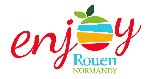
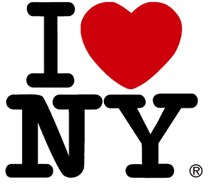

# 享受鲁昂诺曼底

> 原文：<https://dev.to/adriantombu/enjoy-rouen-normandy-34f>

# 享受鲁昂诺曼底

> 国家警察；博士自 2015 年 6 月以来，我一直是鲁昂领土品牌先驱大使之一

[T2】](https://res.cloudinary.com/practicaldev/image/fetch/s---o73A9ls--/c_limit%2Cf_auto%2Cfl_progressive%2Cq_auto%2Cw_880/https://blog.otso.img/2015-07-27-enjoy-rouen-normandy/logo-enjoy-rouen-normandie.png)

2015 年 6 月 22 日，我在巴黎与 Laurence bertho-bedel(Rouen normand dy invest 的总代表)举行了一次未事先安排的会议，此后，我在开幕式上成为了“T2”领土品牌罗马尼亚人享有诺曼底的先驱大使。

## 什么是地域品牌？

一个品牌使一个地区(在此例中为罗马尼亚大都市)能够比竞争对手更好地展现出的知名度，同时也象征着该地区的个性。目的是加强**在法国和世界各地的吸引力**，让个人和企业都有兴趣到那里定居。

这种“T0”领土品牌的概念并不新鲜，因为法国第一个品牌是由[兰斯市](http://www.investinreims.com/)于 2003 年推出的。我们必须追溯到 1977 年，才能看到一个世界闻名的标志…

[T2】](https://res.cloudinary.com/practicaldev/image/fetch/s--bkWdfKEw--/c_limit%2Cf_auto%2Cfl_progressive%2Cq_66%2Cw_880/https://blog.otso.img/2015-07-27-enjoy-rouen-normandy/logo-i-love-new-york.gif)

## 为什么要成为大使？

我成为大使是因为鲁昂自 2009 年以来就是我的领养城市。尽管诺曼地气候有些不舒服，但我们必须承认，我们终于感觉很好了！

都市的一些优点:

*   一个以人为本的不断变化的城市:为行人设计码头，建立自行车道，改善公共交通供应……
*   Un **非常丰富的遗产**，该市自 2002 年起被贴上*艺术历史名城*
*   一辆**靠近巴黎**(列车 50 分钟)
*   更重要的是，**竞选**坐车 10 分钟！

如果你也想成为大使，宣传我们美丽的城市，那么[现在就填写表格](http://www.enjoyrouennormandy.com/devenir-ambassadeur/)！