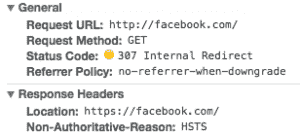

# 确保与 HSTS 的安全连接(HTTP 严格传输安全)

> 原文：<https://dev.to/borisschapira/ensure-secured-connections-with-hsts-http-strict-transport-security>

*这篇文章最初见于 [Dareboost 的博客](https://blog.dareboost.com/en/2017/09/hsts-ensure-secured-connections/)。*

*我们的老读者已经知道 **[HTTPS 现在是任何网站](https://blog.dareboost.com/en/2016/03/https-requirement-for-your-website/)** 的必备条件。摆脱不安全导航的冲动从未如此强烈:谷歌 Chrome 或 Mozilla Firefox 的每个版本都带有一个新的警告标志，提醒用户共享私人数据。很快，所有形式都会受到关注。*

但是提供一个 HTTPS 版本的网站并不足以自动将你所有的 HTTP 流量重定向到这个安全的版本。

## 实施重定向:一种有限的解决方案

重定向流量最有效的方法之一是使用永久重定向(HTTP 代码 301，带有包含目标 URL 的`Location`头)。这样，对于每个 HTTP 请求，用户和搜索引擎会立即被重定向到你的 HTTPS 网站。

够了吗？不幸的是，不能。因为对于大多数用户来说，重定向不会改变促使他们请求不安全 URL 的第一个动作。他们中的一些人可能直接键入了带有`http://`的 URL，其他人点击了他们的收藏夹栏中的图标或者跟随了位于第三方网站上的链接。你甚至不能幸免于忘记一些到你自己的 HTTPS 网站的内部 HTTP 链接！在所有这些情况下，重定向不足以保证你的访问者的安全流量。此外，每次重定向都会影响您的 web 性能。

此外，将一个用户重定向到安全版本意味着首先调用/请求了不安全的页面。在这个初始请求期间，导航很可能被捕获。如果一个恶意的人能够访问您的访问者的网络，他将能够拦截流量，更糟糕的是，转移它来窃取机密数据。您的一些访问者可能面临风险，他们通过公共 Wifi 热点、运输公司提供的互联网连接(有时是第一个将内容注入不安全流量的公司)或受损的专用网络访问您的网站…

为了安全和性能，您需要尽可能避免这种重定向。

## HSTS 逼 HTTPS

HTTP 严格传输安全( <abbr title="HTTP Strict Transport Security">HSTS</abbr> )是在 [RFC 6797](https://tools.ietf.org/html/rfc6797) 中指定的指令。安全策略由服务器通过报头响应**发送给用户代理，声明对于任何进一步的呼叫，应该通过 HTTPS** 请求该域。

浏览器(或任何其他用户代理)存储信息，然后对该域的任何 URL 的每个新的不安全请求将通过内部重定向(HTTP 代码 307)自动重新路由到 HTTPS 方案。请注意，301 重定向仍然是必要的，因为该指令只考虑未来的调用。

HSTS 指令必须有一个由`max-age`参数定义的活动周期，以秒为单位。值 300 将指示浏览器记住内部重定向五分钟。设置为 63072000 的值将使重定向保持两年。

我们强烈建议您先实施小活动期的 HSTS，然后逐步增加。在每一步，确保等待规定的时间，通过观察或分析发现错误，然后解决问题并继续。

下面是一个用 Apache 实现 HSTS 的例子，活动时间为 5 分钟:

```
Header always set Strict-Transport-Security "max-age=300; includeSubDomains;" 
```

Enter fullscreen mode Exit fullscreen mode

`includeSubDomains`参数表示 HTTPS 可用于当前域的所有子域。在应用此切换之前，请确保您的所有资产在 HTTPS 可用，否则您的资产将变得无法访问。

不要担心。如果出错，您可以通过将`max-age`设置为“0”来禁用 HSTS 策略。

> max-age 值为零(即“max-age=0”)表示 UA 不再将该主机视为已知的 HSTS 主机，包括 includeSubDomains 指令(如果针对该 HSTS 主机声明)。
> 
> <cite>[RFC 6797 第 6.1.1 节](https://tools.ietf.org/html/rfc6797#section-6.1.1)</cite>

简而言之，除了 301 重定向之外，HSTS 指令还可以用于保护用户在特定时间段内对某个域(最终是其子域)的所有未来请求。但是，仍然存在一个安全问题:初始请求仍然不安全。

## HSTS 预压可靠地保障了往来

为了确保第一个请求的安全，Chromium 项目维护了一个有效的 HSTS 域名列表，该列表被硬编码到 Chrome 中，仅作为 HTTPS 域名。[火狐](https://blog.mozilla.org/security/2012/11/01/preloading-hsts/)、Opera、Safari、 [IE 11 和 Edge](https://blogs.windows.com/msedgedev/2015/06/09/http-strict-transport-security-comes-to-internet-explorer-11-on-windows-8-1-and-windows-7/) 也有它们的列表衍生于此。

为了被 HSTS 预加载列表接受，网站必须满足以下一组要求:

1.  出示有效证件。
2.  自动从重定向到同一主机上的 HTTPS
3.  服务于 HTTPS 的所有子域
4.  在基本域上响应 HTTPS 请求的 HSTS 报头:
    *   最大年龄必须至少为 ~~10886400 秒(18 周)~~ 31536000 秒(一年)。
    *   指令头必须包含子域。
    *   必须指定 preload 指令。
    *   如果您从您的 HTTPS 站点提供额外的重定向，该重定向必须仍然有 HSTS 标题(而不是它重定向到的页面)。

如果您的网站符合条件，您可以通过此表格提交其域名[。](https://hstspreload.org/)

[](https://res.cloudinary.com/practicaldev/image/fetch/s--u24jWCsp--/c_limit%2Cf_auto%2Cfl_progressive%2Cq_auto%2Cw_880/https://thepracticaldev.s3.amazonaws.com/i/64mia5hnuoxuwfju2teg.png) 

<figure>

<figcaption>内部 HTTPS 通过 HTTP 向脸书发出重定向请求，Chrome 60</figcaption>

</figure>

注意:用 0 秒`max-age`修改指令不会关闭 HSTS 预加载。域名可以从 HSTS 预加载注册表中删除，但你将不得不等待数月，因为浏览器的下一次更新需要达到所有用户。所以，一个忠告:不要注册 HSTS 预加载，如果你不是很有信心有能力提供你的域名及其子域名的 HTTPS。

## 用 HSTS 保护你的用户

HSTS 指令已经存在好几年了。它可以保护服务器和访问者浏览器之间的请求和响应。第一个请求可以通过 HSTS 预加载来保护，确保所有流量免受威胁。必须谨慎激活 HSTS，但当它完成时，用户体验不会受到请求时间延长的影响。正如谷歌重视安全性一样，HSTS 也是对 SEO 的优化。

## 奖励:与 HSTS 预载，保护您的域名免受 SSL 带攻击

如果你密切关注信息安全新闻，你可能已经注意到了由[黑客攻击](https://www.krackattacks.com/)所代表的危险，这表明了 WPA2 的一个严重弱点，这是一个保护所有现代受保护 Wi-Fi 网络的协议。攻击过程中的一个步骤是恶意软件拦截浏览器发送的 SSL 请求，请求 URL 本身，然后用 HTTP 而不是 HTTPS 来回答结果。一个简单的猝不及防的瞬间就足以让一个海盗截获私人信息。如果你的域名被列入 HSTS 预加载列表，浏览器将拒绝切换到 HTTP，从而保护你的访问者。

## 关于 HSTS 的进一步信息

*   [HTTP 严格的运输安全 Chromium 项目](https://www.chromium.org/hsts)
*   [HTTP 严格传输安全备忘单–OWASP](https://www.owasp.org/index.php/HTTP_Strict_Transport_Security_Cheat_Sheet)