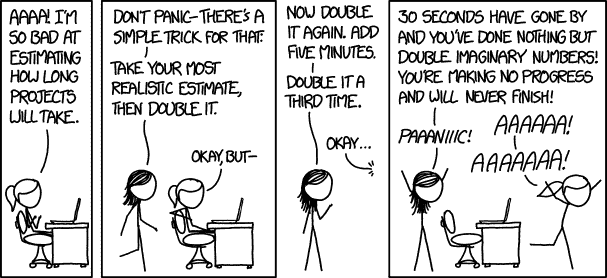

# 估计和理论构建

> 原文：<https://dev.to/designfrontier/estimations-and-theory-building-3n18>

[T2】](http://xkcd.com/1658/)

我的团队在[架构](http://instructure.com)、[丹·多尔曼](https://twitter.com/dandorman)带领团队前几天通过了[彼得·诺尔 1985 年的这篇精彩文章](http://pages.cs.wisc.edu/~remzi/Naur.pdf)。它的标题是“作为理论构建的编程”,讨论了编程更接近于构建世界如何工作的理论，而不是制造理论。这产生了非常有趣的结果。

它出现的原因更多的是随着团队的来来去去，代码库经历的逐渐衰退。Naur 解释说，因为编程正在创建一个关于世界如何运行的理论，所以不可能将这个理论从一个程序员完全转移到另一个程序员身上。文档是有帮助的，但是完整的基础理论基本上不可能从一组程序员转移到另一组。

所有这些都令人着迷！但是这篇文章是关于所有这些是如何影响项目评估的难度的。

有一天，我和一位同事谈到，在我们花时间对问题空间进行推理之前，我们真的不知道一个特性或 API 的最终实现会是什么样子。通常，一旦我们对问题进行了充分的推理，知道如何解决它，解决方案就相对容易实现。我开发程序的大部分时间都是在搞清楚这个东西应该如何工作的阶段。

这就是为什么诺尔把编程作为建筑理论的想法吸引了我。对这个问题进行推理需要时间。建立理论需要时间。

这就是为什么估计几乎总是错的。虽然我们可以在我们认为一个问题的理论可能需要证明的数量级左右做出快速判断。但是，如果程序的最初理论没有成功，那么我们就需要反复开发和测试一个新的理论，直到我们找到一个匹配的理论。

这是有问题的。因为我们管理我们的项目就像我们在为一辆汽车或其他物理产品制造零件一样，在生产开始之前理论已经建立了。在这类作品中，理论的建立被视为一项独立于物质创造的任务。

因此，得出估计值是一项简单的任务。你可以测量焊接一个框架或油漆一辆汽车所花费的时间。这些测量给你准确的估计。

同样，在创建程序的过程中，我们可以测量代码行数，并准确知道打印一个程序需要多长时间。然而，这给我们留下了一个问题。因为有时候更少的行是更好的行，在我们完成理论的实现之前，我们甚至不知道我们将需要多少行代码。也就是说，我们应该对我们已经实施的项目中已经实施的东西做出惊人的估计，对我们从未实施过的项目做出可怕的估计。

因为归根结底，我们无法知道我们的理论是否可行，直到我们证明了它们，我们也不知道推理出新理论需要多长时间，直到我们做到了这一点。

这就是为什么很难估计的原因。因为我们请爱因斯坦坐下来，告诉我们在他知道广义相对论包含什么之前，他要花多长时间才能提出广义相对论。*这是导致灾难的原因。但是当我错误地估计特性和项目时，它确实让我对自己的缺点感觉更好。

*爱因斯坦在发表狭义相对论后，花了 8 年时间研究才确定广义相对论。