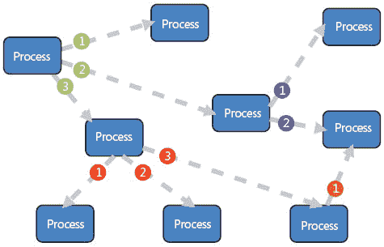
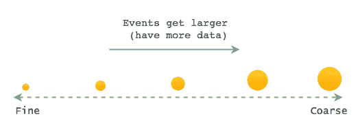
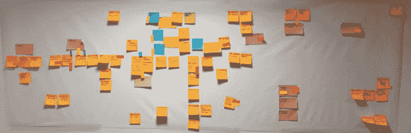

# 事件粒度:在事件驱动的应用程序中建模事件

> 原文：<https://dev.to/barryosull/event-granularity-modelling-events-in-event-driven-applications-e50>

对构建事件驱动的应用程序感兴趣吗？如果是这样的话，有一个问题会很早出现；你认为你的活动有多大或多小？

# 事件驱动系统

在我们开始之前，让我们给出一些事件驱动系统的背景。事件驱动的系统不互相同步调用，而是广播消息，即。“事件”。其他服务监听这些事件，并以自己的速度处理它们。假设一个服务开始变慢或崩溃，其他服务会继续工作，就像什么都没发生一样。一旦失败的服务再次启动，它就返回处理事件并赶上系统的其余部分。这是构建健壮的分布式系统的好方法，比如基于微服务的架构。

[T2】](https://res.cloudinary.com/practicaldev/image/fetch/s--wfE7hrqC--/c_limit%2Cf_auto%2Cfl_progressive%2Cq_auto%2Cw_880/https://thepracticaldev.s3.amazonaws.com/i/fo7b8dewfc1qyl358xda.jpg)

所以，如果你正在构建一个这样的系统，你如何定义你的事件？

# 建模事件

当设计一个事件驱动的系统时，我们需要对引起系统变化的事件进行建模。事件用于广播我们所有系统/服务之间的变化，因此它们需要满足两个标准，它们必须是:

1.  表达的
2.  有用的

换句话说，他们需要描述他们做什么，并包含易于消费的信息。这比听起来要复杂，尤其是如果你来自一个表格驱动的、CRUD/ORM 风格的开发。

# 粒度

对于我们的团队来说，最大的问题是弄清楚事件的粒度。它们应该有多小/多详细？我们是否需要为每一个值的改变准备一个事件？或者我们使用大型事件来广播整个实体，比如用户对象？这些是粒度的问题，为了回答这个问题，我们必须了解粒度的范围。

[T2】](https://res.cloudinary.com/practicaldev/image/fetch/s--XD2u37hR--/c_limit%2Cf_auto%2Cfl_progressive%2Cq_auto%2Cw_880/https://thepracticaldev.s3.amazonaws.com/i/s23rh9pgrp13h1rm6282.png)

当设计一个事件时，你需要在光谱上选择正确的点。太好了，事件就没用了。太粗糙了，而且没有表现力。从我们的经验来看，有三种情况你会弄错。

1)太粗
2)太细
3)两者都有点

## 太粗糙

粗糙事件是大的和通用的。它们有一个通用名称，包含大量数据。然而，这个名称并没有传达太多的意思，所以你必须检查数据本身来理解实际发生了什么。这意味着您的服务必须侦听这些事件，并检查其中的数据，然后才能确定它们是否真的关心。这是一个迹象，表明你已经从你的领域向你的听众灌输了一些逻辑。

### 粗事件

以事件`AccountStatusChanged`为例，模式如下。

```
AccountStatusChanged
  accountId: 12
  status: "closed" 
```

这是一个粗糙的事件，因为它没有表达。我们的流程都不关心状态是否发生了一般性的变化，它们关心的是状态是否变成了特定的值。营销服务关心帐户是否已经“关闭”，而计费服务关心帐户是否已经“激活”或“关闭”。

### 修复粗糙事件

由于这两个值的变化触发不同的过程，因此将它们建模为两个独立的事件是有意义的。

```
AccountClosed
  accountId: 12

AccountActivated
  accountId: 12 
```

这两个事件更有用，因为它们给出了实际发生的事情的背景。

### 为什么会这样

粗糙事件的发生有两个原因:

1.  开发人员试图通过减少他们领域中的事件数量来进行预优化(我们做到了)。
2.  事件是从 UI 模型中创建的，而不是与领域专家交谈并找出什么是真正重要的(我们也这样做了)。

## 太细的颗粒

细粒度事件是小而具体的。它们通常名副其实，但包含的信息非常少。一个太细粒度的事件本身是没有用的，在你决定下一步做什么之前，你必须把它和许多其他事件结合起来。如果您的侦听器同时侦听由同一个系统触发的多个事件，这是一个好迹象，表明它们太细粒度了。

### 细粒度事件

以下面的事件`CustomerFirstnameChanged`和`CustomerLastnameChanged`为例。

```
CustomerFirstnameChanged
  userId: ...
  firstName: "Tim" 

CustomerLastnameChanged
  userId: ...
  lastName: "The  Enchanter" 
```

这些事件粒度太细，因为没有服务关心它们是否独立发生。我们的服务只关心客户的当前姓名。他们不关心名字和姓氏在不同的时间是否改变，那是无关紧要的，他们只关心现在的值。例如，我们的 emailer 服务监听这两个事件，以便更新用户名。就是这样。他们没有真正的理由分开。

### 修复细粒度事件

基于以上所述，一个更好的事件应该是具有以下模式的`CustomerNameChanged`。

```
CustomerNameChanged
  userId: ...
  firstName: "Tim" 
  lastName: "The  Enchanter" 
```

现在我们的监听器只需要监听一个事件就可以触发工作，简单多了。

### 为什么会这样

当开发人员试图避免粗糙事件，并在相反的方向走得太远时，就会发生粒度事件。尽管根本原因是相同的，但是他们没有与领域专家交谈来弄清楚什么是真正重要的，相反，他们猜测并且弄错了。

## 兼而有之

我知道这听起来很奇怪，但是你也可以同时设计太粗糙和太精细的事件。这些事件具有带有大量数据的通用名称(即粗糙)，但是它们本身没有用，并且总是与其他事件(即粒度太细)。他们把太粗和太细的问题结合成一个可爱的混乱的包。

### 理解错误

```
CustomerFirstnameChanged
  userId: ...
  firstName: "Tim" 

CustomerDetailsChanged
  userId: ...
  lastName: "The  Enchanter"
  twitterHandle: "@enchantz247" 
```

在上面的`CustomerDetailsChanged`中就是这个问题，它既太粗又太细。

太粗了，因为包含的信息太多了。关心 twitter 句柄变化的服务不关心用户的姓氏。然而，它必须监听所有这些事件，并检查 twitterHandle 在继续之前是否真的发生了变化。讨厌鬼。

也太颗粒化了；每一个关心人名的服务都必须监听这两个事件，然后才能得到完整的图片。它遇到了与上面的细粒度示例相同的问题，增加了粗糙的、表达性较差的事件名称的问题。又一个讨厌鬼。

### 把事情办好

显然，我们的数据边界是错误的；我们有错误事件的数据，我们的事件命名不当。让我们重新定义它们。

```
CustomerNameChanged
  userId: ...
  firstName: "Tim" 
  lastName: "The  Enchanter" 

CustomerTwitterHandleChanged
  userId: ...
  twitterHandle: "@enchantz247" 
```

这些事件更容易被消费。每个关心名称的服务只监听一个事件，关心 twitter 句柄的服务也是如此。更简单，更清晰。

### 为什么会这样

当您需要处理系统中的一条新数据并且处理得很糟糕时，就会出现这种情况。您不想添加一个新事件，所以您只需将那段数据添加到一个现有的事件中，这个事件已经太细粒度了。这就是为什么尽早修复事件粒度问题很重要，它带来了清晰性并阻止你犯更大的错误。

# 那么如何找到甜蜜点呢？

我们如何为我们的事件找到合适的粒度？首先，我们需要后退一步，与领域专家交流。他们已经知道界限，他们多年来一直在传递信息，明白什么是重要的，什么是不重要的，什么属于一起，什么是分开的。

[T2】](https://res.cloudinary.com/practicaldev/image/fetch/s--Wy7c2Ps7--/c_limit%2Cf_auto%2Cfl_progressive%2Cq_auto%2Cw_880/https://thepracticaldev.s3.amazonaws.com/i/anogja1gvusrqyql757l.jpg)

最好的开始方式是花一些时间和他们一起在你的领域进行活动。弄清楚什么消息(即。事件)在他们的部门内部使用(即服务)以及哪些用于触发其他部门的流程。需要注意的是，您不会在第一次 ES 会议中就做对，这没关系。用几天时间与您的领域专家进行几次会谈，迭代您的模型，您将发现更好的事件并避免上述问题。

如果这听起来很费力，而你宁愿开始编码，请记住这句话。

> 数周的编码可以节省你数天的计划时间。

换句话说，最好在一开始就发现事件，而不是在中途，当定义不明确的事件开始妨碍时，导致痛苦、沮丧和延迟交付。这不是预先的大设计，而是预先的大发现。希望你发现这个有用和快乐的编码！