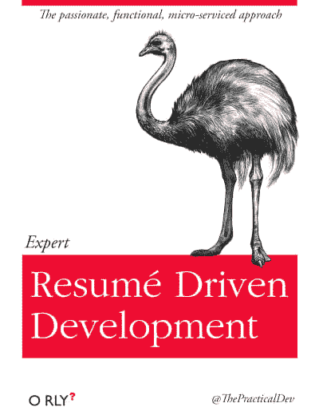

# 专家简历驱动的开发

> 原文：<https://dev.to/tra/expert-resum-driven-development>

声明:我写了本书[《堆栈溢出的基本复制粘贴》](https://tra38.gitbooks.io/essential-copying-and-pasting-from-stack-overflow/content/)，灵感来自 [@ThePracticalDev](https://twitter.com/thepracticaldev?lang=en) 设计的一个[封面](https://twitter.com/thepracticaldev/status/705825638851149824)。这篇博文的灵感也来自 PracticalDev 设计的封面。就像“从栈溢出进行本质复制粘贴”一样，“专家简历驱动开发”也是面无表情的写出来的。

[T2】](https://res.cloudinary.com/practicaldev/image/fetch/s--ELEg7sZr--/c_limit%2Cf_auto%2Cfl_progressive%2Cq_auto%2Cw_880/https://res.cloudinary.com/practicaldev/image/fetch/s--BKYsV9_a--/c_fit%2Cf_auto%2Cfl_progressive%2Cq_66%2Cw_400/http://i.imgur.com/nPyM8ST.png)

### 什么是“简历驱动开发”？

简历驱动开发指的是为你的项目选择热门的新技术，以使你的简历更令人印象深刻。例如，您想在热门的新 Javascript 微生成器框架[“plop . js”](https://github.com/amwmedia/plop)中编写一个程序...因为这是一个热门的新 JavaScript 框架。当然，你可以使用你已经知道并且可能更适合这份工作的技术，但是那不会像赶时髦那样令人印象深刻。你甚至不知道“扑通. js”是什么，但你很快就会知道了。

简历驱动的开发是否真的好有一些争议。Paul E. Davis 为这种做法辩护，因为这表明开发者愿意学习新技术，而不是坚持使用可能过时的解决方案。当然，“扑通. js”实际上可能不适合你的用例，但至少你表明了你*可以*快速学习和使用它，并且你可以在以后找到实际上可能有用的尖端技术。

“最后，如果开发人员不关心他们自己的事业，他们就不太可能关心你的业务。”保罗·戴维斯

尽管大多数开发者似乎讨厌 RDD(从这个恶搞网站可以看出)。人们普遍认为，开发人员在业余时间没有使用热门的新技术，而是[将它们用于公司项目](http://www.healthcareguy.com/2007/01/19/resume-driven-development-rdd/)。这是对公司资金的巨大浪费，因为该技术可能不适合手头的任务，并可能导致长期的维护问题。

开发人员不是唯一参与简历驱动开发的人。管理层也可能在招聘过程中参与 RDD。如果有一个职位空缺，人们希望雇佣一个和老程序员拥有相同技能的新程序员。所以老程序员是 Plop.js 的专家，那么招聘启事就会写着“6 个月使用 Plop.js 的经验”。这可能是一件非常糟糕的事情，因为您正在优化某些技术的知识，而不是为工作选择“正确的工具”。如果你只雇佣 ploc . js 开发者，你只会得到 ploc . js 网站。

RDD 可能是更大的委托代理问题的一个子集。委托人(管理层)雇佣一个代理人(开发人员)来构建一个程序，并允许代理人选择技术堆栈。但是代理人的兴趣(让他的简历更令人印象深刻)可以与委托人的兴趣(通过使用“合适的工具”生产出伟大的产品)相垂直。如果委托人允许代理人做他想做的事情，那么代理人**就会**做他想做的事情，从而导致代理人成功而委托人失败。

RDD 由两部分组成:简历和技术。让我们简单地看一下这两者。

### “简历”的作用

简历让人们知道你做了什么，希望能给人留下深刻印象。根据简历重写公司 TheLadders 的一项研究，招聘人员可以在每份简历上花 6 秒钟，浏览关键词和关于你的教育和工作经历的粗略背景信息，然后决定你是“适合”还是“不适合”。你可以看到为什么一些开发者想通过练习 RDD 来最大化这 6 秒。

现在，对简历上的内容还没有那么深入的研究。如果有人说他们在构建狗的优步应用程序时使用了 Plop.js，那么你可以假设他们确实使用了 Plop.js，并且确实有一个狗的优步应用程序...他真的花了 6 个月的时间...他还在工作的时候抚摸了一只独角兽。简历上是这么写的。那就继续扫描更多的关键词吧。

你可以明白我的意思。简历可能会说谎。你可以声称在闭源公司参与了 60 个 Plop.js 项目，并提供虚假的电话号码和参考资料作为这些闭源项目存在的“证据”。撒谎是非常不道德的，我不建议任何人这么做。但这是可以做到的，而且可能比纯粹的 RDD 方法更有效...至少在迈出第一步的时候。然而，在面试阶段，面试官会试图剔除那些在简历中撒谎的人，比如问一些基本的问题，比如“什么是 Plop.js？”。

因此，更好的选择是在实际项目中使用这些技术，这样当你进入面试阶段时，你就可以证明你在这方面的专业知识，而不会被揭穿是个骗子。(可悲的是)这意味着您必须构建一个优步狗应用程序，这样您就可以使用 Plop.js 关键字。如果有人看你的简历超过 6 秒钟，你甚至需要提供申请的链接和源代码。然而，一旦你做到了这一点，你就不必担心证明其他任何东西。如果你能证明你能使用 Plop.js，那么大多数人会认为你知道如何使用它。

### 选择热门技术

选择热门新技术的最大问题不是实际学习它们。这很困难，你必须处理糟糕的文档和困难的解决方案，但是只要有足够的时间和坚持，你最终会成功的。

不，选择热门新技术的最大问题是你不知道真正热门的是什么。

你可以猜猜。你可以听听某个社区，如果这个社区谈论很多关于 Plop.js 的话题，那么这表明 Plop.js 很热门。如果社区不再讨论扑通. js，那么扑通. js 一定不火。你可以给谷歌趋势加书签，注意人们在搜索什么词。你可以看看招聘信息，看看招聘人员用的是什么关键词。诸如此类。

但它们都是追踪指标。它并不能帮助你预测这项技术在未来是否会持续火爆。

正是在这一点上, [Gartner 炒作周期](http://www.gartner.com/technology/research/methodologies/hype-cycle.jsp)对 RDDer 最有用。Gartner 认为所有新技术都会经历一个周期。我在[我反对人工智能的博客文章](http://tra38.github.io/blog/ai3.html)中描述了炒作周期...我在这里转载我对这个周期的评论:

> 起初，人们对一种全新的技术非常感兴趣(“技术触发器”)。公司开始过度投资于这项技术的研究，导致了“膨胀预期的顶峰”(即泡沫)。但是这项技术有很大的局限性。结果，技术投资枯竭(“幻灭的低谷”)。大多数公司要么开始裁员，要么干脆关门大吉。
> 
> 最终，幸存者很快意识到如何正确使用技术(“启蒙的斜坡”)，我们终于可以在日常生活中使用技术(“生产力的高原”)。但是正如维基百科上的这张图片所示，在生产力的稳定期，这项技术的可见性远远低于同样的技术在膨胀的期望的顶峰期的可见性。这项全新的技术为我们做了很多伟大的事情。只是没有我们希望的那么好。这是否证明了“膨胀预期的顶峰”中的极度浪费是合理的？

由于这项技术在膨胀的期望达到顶峰时达到了最大的知名度/炒作，这意味着，当你听说一项技术时，*已经太晚了*。唯一能够利用炒作的人是“早期采用者”，他们可能会获得大部分好处(尽管他们也接受大部分成本，因为不是所有的新技术都足够有趣或有用，可以经历这个炒作周期)。

这张图表告诉我们的另一个信息是，学习新技术的最佳时间要么是在技术触发期，要么是在幻灭的低谷期。

在技术触发阶段，没有专家。只有少数人知道你的关键词。现在作为“早期采用者”(当这个领域还年轻时)进行专业化，会比在期望的高峰期成为专家更令人印象深刻，那时你的领域里有成千上万的“专家”。制造一个可以画画的机器人现在看起来很棒。五年后，当每个程序员都已经建造了他们自己的油漆机器人时，建造一个油漆机器人？**无聊。**

在幻灭的低谷期，你可以利用以前在技术触发期和膨胀期望的高峰期所做的研究，从过去技术的成功和失败中学习。在低谷期，你也将面临更少的竞争，因为大多数程序员已经离开，转向下一个“热门”技术。最终，对技术的兴趣将会复苏，你可爱的关键词将会重获一些吸引力。

任何其他时间研究一项技术要么会带来太多的竞争(膨胀的期望的顶峰)，要么会带来太少的回报(生产力的平稳期)，以至于不值得花费。在这种情况下，您想要学习该技术的唯一原因是，您认为它实际上可能会帮助您成长为一名开发人员。

“本文原载于 2016 年 5 月 12 日[tra38.github.io/blog](http://tra38.github.io/blog)。请访问我的博客了解我的更多帖子，或者访问我的网站 [tra38.github.io](http://tra38.github.io/) 了解更多关于我的信息。”