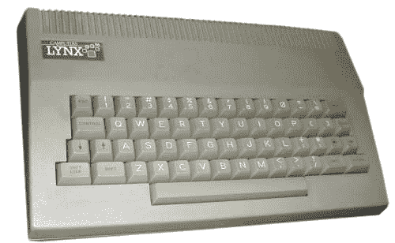

# 父亲节

> 原文：<https://dev.to/funkysi1701/fathers-day-o87>

在英国，今天是父亲节。父亲节快乐，爸爸！

我想我可以谈谈他如何鼓励我对技术的兴趣，特别是在大约 8 周后我将成为一名家长，并将有人鼓励和激励我。

我听起来真的很老了，但是当我出生的时候没有互联网，没有手机，电脑更多的出现在科幻小说中而不是你的家里。

我记得我们拥有的第一台电脑是山猫。快速谷歌显示有许多不同的模型，我不知道我们有什么，但这里是我发现的。

[T2】](https://res.cloudinary.com/practicaldev/image/fetch/s--orkJkQXt--/c_limit%2Cf_auto%2Cfl_progressive%2Cq_auto%2Cw_880/https://storageaccountblog9f5d.blob.core.windows.net/blazor/wp-content/uploads/2015/06/PRODPIC-2926.jpg%3Fresize%3D300%252C185%26ssl%3D1)

1983 年 3 月，Lynx 48K 发布，9 月升级到 96K。1983 年 12 月，发布了 128K 的新 Lynx。为了正确看待这些数字，我的桌面上有一个 123K 的图像文件！这台计算机的中央处理器速度在 4 到 6 兆赫之间。(现代个人电脑的中央处理器频率约为 1.5Ghz 或 1500Mhz)

我们的 Lynx 没有磁盘驱动器或鼠标。程序是从录音带(录音带是一种数据存储形式，出现在 CD 之前，数据存储在磁带上，最常用于音乐)加载的，我们的磁带经常卡住，数据无法加载。对此的回答是快进/倒带或者把带子砸在腿上。出于某种原因，这是我仍然记得我的父亲打了他的腿上的磁带，让游戏或其他东西加载到山猫。我们也有一个操纵杆来玩一些游戏。我相信我们也有早期的热敏打印机。

我对猞猁的记忆是黑白的。这样做的原因是 Lynx 连接到一台旧的黑白电视，当我们将主彩色电视连接到 Lynx 时，这是一种特殊的待遇。

我们为猞猁准备了各种各样的游戏，我记得杰特·集威利和迪格曼。但是也有我父亲创建的程序。Lynx 有一种 BASIC 语言，你可以编写自己的程序，我父亲花了很多时间为我和我妹妹编写程序。(实际上我们当时从未意识到这一点)

以此作为我对计算机的入门，我现在所做的事情有什么奇怪的吗？现在我该为我的孩子做些什么来用类似的方式鼓励他们呢？

作为一个家庭，我们从未拥有过游戏机。不确定这是经济上还是道德上的选择，但这是我必须考虑的事情。我希望我的孩子对计算机有所了解，能够在竞争激烈的就业市场上竞争，但我也希望他们了解科学和自然，并享受他们的童年。未来几年要做出许多技术选择。