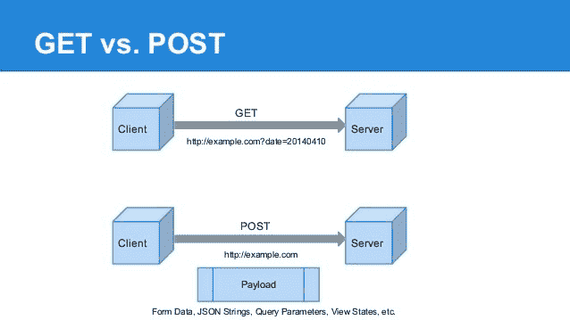

# 提琴手和蜜蜂

> 原文：<https://dev.to/funkysi1701/fiddler-and-apis-1304>

不久前，我写了一篇关于用 Buffer 推广我的博客的博客。当时我使用了 nuget 包 [BufferAPI](https://www.nuget.org/packages/BufferAPI/) ，但是让我们看看我能做的一些改进。

BufferAPI 包在我的控制台应用程序上运行得很好，但是当我试图在 MVC 应用程序的控制器上使用它时，我从来没有让它运行过。让我们看看 API 文档，看看我是否可以重写它。

有两种主要类型的 API 调用 GET 和 POST，前者从服务器获取数据，后者向服务器发送数据。这些来自 HTTP 请求的类型。

[T2】](https://res.cloudinary.com/practicaldev/image/fetch/s--M3wvPPDi--/c_limit%2Cf_auto%2Cfl_progressive%2Cq_auto%2Cw_880/https://dev-to-uploads.s3.amazonaws.com/uploads/articles/6wozrfdoqvtjaoxs7j1v.jpg)

我很快就明白了如何使用 GET API 调用通过[https://api.bufferapp.com/1/profiles.json?access_token=XXXX](https://api.bufferapp.com/1/profiles.json?access_token=XXXX)进行认证

然而，波斯特打败了我。直到我想起了小提琴手。

我听过 Troy Hunt(和其他人)谈论使用 Fiddler 来检查网站之间传递的数据。Troy 用它做了一个中间人测试，看看有什么信息可以被窃取。

这真的很容易设置，安装 Fiddler，对一些安全警告单击 yes，你就可以看到什么信息从你的代码传递到远程 API。

一旦安装了 Fiddler，我就可以比较使用 BufferAPI nuget 包的成功 API 调用和使用我的代码的不成功 API 调用之间传递了什么信息。

Fiddler 还展示了在 POST 请求中传递我的身份验证令牌要好得多。尽管在使用 HTTPS 时 GET 和 POST 都被加密了，但是任何记录 URL 的东西都会记录你的用户名和密码。

如果您还没有尝试过 Fiddler，请尝试一下，尤其是当您正在使用 API 调用时。