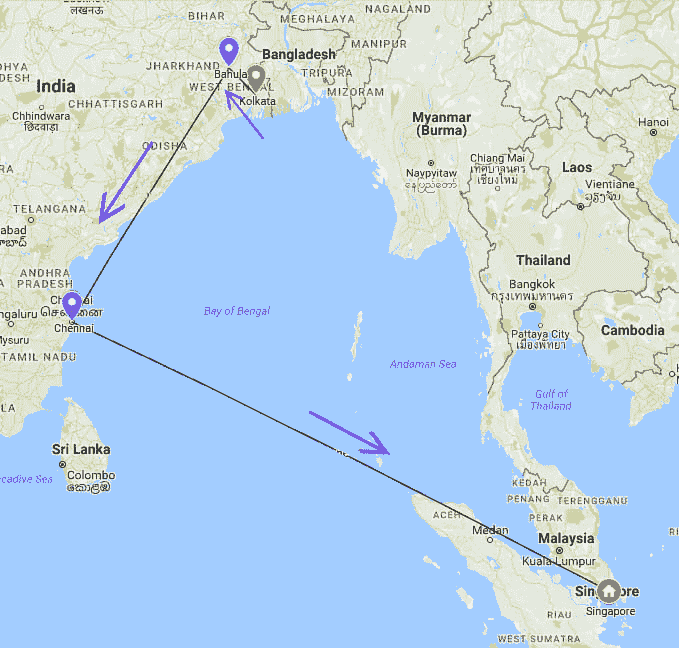

# 寻找数据包的路径

> 原文：<https://dev.to/rounakpolley/finding-path-of-packets>

我们知道数据以小数据包的形式在互联网上传输。但是它不是从一台计算机飞到另一台计算机，而是通过各种网络设备。但是，我们能确定数据包传输的大致路径吗？
答案是肯定的！

例如，从加尔各答(印度)访问`www.facebook.com`的路径如下所示。
(注意:为了简单起见，这里我用直线连接了服务器位置)
[](https://res.cloudinary.com/practicaldev/image/fetch/s--Gow1AwC4--/c_limit%2Cf_auto%2Cfl_progressive%2Cq_auto%2Cw_880/https://thepracticaldev.s3.amazonaws.com/i/ww1isle1mfwqspu8qc3u.jpg)

在 Windows 上使用`tracert`命令就可以做到，相当于 Mac 和 Linux 上的`traceroute`命令。
**注意:**这些命令执行起来需要一些时间，所以请耐心等待或者中途取消按`ctrl+c`。

`tracert`或`traceroute`显示数据包从本地系统通过 IP 网络(使用 IP 在一台或多台计算机之间发送和接收信息的网络)到达远程服务器/主机的路径。

`tracert`向目的地发送 **ICMP** (互联网控制消息协议)回应数据包，并监听回复。
跟踪路由将 TTL 设置为 1，并且每跳递增一次。收到消息的路由器会递减该值，当该值达到 0 时，它们会回复一条消息，说明 TTL 已达到 0。这个回复告诉客户端(执行命令的客户端)它从哪里返回。这个过程一直持续到到达目的地。

下面是`www.facebook.com`上的一个`tracert`。我用来绘制上面的地图。

```
C:\Users\ROUNAK POLLEY>tracert www.facebook.com

Tracing route to star-mini.c10r.facebook.com [157.240.13.35]
over a maximum of 30 hops:

  1     2 ms     1 ms     1 ms  192.168.0.1
  2     4 ms     3 ms     3 ms  172.17.149.1
  3     7 ms    21 ms    13 ms  node-203-171-243-1.alliancebroadband.in [203.171.243.1]
  4     7 ms     7 ms     8 ms  192.168.199.109
  5     4 ms     4 ms     4 ms  node-203-171-240-1.alliancebroadband.in [203.171.240.1]
  6    42 ms    45 ms    46 ms  172.31.180.57
  7    42 ms    43 ms    42 ms  ix-ae-4-2.tcore1.CXR-Chennai.as6453.net [180.87.36.9]
  8    84 ms    77 ms    78 ms  if-ae-3-3.tcore2.CXR-Chennai.as6453.net [180.87.36.6]
  9    74 ms    75 ms    75 ms  if-ae-6-2.tcore2.SVW-Singapore.as6453.net [180.87.37.14]
 10    94 ms    81 ms    77 ms  180.87.15.246
 11    77 ms    78 ms    77 ms  po121.asw02.sin1.tfbnw.net [173.252.64.50]
 12    78 ms    77 ms    78 ms  po224.psw04.sin6.tfbnw.net [157.240.34.51]
 13    77 ms    76 ms    79 ms  157.240.36.117
 14    78 ms    76 ms    76 ms  edge-star-mini-shv-02-sin6.facebook.com [157.240.13.35]

Trace complete. 
```

Enter fullscreen mode Exit fullscreen mode

命令的输出:

*   输出分为以下几列

**跳数**， **RTT 1** ， **RTT 2** ， **RTT 3** **域名和 IP 地址**
RTT 代表往返时间。

*   这里`192.168.0.1`是我路由器的 IP 地址。而 *alliancebroadband.in* 是我的 **ISP** (互联网服务提供商)等。
*   如果路由器在超时(TTL)内没有响应，则会显示星号。例如:

```
 3     *        *        *     Request timed out. 
 4     5 ms     *        *     node-203-171-243-1.alliancebroadband.in[203.171.243.1] 
```

Enter fullscreen mode Exit fullscreen mode

*   通常，当我们在由`tracert`返回的 IP 地址上使用 IP 位置查找器时，我们看到一些 IP 是私有的。这是因为这些是一些组织的服务器/网关的内部 IP。

“跳”只不过是计算机、路由器或源和目的地之间的任何设备。
要使用与`tracert`不同的选项，键入‘tracert’并按‘enter’(在命令提示符中)。它将显示所有可用的语法。

为了可视化物理位置，我们只需使用任何 IP 地理定位服务，如[https://www.iplocation.net](https://www.iplocation.net)。然后简单地把它们标在地图上。