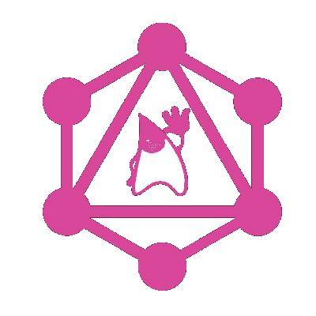

# Java 中 GraphQL 的第一印象

> 原文：<https://dev.to/committedsw/first-impressions-with-graphql-in-java-5c82>

[T2】](///static/logo-aebeb4e70ae5145695bbb1e151e1fccf-f2200.png)

GraphQL 是一种开放的查询语言，用于以灵活的方式公开数据。由[脸书](https://code.facebook.com/projects/)研发，现已在多个[项目](http://graphql.org/users/)投入生产使用。主要概念是 GraphQL 描述可用的数据，然后消费者可以要求他们需要什么。都使用相同的端点和语言。

我们正在研究它的用途，以展示自然语言处理结果来替换或增强 [REST](https://en.wikipedia.org/wiki/Representational_state_transfer) 。

## Java 生态系统

GraphQL 是与编程语言无关的，不同的实现存在于[多种语言中](http://graphql.org/code/#server-libraries)对于这个项目，我们使用 Java 和 Spring Boot，所以自然的选择是 [graphql-java](https://github.com/graphql-java/graphql-java) 。它可能不是唯一的 java 实现，但肯定是目前最活跃的。这个核心项目忠于规范，并且有许多支持的[项目](https://github.com/graphql-java)来简化集成和使用。

## 接近

在 GraphQL 中，您需要声明您的数据模式，以便客户端可以正确地自省系统和查询。然而，模式需要是底层数据类的准确表示。虽然您可以手动创建这两个东西，但是从另一个生成一个将减少工作量和错误。一种方法是定义模式并生成数据类。这种方法由 [graphql-apigen](https://github.com/Distelli/graphql-apigen) 和 [graphql-java-tools](https://github.com/graphql-java/graphql-java-tools) 提供。虽然如果您有一个具有严格模式规范的新项目，这种方法可能非常有用，但是我们已经有了数据类。因此，我们采用类优先的方法来生成模式。有一个基于这种方法的 [graphql-java-annotations](https://github.com/graphql-java/graphql-java-annotations) 项目，然而，它的开发似乎已经停止，社区似乎正在转向[graph QL-spqr](https://github.com/leangen/graphql-spqr)(发音为“speaker”)。看起来这可能会成为官方的 graphql-java 类优先方法。

## 入门

使用 graphql-spring-boot 非常容易。这给出了:

*   一个 graphql-java servlet，服务于模式，并接受 GET 和 POST GraphQL 请求
*   一个[GraphQL UI](https://github.com/graphql/graphiql)，用于针对发布的模式编写和执行 graph QL 查询。
*   ~~grapghql-java-tools~~ 模式优先
*   ~~graph QL spring common~~class first

我们选择不使用后者，并通过提供一个使用 graphql-spqr 生成的`graphql.schema.GraphQLSchema` Bean 以及对`DemoService`和所用 POJOs 的注释来添加 graphql-spqr simple。

```
package io.committed;

import org.springframework.beans.factory.annotation.Autowired;
import org.springframework.boot.SpringApplication;
import org.springframework.boot.autoconfigure.EnableAutoConfiguration;
import org.springframework.context.annotation.Bean;
import org.springframework.context.annotation.ComponentScan;
import org.springframework.stereotype.Controller;
import org.springframework.web.servlet.config.annotation.ViewControllerRegistry;
import org.springframework.web.servlet.config.annotation.WebMvcConfigurerAdapter;

import graphql.schema.GraphQLSchema;
import io.committed.query.DemoService;
import io.leangen.graphql.GraphQLSchemaGenerator;

@Controller
@EnableAutoConfiguration
@ComponentScan
public class GrahpQLDemo {

  @Autowired
  DemoService demoService;

  @Bean
  GraphQLSchema schema() {
    return new GraphQLSchemaGenerator()
        .withOperationsFromSingleton(demoService)
        .generate();
  }

  public static void main(String[] args) throws Exception {
    SpringApplication.run(GrahpQLDemo.class, args);
  }

} 
```

## 准备出发

将 graphql-spqr 注释添加到我们现有的 JPA/MongoDB 数据访问对象(DAO)非常简单。事实上，如果你使用相同的名字，它甚至没有必要，因为他们会自动挑选。或者，如果您想将 DAO 从 GraphQL 定义中分离出来，您可以定义一组数据传输对象(DTO)并使用它们。如果你不能改变你的道层，这可能会给你更多的灵活性。我们通过为每个服务添加一个根查询方法来将类型暴露给 GraphQL，即:

```
package io.committed.query;

import java.util.List;

import org.springframework.beans.factory.annotation.Autowired;
import org.springframework.stereotype.Component;

import io.committed.dao.repository.DemoRepository;
import io.committed.dto.Document;
import io.leangen.graphql.annotations.GraphQLQuery;

@Component
public class DocumentService {

  @Autowired
  DemoRepository repository;

  @GraphQLQuery(name = "allDocuments", description="Get all documents")
  public List<Document> getDocuments() {
    return repository.findAll();
  }
} 
```

参数可以添加到这些方法中，用于过滤、限制等，如果使用流，这些参数可以直接返回:

```
@GraphQLQuery(name = "allDocuments", description="Get all documents")
  public Stream<Document> getDocuments(
      @GraphQLArgument(name = "limit", defaultValue = "0") int limit) {
    Stream<Document> stream = repository.streamAll();
    if (limit > 0) {
      stream = stream.limit(limit);
    }

    return stream;
  } 
```

同样，我们可以通过 id 获取一个具体的文档，直接返回一个`Optional` :

```
@GraphQLQuery(name = "document")
  public Optional<Document> getDocument(@GraphQLArgument(name = "id") String id) {
    return repository.findById(id);
  } 
```

在 GraphQL 中，客户端明确询问结果应该包含什么数据。这并不局限于数据对象的字段，方法也可以用来提供计算结果，这里有一个简单的例子:

```
package io.committed.dto;

import io.leangen.graphql.annotations.GraphQLId;
import io.leangen.graphql.annotations.GraphQLQuery;
import lombok.Data;

@Data
public class Document {

  @GraphQLId
  private String id;
  private String content;

  @GraphQLQuery(name = "length")
  public int length() {
    return content.length();
  }

} 
```

这将在`Document`类上公开一个`length`字段。只有在查询请求时才调用该方法，这样客户端就不必为任何不需要的计算付出代价。这种方法还允许客户端通过让服务器进行计算并只传输结果来节省数据传输。

## 获取图形

GraphQL 的真正力量来自于通过连接属性遍历数据类型的能力。例如，如果我有从文档中提取的实体，那么我希望能够查询文档中包含的实体。如果这些已经存储在您的文档对象中，这是微不足道的，但是，它们可能存储在数据库中的不同表或集合中。为了在文档中嵌入实体，我们添加了以下内容:

```
@GraphQLQuery(name = "entities")
  public Stream<Entity> getByDocument(@GraphQLContext Document document) {
    return repository.getByDocumentId(document.getId());
  } 
```

其中,`@GraphQLContext`注释提供了构建模式的链接逻辑。

## 获取查询

您可以使用托管在`/graphiql`上的 GraphiQL UI 进行查询，或者向`/graphql`发送 HTTP 请求并从`/schema.json`获取模式，我相信所有这些都是可配置的。你也可以在内部使用 GraphQL，例如通过创建一个`QueryService` :

```
package io.committed.query;

import org.springframework.beans.factory.annotation.Autowired;
import org.springframework.stereotype.Service;

import graphql.ExecutionResult;
import graphql.GraphQL;
import graphql.schema.GraphQLSchema;

@Service
public class QueryService {

  private final GraphQL graphQL;

  @Autowired
  public QueryService(GraphQLSchema graphQLSchema) {
    graphQL = GraphQL.newGraphQL(graphQLSchema).build();
  }

  public ExecutionResult query(String query) {
    return graphQL.execute(query);
  }

} 
```

或者将`GraphQL`对象公开为 bean。

## 好转

我们能够在不到一天的时间内在现有的 DAO 对象上建立并运行一个快速的 GraphQL 端点，为客户端提供一个强大的查询机制。在这次调查中，我们发现并报告了 graphql-spqr 中的一个错误，并从[作者](https://github.com/kaqqao)那里得到了快速响应。看来这个生态系统将会快速发展，我们对 graphql-spqr 的改进建议如下:

*   忽略某些字段的能力
*   限制和过滤的现成支持
*   支持 graphql-java v5

总的来说，这是将 GraphQL 快速集成到现有的 spring-boot 服务器中的一个非常有前途的途径。