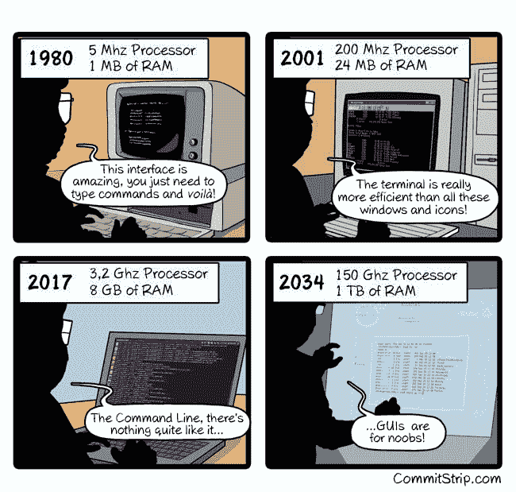

# 作为专业开发人员的第一个月

> 原文：<https://dev.to/alysivji/first-month-as-a-professional-developer-169>

*本帖最初发表在 [Siv 脚本](http://bit.ly/siv-blog)T3 上*

> *精心布置的方案老鼠们*
> *一帮人斜斜地靠在船尾*

10 月份，我开始了一份新工作，在芝加哥的一家医疗保健初创公司担任数学家/软件工程师。这是我的第一份*正式的*开发工作，我兴奋极了。

我靠写代码赚钱。挺牛逼的。

我一直以为我会从事数据方面的工作，也许会转型成为一名数据工程师。但是我们在这里。我正在为一个由大约 10 名开发人员组成的团队工作，构建一个[临床决策支持](https://www.healthit.gov/policy-researchers-implementers/clinical-decision-support-cds) web 应用程序。

我猜这种变化并不完全是意料之外的；在过去的几个月里，我已经开始深入研究软件工程的最佳实践。对不同的方法和框架着迷，这些方法和框架促进了优秀代码的产生。作为一名自学成才的开发人员，我渴望形式。通过阅读其他人的经验和在工作之余从事开源项目，我只能吸收这么多。

我需要亲自动手，作为团队的一员，在真实世界中练习编写代码。认为体验结构化敏捷/Scrum 开发环境的基于过程的工作流会很好；理解使用遗留代码工作的痛苦；别无选择，只能为我发布的代码编写测试。更好的是，让那些[测试先被编写](https://www.amazon.com/Test-Driven-Development-Kent-Beck/dp/0321146530)。

虽然才一个月，但我觉得我做了正确的决定。在我的第一次提交中，我做了一个改变，花时间重构代码以增加可读性。在代码评审中得到一个大喊。感觉棒极了！软件工艺 FTW！

我会说，我发现自己在下班后和周末不断地学习，这样我就不会完全无用，但我不想以任何其他方式学习。在我能力的边缘编码将会成倍地增加我的技能。

虽然我最终计划回到数据，让我们推迟考虑什么时候。现在，我正在享受生活，想继续骨头先生的疯狂旅程。

* * *

### 掌握开发工具

我担任后端开发人员的主要原因是为了提升我的开发能力。这意味着许多不同的事情，例如编写干净的代码，能够识别并正确应用设计模式，识别反模式(代码气味)，当然，还要学习该行业的工具。

在过去的几周里，我已经开始从 VSCode 和 iTerm2 的友好范围过渡到 [Vim](http://www.vim.org/) 和 [tmux](https://github.com/tmux/tmux/wiki) 的神奇世界。尽管我相当精通图形 IDE，但我认为值得投资开发一些工具，让我能以我认为的速度工作。

通过切换到纯终端开发环境，我希望减少每次使用鼠标或触控板时发生的上下文切换。额外的好处是，我可以登录任何机器，感觉就像在家里一样。再也不用设置 [rsync](https://en.wikipedia.org/wiki/Rsync) 或者使用 [nano](https://www.nano-editor.org/) 作为拐杖。

#### 我是如何学习 Vim 的

1.  我一路走过`$ vimtutor`。这是一种成人仪式。
2.  在我的所有文本编辑器(VSCode & Sublime)中启用了 Vim 键绑定，以方便使用`h j k l`移动键。在一个熟悉的环境中，我可以完成工作，而不必谷歌每一个命令，这确实有助于平坦的学习曲线。
3.  一旦我能够让光标移动到我想去的地方，我看着[在一周内学习 Vim](https://www.youtube.com/watch?v=_NUO4JEtkDw)。关键要点:
    *   建立一个基本的`.vimrc`文件，并将其置于 Verison 控制之下
        *   我的[网络文件回购](https://github.com/alysivji/dotfiles) -警告:使用风险自担ðÿ˜œ
    *   将[大写锁定]重新映射到[Esc]
        *   我更进了一步
    *   使用插件进行开发，包括推荐
        *   我推荐 vim-plug 插件管理器

上周末，我在家里的机器上安装了 tmux，这样我就可以开始熟悉它的工作原理了。我的`.tmux.conf`非常基础，但是所有的部分都已经就绪，可以让我按照自己的进度学习。我只需要每周努力学习一些新东西。像生活中的其他事情一样，这是关于投入的。

你的工具有多好就有多好，所以投资优化你的工作流程是值得的。我们是开发人员，我们应该经常修补我们日常使用的软件。它不一定是 Vim，我也不建议每个人都去学习它。但是请花一些时间来学习您的工具和 IDE 的插件生态系统。

对回复我的推文并给出有用建议的人们大声喊出来。[尤达真正的 MVP](http://knowyourmeme.com/memes/events/kevin-durant-mvp-speech)！

#### 附加资源

*   [Vim 插件列表](https://vimawesome.com/)
*   [快速简单的 tmux 指南](http://www.hamvocke.com/blog/a-quick-and-easy-guide-to-tmux/)
*   [让 tmux 变得漂亮和可用——定制 tmux.conf 终端的指南](http://www.hamvocke.com/blog/a-guide-to-customizing-your-tmux-conf/)
*   [tmux 和 Vim——更好的组合](https://blog.bugsnag.com/tmux-and-vim/)