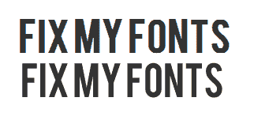

# 修复 Chrome/WebKit 中的锯齿字体

> 原文：<https://dev.to/adamkdean/fix-jagged-fonts-in-chrome-webkit-1dkj>

今天只是一个简短的帖子，更多的是对自己的提醒。以下是在基于 Chrome/WebKit 的浏览器上使用字体工具包时修复锯齿字体的好方法。

定义字体时，您会看到以下内容:

```
@font-face {
  font-family: 'FontName';
  src: url('../fonts/FontName.eot');
  src: url('../fonts/FontName.eot?#iefix') format('embedded-opentype'),
       url('../fonts/FontName.woff') format('woff'),
       url('../fonts/FontName.ttf') format('truetype'),
       url('../fonts/FontName.svg') format('svg');
  font-weight: normal;
  font-style: normal;
} 
```

Enter fullscreen mode Exit fullscreen mode

嗯，[显然 Chrome 使用了 SVG，并且不喜欢它出现在最后](http://www.adtrak.co.uk/blog/font-face-chrome-rendering/)。

将它添加到你的 CSS 中，你会得到更好的结果:

```
@media screen and (-webkit-min-device-pixel-ratio:0) {
  @font-face {
    font-family: 'FontName';
    src: url('../fonts/FontName.svg') format('svg');
  }
} 
```

Enter fullscreen mode Exit fullscreen mode

无修复和有修复:

[T2】](https://res.cloudinary.com/practicaldev/image/fetch/s--qsnNRq5d--/c_limit%2Cf_auto%2Cfl_progressive%2Cq_auto%2Cw_880/http://i.imgur.com/Ubxkcod.png)