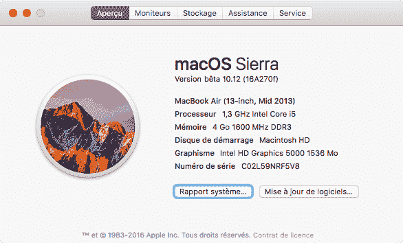

# 修复 macOS Sierra 上的自制程序

> 原文：<https://dev.to/clawfire/fixing-homebrew-on-macos-sierra-4p9o>

一个新版本的 macOS(顺便说一句，再见 os X)必然会在 homebrew 一级爆炸。和往常一样。更不用说像我一样，如果你还没有把头盔从`/opt/homebrew-cask/`移至`/usr/local/Caskroom/`，这显然是因为限制了`/usr/local/`的权限而需要额外的一个小步骤。

<figure>[](https://res.cloudinary.com/practicaldev/image/fetch/s--OyAHT36t--/c_limit%2Cf_auto%2Cfl_progressive%2Cq_auto%2Cw_880/https://cdn-images-1.medium.com/max/586/1%2AKNEboDgw8TxmPjnBqLyxOA.png) 

<figcaption>/拜拜 os。X</figcaption>

</figure>

### 步骤 1:更新 homebrew

```
brew update 
```

Enter fullscreen mode Exit fullscreen mode

### Step 2:设置权限&重新安装构建工具

```
sudo chown -R $(whoami) /usr/local 
```

Enter fullscreen mode Exit fullscreen mode

这时你也可以检查一下*布鲁尔医生*对你没有什么不好的反应。然后必须重新安装 macOS 的本机构建工具:

```
xcode-select --install 
```

Enter fullscreen mode Exit fullscreen mode

### Step 3:将头盔移到新目录中

```
mv /opt/homebrew-cask/Caskroom/* /usr/local/Caskroom/ 
```

Enter fullscreen mode Exit fullscreen mode

然后你可以毫不后悔地把旧的卷宗移走:

```
rmdir /opt/homebrew-cask/Caskroom 
```

Enter fullscreen mode Exit fullscreen mode

就是这样！您可以轻松安装和更新头盔。只要一点点 brew 升级就行了😉

* * *