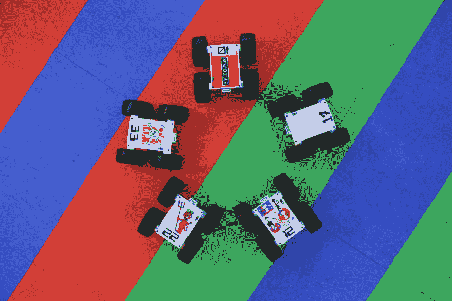

# 圆周率:赛车软件工程师

> 原文：<https://dev.to/thetuftii/formula-pi-racing-software-engineers>

这感觉有点无耻(和我以前的帖子完全不同)，但我对此非常兴奋，所以请原谅我！

[Formula Pi](https://www.formulapi.com) 是第一个基于 [Raspberry Pi](http://www.raspberrypi.org) 单板机的远程自主机器人比赛系列，我知道相当小众...

我在这场竞赛中有相当大的既得利益，不是来自开发者的背景，但是我是提供评论的人。它既可怕又迷人(比赛，不是我的评论)。

[T2】](https://res.cloudinary.com/practicaldev/image/fetch/s--vXVp2_Ax--/c_limit%2Cf_auto%2Cfl_progressive%2Cq_auto%2Cw_880/https://thepracticaldev.s3.amazonaws.com/i/k96zrzwu3esjzcr7gxfp.JPG)

该系列的想法是让软件工程师在一个公平的竞技场上相互竞争，即:从 Python 代码库开始，以改善他们选择的方式，或者从零开始，使用他们自己选择的语言，以及由 [PiBorg](https://www.piborg.org) 团队维护的标准化机器人。比赛大约每两周在 YouTube 上直播一次。

公式 Pi 的 Python 代码利用了 [OpenCV](http://opencv.org) 库，这是一个流行的开源计算机视觉库，它有一个用于实时处理图像数据的强大库。Formula Pi starter library 在 Raspberry Pi 上大量使用它和 Raspbian OS。

第一个系列决赛于 2017 年 1 月播出，其特点是:

*   Hayler-Goodalls:一个来自英国的家庭，
*   超级沃德兄弟:来自美国的兄弟，
*   英格玛团队:一个引擎专家团队，
*   加托·罗索车队:由前 F1 软件工程师组成的车队，
*   RasPerras del Infierno:来自西班牙的朋友，他们在酒吧聚会讨论他们的编程项目。

在不破坏最终结果的情况下，你可以在下面完整观看决赛:

[https://www.youtube.com/embed/3FI4xpWQ-SU](https://www.youtube.com/embed/3FI4xpWQ-SU)

让我惊讶的是参赛队伍的种类之多。业余爱好者、专业人士和学生在一个公平的竞技场上竞争，没有一个人的背景是明显的优势。它促成了一些真正激动人心的竞赛，任何人都有可能获胜！

第二季将于 4 月 26 日**18:00 BST**开始测试，可以在下面观看直播:

[https://www.youtube.com/embed/IFg-TQMXKb8](https://www.youtube.com/embed/IFg-TQMXKb8)

想了解更多关于这个系列的信息，请访问 [Formula Pi](https://www.formulapi.com/) 网站。