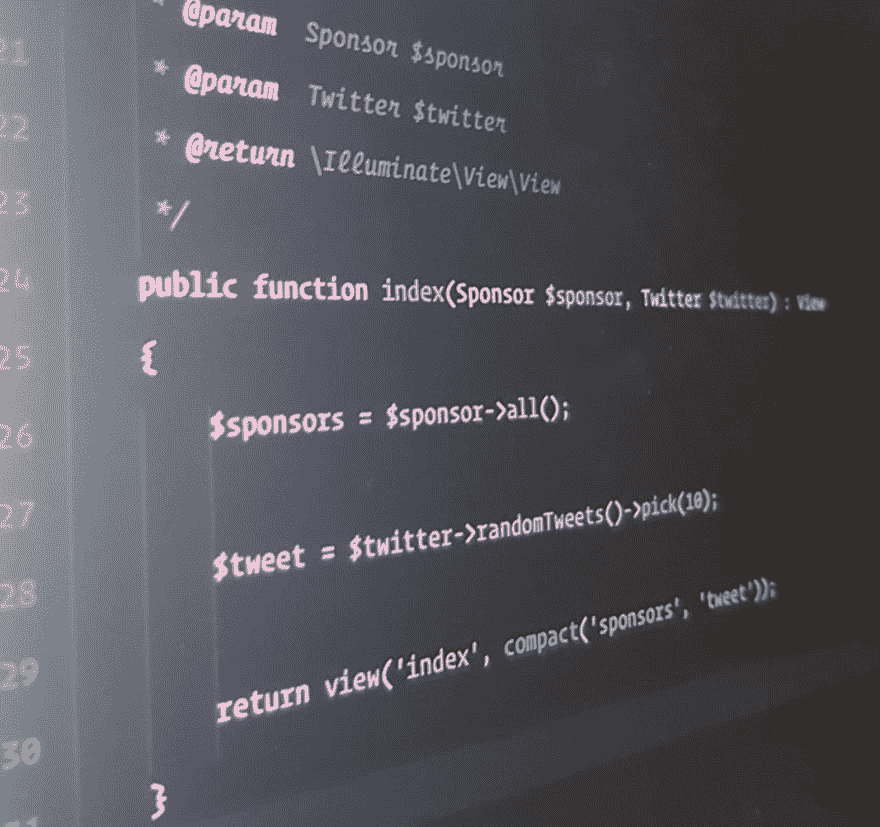

# 从用墨水写代码和日记到组织最大的拉腊维尔聚会

> 原文：<https://dev.to/neo/from-writing-code-in-ink--a-diary-to-organising-the-biggest-laravel-meetup>

[T2】](https://res.cloudinary.com/practicaldev/image/fetch/s--Euj6ZCzx--/c_limit%2Cf_auto%2Cfl_progressive%2Cq_auto%2Cw_880/https://thepracticaldev.s3.amazonaws.com/i/u3aeaykkgj1b6qqsrj4h.jpg)

在这个播客中，我将讲述我是如何成为一名开发人员的，以及在这个过程中我所面临的挑战。

我还讲述了我是如何从零到 350 RSVP 和 150 在等待名单上开始 [Laravel Nigeria](https://laravelnigeria.com) meetup 的；本质上使 T4 成为比大多数会议更大的聚会。

继续听，请告诉我你的想法，如果你受到启发。

播客链接:[S3 播客 Ep3](http://www.laravelpodcast.com/7b180dae)