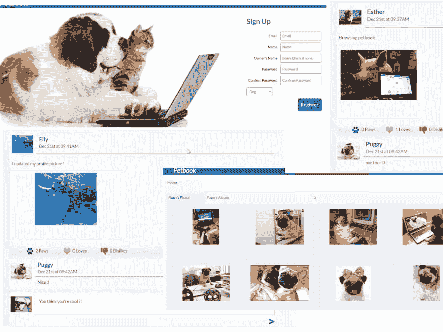
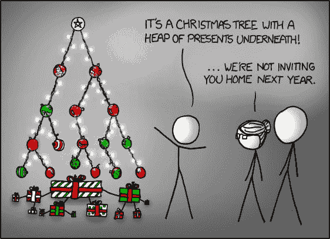
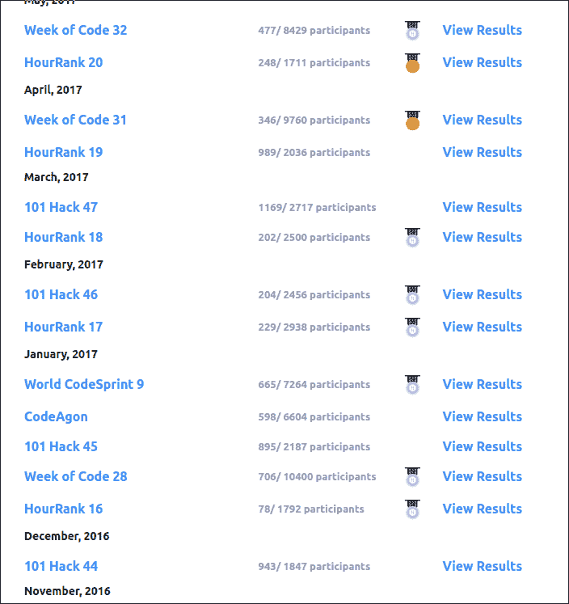

# 从零到英雄(我如何在一年内成为一名专业开发人员)

> 原文：<https://dev.to/enether/from-zero-to-hero-how-i-became-a-professional-developer-in-a-year>

我一直认为我会很难找到一份程序员的工作。刚开始的时候，我很容易被各种问题窒息。经常有人认为这不适合我。尽管我没有更好的选择，但我还是坚持走了下去。

高中毕业后，我决定放弃大学，转而投身于编程训练营。这只是在他们在保加利亚越来越受欢迎的时候，他们给了我希望，我可以比大学四年更快地找到工作。我有几个不上大学的主要原因

1.  我不想浪费 4 年时间去获得一些本可以少花的东西。是的，当然这四年并没有“浪费”,在那里学到的一切迟早会以直接或间接的方式(如数学)得到回报。

2.  我不想在接下来的 4 年里成为父母的经济负担。我知道如果我不得不同时工作，我就不能充分地学习，所以找工作是不可能的。

3.  我不确定这是否适合我，我害怕学习多年，一旦我尝到了职业世界的滋味，就会发现自己不喜欢它

## 开头

所以我冒险进入了编码训练营的世界，首先是在网上，学习编程的基础知识。为此，我想给软件大学( [www.softuni.bg](http://www.softuni.bg) )喊一声。他们的入门课程对我这样的初学者来说是无价的。两个小时的数组讲座、现场编码和材料上的大量挑战现在看起来似乎有些多余，但在当时它们被证明是非常有用的。SoftUni 有世界一流的编程入门课程，但没有英语讲座真的很遗憾，因为世界将从这些课程中受益匪浅。从那些试图通过其他课程/教程学习编程的人那里，我还没有在网上找到同样好的初学者编程课程。在我所见过的其他教材中，大多数教材浏览得太快，而且没有给出学生需要解决的问题，以便完全掌握教材。有些人甚至没有家庭作业！

无论如何，几门入门课程是远远不够的。我很快意识到，一个训练营是不够的，最初我决定建立一个与这些认证相匹配的作品集。我从简单开始，用 Python 构建了一个 [RPG 主机游戏](https://github.com/Enether/python_wow)。当然，这是一个非常简单的应用程序，但是我确实把它增加到了大约 5000 行代码，这在当时对我来说已经很多了。
这仍然不够，我又尝试了其他课程(一些在线课程，一些面对面课程)。我的工作量增加了，我发现自己一直要花 10 多个小时来掌握一切。虽然感觉很好，因为我真的可以看到进展。

我们现在接近新年，我有一个团队项目要做。和一个团队一起工作并不容易，尤其是分工。了解我，我做了大部分只是因为我想做(毕竟，你通过做来学习)，没有人反对。这是我们为宠物创造了一个真正愚蠢的脸书克隆人([https://github.com/codeBusters-softuni/petbook](https://github.com/codeBusters-softuni/petbook))

*这很可爱*

在这一点上，我对自己的技能相当有信心，并认为在新年的某个时候找到一份实习工作是下一步最好的选择。如果我想继续成长，是时候让专业人士包围我了。无意冒犯，但编码训练营的大多数人都没那么好。虽然你不能责怪训练营，只是这种形式吸引了那些想要“容易”进入高薪行业的人，但我跑题了。我决定，为了进入一家好公司，我需要了解大量的数据结构和算法。没问题，关于这个话题有很多资源。
事实证明，这种材料是迄今为止最坚硬的。突然，我又有了这样的感觉，也许我不适合做这个。当我花了两三天的时间实现了一棵红黑树*(古典的那种，没有这些左倾的垃圾变种)*时，这一切达到了高潮。这也是在圣诞节前后，因此我觉得一个强制性的 xkcd 已经到位:
 
从好的方面来说，最终掌握一个结构/算法是值得的，足以让我继续下去。

很快，我和一个朋友沉迷于算法的直接问题解决方面，并开始参加在线编程比赛。很明显，我们没有得到那么好的分数，但这很有趣，激励了进一步的学习。我觉得我在算法思维方面取得了重大进步，我鼓励每个人都尝试一下竞争性编程。接下来的几个月(12 月到 3 月)，我花了相当多的时间解决问题，写出数据结构，学习算法。
回想起来，我很高兴我花了一些时间在这些主题上，因为它们培养了我的弹性、逻辑思维和对技能的信心。实际上，我会继续在线学习算法课程*(我推荐[这个](https://www.coursera.org/learn/advanced-algorithms-and-complexity) )* ，总有一天我会回到竞争性编程中。
 
*我的‘战利品’*

受算法问题和竞赛平台 [Hackerrank](https://www.hackerrank.com) 的启发，我想做一个类似的东西，但带有我觉得缺失的功能。二月份，我开始了我的第三个项目——截稿日。这最初是作为一个黑客马拉松项目计划的，虽然它为我们赢得了 2017 年 WebIt 节的门票，但我和我的合作伙伴都知道我们将继续开发这个*(我们实际上仍然在做，在这里跟踪它的进展:[截止日期](https://github.com/two-man-army/deadline) )*

## 上班时间

我们现在大约是四月，是时候找份工作了。我相信我可以获得任何实习机会，因为我认为公司在实习生身上寻找的主要是他们的动机和潜力。我有足够的动力和大约 8 个月不间断的 Github 活动来证明这一点。从 12 月份开始，我就想尝试一下优步，尽管这似乎不太可行(为期一年的训练营/课程，并进入一家拥有世界上最顶尖工程师的顶级科技公司工作？【耶，对)】T2。尽管困难重重，我还是收到了面试的邀请。我欣喜若狂，整个过程都很开心。之后，我认为我有一个公平的机会进入，因为我尽了最大努力来展示我的动机、个性和抱负。技术问题一点也不难，我觉得我做得很好。
我没有被选中。这并不是一个大惊喜，尽管令人失望，但我很高兴我为之努力，因为它帮助我成为一名更好的工程师。

随着优步事件的结束，现在是我继续寻找的时候了。我想进入一家问题有趣的公司，作为一名工程师，我会找到最大的发展空间。我的下一个选择是 VMware，但是他们的招聘过程非常慢，我觉得我已经等够了。我开始向其他公司申请，并在 SumUp 得到了一个初级 Ruby 开发人员的职位。我以前没有使用 Ruby 的经验，但是我确信很快就学会了基础知识，并且在这一点上，我对编写 Ruby 感到非常舒服。

在这里，我们开发自己的产品，这是我在公司所看重的，我不想在外包公司工作。我喜欢我现在的工作，同事们都很棒，尽管我没能在我最初想要的地方工作，但我很高兴事情变成这样。
我期待与他们一起度过漫长的职业生涯，尽我所能发挥最大的影响力。他们信任我，我会确保偿还。

## 结论

最后，我觉得我这样更好，因为我决定暂时不上大学。我现在能上大学是因为对这个领域的渴望和好奇，而不是出于表面上的需要。如果我真的入学，我很有可能，我会对那里教授的材料有一个更清晰的认识，我会更欣赏它，因为我将能够更容易地看到它的应用。

作为这个故事的寓意，我想强调的是，在任何努力中，你不必走寻常路来获得成功，有时这甚至是更好的选择。要知道只要有足够的决心和努力，一切皆有可能。