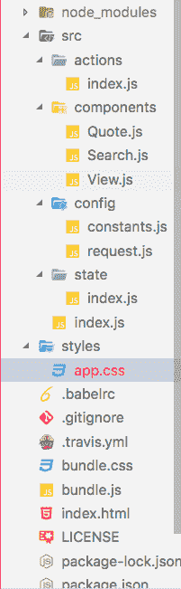

# Hyperapp 在 JavaScript 中的函数式编程

> 原文：<https://dev.to/aspittel/functional-programming-in-javascript-done-right-with-hyperapp-570f>

鉴于我在 Vue 和 React 上相当长的历史，我有点像一个叛徒，但我认为我有了一个新的前端框架。Hyperapp 是我希望 Elm 成为的一切——它易于构建代码，高度组织化，状态处理完美无缺。也就是说，它还不像前面提到的框架那样可以投入生产，但是一旦投入生产，我可以预见它将会非常庞大。

让我们从零开始构建一个 Hyperapp 应用程序——使用仍在出现的工具，我通常会更深入。我将为 Hyperapp 做同样的事情。

## 入门

几周前，我在 GitHub 上看到几篇关于 Hyperapp 发布 1.0 版本，超过 1 万颗星的文章。我简单看了一下他们文档中的计数器“hello world”。我真的很喜欢它看起来如此干净和简单，我想尝试一下！

```
const { h, app } = hyperapp

const state = {
  count: 0
}

const actions = {
  down: value => state => ({ count: state.count - value }),
  up: value => state => ({ count: state.count + value })
}

const view = (state, actions) =>
  h("div", {}, [
    h("h1", {}, state.count),
    h("button", { onclick: () => actions.down(1) }, "–"),
    h("button", { onclick: () => actions.up(1) }, "+")
  ])

window.main = app(state, actions, view, document.body) 
```

Enter fullscreen mode Exit fullscreen mode

你也可以使用 JSX 而不是调用`h`函数来创建元素。我就是这么做的，因为我已经习惯了！我浏览了 Hyperapp 的 Codepen 上的例子。我最终使用了一个[样板文件](https://github.com/selfup/hyperapp-one)，这样我就不必为传输 JSX 而设置 webpack 或者处理设置。这太棒了，我使用它没有任何问题，而且它有一个我喜欢使用的文件结构。

[T2】](https://res.cloudinary.com/practicaldev/image/fetch/s--IoVDeaWn--/c_limit%2Cf_auto%2Cfl_progressive%2Cq_auto%2Cw_880/https://thepracticaldev.s3.amazonaws.com/i/eac1hds9a1f4s87d4qw6.png)

Hyperapp 使用了受 Elm 启发的架构——它有视图、模型和更新。它也遵循功能哲学，类似于 Elm。这意味着状态是不可变的，动作没有副作用。状态管理感觉更像 Redux，而不是标准的 React，因为状态是集中的，而不是特定于组件的。此外，为了构建不纯的函数，您必须使用 [thunks](https://en.wikipedia.org/wiki/Thunk) 。架构和设置工作起来很流畅，我没有遇到任何问题。

由于我过去曾与 Elm、React、Redux、Vue 和 Vuex 一起工作过，所以在阅读了文档(这是最少的)并查看了代码示例之后，我认识到了这些模式并对继续进行最终项目感到满意。

## 最终项目

我想从 API 中构建一些东西——这在 Redux 中可能是一个相对混乱的过程。我心中没有一个，所以我浏览了这个列表，试图找到一个。我最终使用了[FavQs API](https://favqs.com/api)——我有一个想法，制作一个报价的旋转列表，可以搜索不同报价上的标签。这将允许我与政府有更多的互动。

我写的第一个代码是国家的模型。我为项目中需要的属性设置了初始属性:

```
export default {
  quotes: [],
  term: '',
  index: 0
} 
```

Enter fullscreen mode Exit fullscreen mode

在这里，像 TypeScript 或 Flow 这样的东西本来可以很好地强制输入。我相信它们可以很容易地集成到 hyperapp 项目中。

报价是从 API 返回的报价数组，如果用户指定了搜索项，那么这个搜索项就是搜索项，然后索引就是用户正在查看的报价的当前索引。

我有一个配置文件，在其中我定义了一些贯穿始终的常量:

```
export const API_URL = 'https://favqs.com/api/quotes/'
export const COLORS = ['#DBEBFF', '#FFBBDD', '#e6f9ff', '#BBBBFF', '#F7FFFD', '#fff8e1']
export const FONT_COLORS = ['#62D0FF', '#FF62B0', '#33ccff', '#5757FF', '#03EBA6', '#ffb300'] 
```

Enter fullscreen mode Exit fullscreen mode

我还创建了一个服务文件，其中保存了对我的搜索的 Axios(一个极简的 AJAX 库)请求:

```
import axios from 'axios'
import { API_URL } from './constants'

const getRequest = url => {
  return axios.get(url, {
    headers: {'Authorization': `Token token="XXXXXXXX"`}
  }).catch(
    err => console.log(err)
  )
}

export default {
  getAll: _ => getRequest(API_URL),
  getQuery: query => getRequest(API_URL + `?filter=${query}&type=tag`)
} 
```

Enter fullscreen mode Exit fullscreen mode

上述文件是框架不可知的，但我想把它们包含在上下文中。

潜在的最关键的文件保存了动作:

```
import request from '../config/request'

export default {
  getQuotes: quotes => (state, actions) => request.getAll().then(
    actions.setQuotes),
  submitSearch: quotes => (state, actions) => request.getQuery(
    state.term).then(actions.setQuotes),
  setQuotes: res => ({ quotes: res.data.quotes.filter(
    quote => quote.body && quote.body.length < 150) }),
  updateSearch: ({ term }) => ({ term }),
  next: e => ({ index, quotes }) => ({ index: index + 1 }),
  prev: e => ({ index, quotes }) => ({ index: index - 1 })
} 
```

Enter fullscreen mode Exit fullscreen mode

我对`getQuotes`和`submitSearch`使用了 thunks 这意味着我只是从一个函数而不是一个值来操作一个函数。这允许嵌套函数中有不纯的函数，特别是因为来自 API 的数据比函数式编程要求的更不可预测。因为 Axios 请求需要一点时间来执行，所以在从 API 获取数据之后，直到调用`setQuotes`方法，状态才真正更新。其他动作都比较直接！事件处理程序首先处理事件，然后处理当前状态——我确实觉得这有点“神奇”,但总体来说，操作体验非常流畅。

最后，我创建了视图。主视图是这样的:

```
import { h, app } from 'hyperapp'
import Search from './Search'
import Quote from './Quote'
import { COLORS, FONT_COLORS } from '../config/constants'

const quote = (quotes, index) => quotes[index]
const color = index => COLORS[index % COLORS.length]
const fontColor = index => FONT_COLORS[index % FONT_COLORS.length]

export default ({ quotes, index }, { getQuotes, updateSearch, submitSearch, next, prev }) =>
  <div
    oncreate={getQuotes}
    className={ quotes ? 'body' : 'body hidden' }
    style={{ 'backgroundColor': color(index), 'color': fontColor(index) }}
  >
    <div className='centered-content'>
      <div className='container'>
        { index > 0 &&
        <div
          onclick={prev}
          className='direction left'
          style={{ 'color': fontColor(index) }}>
            &lt;
        </div> }
        { quotes.length > 0 && <Quote quote={quote(quotes, index)} /> }
        { index < quotes.length - 1 &&
        <div
          onclick={next}
          className='direction right'
          style={{ 'color': fontColor(index) }}>
            &gt;
        </div> }
        <Search
          updateSearch={updateSearch}
          submitSearch={submitSearch}
        />
      </div>
    </div>
  </div> 
```

Enter fullscreen mode Exit fullscreen mode

它看起来与 React 中的功能组件基本相同！事件处理程序是小写的，但是 JSX 是相同的。生命周期方法也有一点不同。我通常会在 React 中使用`componentDidMount`方法来发出 API 请求，但是这里我使用了`oncreate`属性。它们本质上做同样的事情，但是语法不同。我也没有看到订阅的文档，这在 Elm 中很重要。它们允许您使用 Websockets 并添加全局事件侦听器。不过，GitHub 的一些问题提到了它们，所以我认为它们已经实现了，但还没有出现在文档中。

我还有两个“子组件”，引用的那个非常简单:

```
import { h, app } from 'hyperapp'

export default ({ quote }) =>
  <div className='quote'>
    <h1>{quote.body}</h1>
    <h4>{quote.author}</h4>
  </div> 
```

Enter fullscreen mode Exit fullscreen mode

搜索的也是:

```
import { h, app } from 'hyperapp'

export default ({ updateSearch, submitSearch }) =>
  <div className='search'>
    <input
      onkeyup={
        e => {
          e.keyCode === 13 ? submitSearch() : updateSearch({ term: e.target.value })
        }
      }
      placeholder='Search quote tags...'
    />
  </div> 
```

Enter fullscreen mode Exit fullscreen mode

最后，`index.js`组合了来自其他文件的元素，以便可以在动作和视图中使用状态。

```
import { app } from 'hyperapp'
import actions from './actions'
import state from './state'
import view from './components/View'

app(state, actions, view, document.querySelector('.hyperapp-root')) 
```

Enter fullscreen mode Exit fullscreen mode

这种绑定本质上与 Elm 组合元素的方式相同！

我喜欢把我的代码分成多个文件，我认为这真的是可伸缩的。我可以肯定地看到自己在未来用 HyperApp 建立更大的东西。

[T2】](https://res.cloudinary.com/practicaldev/image/fetch/s--NcWlfXKp--/c_limit%2Cf_auto%2Cfl_progressive%2Cq_auto%2Cw_880/https://thepracticaldev.s3.amazonaws.com/i/ps4evuwa0rhlaxbvpm2n.png)

## 下一步

再说一次，Hyperapp 是我最近学到的最喜欢的工具之一——可能仅次于 Golang。我发现这是我过去使用的工具的近乎完美的结合。它也是一个微型库，而且超级高效，尤其是与 Angular 相比，这是令人兴奋的，这是我上周学到的！它的 API 是如此的简洁，而且它将函数式编程执行得如此之好。我肯定会推荐把它作为一个 onramp 来学习，来和 Redux 反应。我会 100%再次使用 HyperApp，我发现它很简单，我真的很喜欢代码的优雅。我真的希望社区不断扩大，文档不断改进，并且实现一个像 Redux/Elm 一样的回放特性。另外，我对 Hyperapp 有很好的体验，我已经打算再次使用它了！

[App](https://www.alispit.tel/hyperapp-quote-app/)
[代码](https://github.com/aspittel/hyperapp-quote-app)

**我的一部分[关于学习新事物](https://medium.com/on-learning-new-things/learning-new-things-f4db7f16724)系列**

其他类似文章:

*   [学榆树](https://dev.to/aspittel/how-i-finally-built-an-app-in-elm-a80)
*   [学习角度 5](https://dev.to/aspittel/learning-angular-5-as-a-react-and-vue-developer-5dp3)