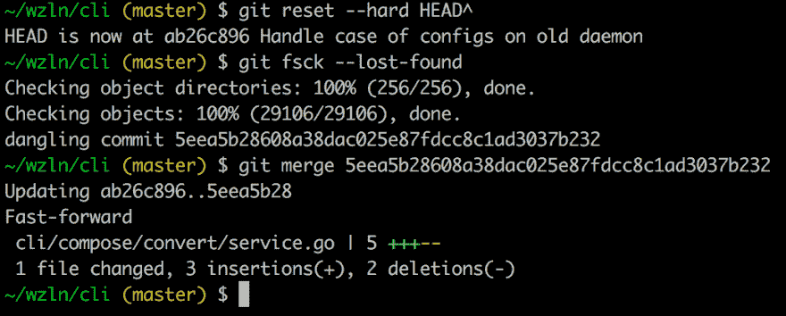

# Git 中的垃圾收集

> 原文：<https://dev.to/plutov/garbage-collection-in-git>

[T2】](https://res.cloudinary.com/practicaldev/image/fetch/s--XRFibc9E--/c_limit%2Cf_auto%2Cfl_progressive%2Cq_auto%2Cw_880/http://pliutau.com/git-gc.png)

为了理解 git 垃圾收集器，我们需要理解分支是如何工作的。分支只是指向提交的指针，每当创建新的提交时，分支就会移动。

每当您执行`git commit --amend`或`git rebase`时，就会创建一个新的提交对象。但是旧的会怎么样呢？旧的提交对象保留在数据存储中。你看不到它们的原因是因为没有指向它们的指针。

此外，`git reflog`存储先前分支指针的列表。换句话说，即使您删除了一个分支，reflog 仍然会显示它。

只有当您运行一个`git gc`时，您才会丢失您的旧对象，它将存储库重新打包成一个更有效的结构。一些 git 命令可能会自动运行`git gc`。

所以，你只是做了一个`git reset --hard HEAD^`并放弃了你的最后一次提交。原来你真的需要这些改变。当您执行重置时，您丢弃的提交将进入`dangling`状态。它仍然在 Git 的数据存储中，等待下一次`git gc`执行来清理它。因此，除非你已经运行了一个`git gc`，因为你删除了它，你可以找到它。

`git fsck`命令将显示您在`dangling`状态下的提交。

*[我博客里的原创文章](http://pliutau.com/git-gc/)*