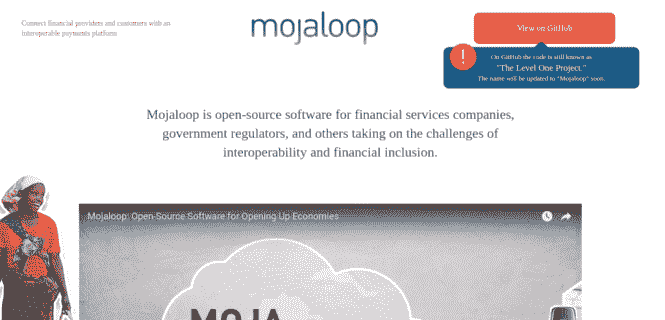

# 盖茨基金会的新开源软件为发展中国家的金融服务铺平了道路。

> 原文：<https://dev.to/xeroxism/gates-foundation-new-open-source-software-to-pave-the-way-in-financial-services-in-developing-nations-1kle>

## Mojaloop 是一款开源软件，面向金融服务公司、政府监管机构以及其他面临互操作性和金融包容性挑战的机构。

[T2】](https://i1.wp.com/fossnaija.com/wp-content/uploads/2017/10/Bill-Melinda-Gates-Foundation-fossnaija.jpg?ssl=1)

对于数十亿没有银行账户的人来说，简单的交易，如电子支付租金或为孩子注册入学，往往是遥不可及的。尽管发展中国家的数字金融服务正在兴起(受移动电话日益普及的推动)，但由于不同银行和金融服务提供商之间的不兼容，进展缓慢。每个机构都必须建立自己的技术来接受支付，这意味着员工可能无法轻松地将工资转移到杂货店或亲戚那里。

[T2】](https://i2.wp.com/fossnaija.com/wp-content/uploads/2017/10/mojaloop_homepage_fossnaija.png?ssl=1)

为了解决这个问题(结束金融服务的循环)，比尔和梅林达·盖茨基金会发布了一款新的 <u>[开源软件](https://fossnaija.com/open-source-really-matter-control-not-code/)</u> 用于创建支付平台，帮助世界各地没有银行账户的人获得数字金融服务。 <u>[软件](http://mojaloop.io/)</u> 旨在为整个国家经济中的银行和其他提供商之间的支付互操作性提供参考模型。

<u>[moja loop](http://mojaloop.io/)</u>——改编自“moja”，斯瓦希里语中“一”的意思——连接了用户接收和发送资金的不同方式，这样他们的资金就不会存放在一两个账户中。

**为什么要做？**

该项目网站称，“客户应该能够向任何人发送数字支付，无论他们使用何种账户或服务。Mojaloop 使金融提供商更容易实现互操作性”。

**是给谁的？**

该项目网站称:“任何从事金融服务的人都被邀请探索并使用 <u>[这一代码。](https://github.com/LevelOneProject/leveloneproject)</u> 特别是，它使中央银行、市场基础设施、支付处理商和金融科技公司能够加速创建和部署可互操作的支付平台，从而为穷人服务。它为现有的支付处理商和提供商提供了一个公平的竞争环境”。

这对开源来说是一个很好的例子。因为这是一种重新认识现实的方式，即开源也是在解决世界问题时最大化努力和实现精彩创新的方式。

快乐的 Linux！

波斯特盖茨基金会的新开源软件为发展中国家的金融服务铺平了道路。最早出现在[福斯奈亚](https://fossnaija.com)上。