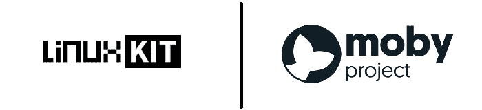
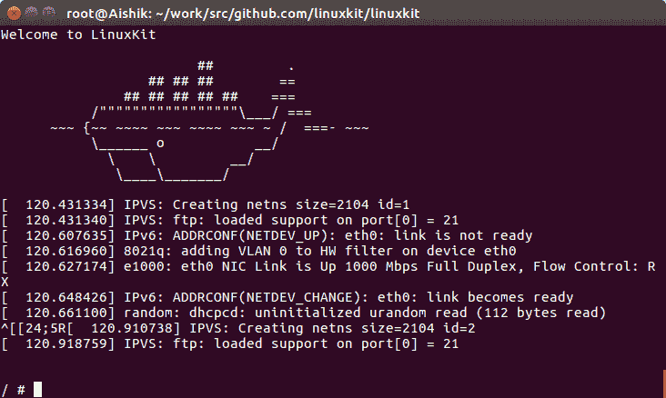

# LinuxKit 和莫比项目入门

> 原文：<https://dev.to/thecodeboy/getting-started-with-linuxkit-and-moby-project>

[T2】](https://res.cloudinary.com/practicaldev/image/fetch/s--cM_1owfU--/c_limit%2Cf_auto%2Cfl_progressive%2Cq_auto%2Cw_880/https://thepracticaldev.s3.amazonaws.com/i/x1de1f01ohxtejhx88ge.png)

你可能已经读过 LinuxKit 和 T2 的莫比项目。如果您还没有，建议您在我们开始之前完成。

莫比是一个装配专业集装箱系统的框架。它有一个容器组件库和一个将这些组件组装成独立容器平台的框架。目前 Docker 正被分解成模块化组件。未来 Docker 将由莫比包装的这些组件组装而成。

LinuxKit 是一个构建最小 Linux 发行版的工具包。它使用莫比构建发行版映像并使用 LinuxKit 工具运行它们。默认情况下，它是安全的。

现在让我们开始吧。你需要安装 Docker 和 Golang。如果您需要帮助，请阅读[安装对接器](https://medium.com/aishik/easiest-way-to-install-docker-on-ubuntu-4206a4172ba1)和[安装 Golang](https://medium.com/aishik/install-golang-the-right-way-4743fee9255f) 。

### 1。安装莫比构建工具。

`$ go get -u github.com/moby/tool/cmd/moby`

### 2。安装 LinuxKit 工具。

`$ go get -u github.com/linuxkit/linuxkit/src/cmd/linuxkit`

### 3。将目录切换到 LinuxKit 存储库。这将在您的 Golang 安装目录中。

`$ cd /usr/local/go/src/github.com/linuxkit/linuxkit`

找不到 LinuxKit 库？没问题。只需再次从 GitHub 克隆存储库。`$ git clone https://github.com/linuxkit/linuxkit`

### 4。构建示例配置文件“linuxkit.yml”。

`$ moby build linuxkit.yml`

这个命令提取一个 Linux 内核，添加 YAML 文件中提到的组件，并构建一个独立的 Linux 发行版。如果出现任何错误，只需再次运行该命令。我不得不跑了 5 次。这是输出。

```
root@Aishik:~/work/src/github.com/linuxkit/linuxkit# moby build linuxkit.yml
Extract kernel image: linuxkit/kernel:4.9.x
Add init containers:
Process init image: linuxkit/init:f71c3b30ac1ba4ef16c160c89610fa4976f9752f
Process init image: linuxkit/runc:b0fb122e10dbb7e4e45115177a61a3f8d68c19a9
Process init image: linuxkit/containerd:60e2486a74c665ba4df57e561729aec20758daed
Process init image: linuxkit/ca-certificates:5fc6ba7f91534ddbfef975404c33e44581e6ed7a
Add onboot containers:
  Create OCI config for linuxkit/sysctl:2cf2f9d5b4d314ba1bfc22b2fe931924af666d8c
  Create OCI config for linuxkit/binfmt:aebd6ed6cc29921371ca78314697881086f4577a
  Create OCI config for linuxkit/dhcpcd:8837289b78ecd80f59524883085424e115dd0b3a
Add service containers:
  Create OCI config for linuxkit/rngd:c42fd499690b2cb6e4e6cb99e41dfafca1cf5b14
  Create OCI config for nginx:alpine
Add files:
  etc/docker/daemon.json
Create outputs:
  linuxkit-kernel linuxkit-initrd.img linuxkit-cmdline
  linuxkit.iso
  linuxkit-efi.iso 
```

Enter fullscreen mode Exit fullscreen mode

### 5。运行在上一步中创建的 Linux 映像。

`$ linuxkit run linuxkit`

这个命令引导到莫比创建的 Linux 映像。这是输出。这是一个最小的 Linux 发行版。您可以键入命令并进行尝试。使用`halt`命令终止控制台。

[T2】](https://res.cloudinary.com/practicaldev/image/fetch/s--j6pxnUYY--/c_limit%2Cf_auto%2Cfl_progressive%2Cq_auto%2Cw_880/https://thepracticaldev.s3.amazonaws.com/i/jn3wof6mplm07nwvq2f4.png)

经过仔细观察，我们的最小发行版变成了 **Alpine Linux** 。使用下面的命令亲自查看。

`/ # cat /etc/alpine-release`

它给出以下输出。

```
cat /etc/alpine-release
3.5.2 
```

Enter fullscreen mode Exit fullscreen mode

接下来，我们可以看到我们的最小系统中安装了什么。

```
/ # apk info

musl
busybox
alpine-baselayout
alpine-keys
libressl2.4-libcrypto
libressl2.4-libssl
zlib
apk-tools
scanelf
musl-utils
libc-utils 
```

Enter fullscreen mode Exit fullscreen mode

* * *

所以我们使用 LinuxKit 和莫比成功地构建了我们自己的最小 Linux 发行版。您可以根据需要编辑 YAML 配置文件，并构建安全、精简的 Linux 发行版来运行您的容器化应用程序。

LinuxKit 和莫比都很棒，但是你需要它吗？如果您需要构建定制的 Linux 发行版，那么这是非常好的，可以节省您大量的时间。但是，如果你只是想在容器上运行你的应用程序，那么你就没有必要去修改莫比。Docker 会为你工作得很好。

### 资源:

[Docker 博客—介绍莫比项目](https://blog.docker.com/2017/04/introducing-the-moby-project/)
[Docker 博客—宣布 Linux kit](https://blog.docker.com/2017/04/introducing-linuxkit-container-os-toolkit/)
[GitHub—Linux kit](https://github.com/linuxkit/linuxkit)
[莫比项目—官方网站](https://mobyproject.org/)

* * *

*原发布于[媒体](https://medium.com/aishik/getting-started-with-linuxkit-and-moby-project-ff7121c4e321)。*