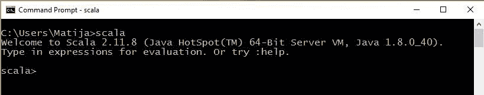
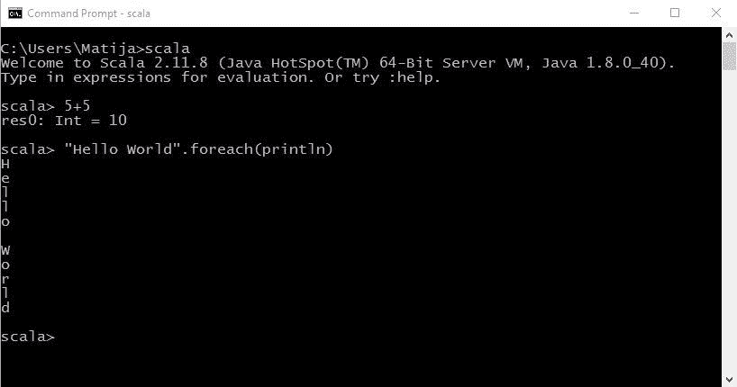
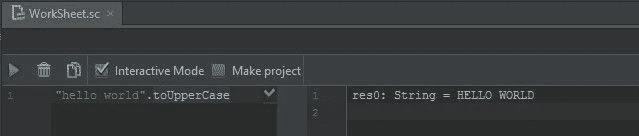

# Scala 入门

> 原文：<https://dev.to/mkovacek/getting-started-with-scala-1oci>

所以你想写你的第一个 Scala 应用？在此之前，你需要在 PC 上安装 Scala，并了解一些基本语法。

首先需要安装 [*Java JDK*](http://www.oracle.com/technetwork/java/javase/downloads/index-jsp-138363.html) 和 [*Scala 二进制*](http://www.scala-lang.org/download/) 。要检查你是否成功安装了 scala，只需在命令提示符或终端中写下命令“Scala ”,如果一切正常，你会看到一条欢迎消息。

[T2】](https://res.cloudinary.com/practicaldev/image/fetch/s--PzFgo_qU--/c_limit%2Cf_auto%2Cfl_progressive%2Cq_auto%2Cw_880/https://cdn.sanity.img/0a8atbln/production/4e0761724cc5042df19ae703687684c393436d30-819x161.jpg)

Scala 有*REPL*(Read-Eval-Print-Loop)，它允许你编写 Scala 代码，并立即在命令提示符/终端中看到代码的结果。 *REPL* 允许你试验各种 Scala 表达式，并立即看到结果。

[T2】](https://res.cloudinary.com/practicaldev/image/fetch/s--nSWjH4Rz--/c_limit%2Cf_auto%2Cfl_progressive%2Cq_auto%2Cw_880/https://cdn.sanity.img/0a8atbln/production/dbaaeacb001ee409f5ddff651278b9d763026fdf-818x430.jpg)

如果你不喜欢 cmd/终端，你可以使用你最喜欢的 IDE 或者文本编辑器。IntelliJ、Eclipse 和 NetBeans 对编写 Scala 代码有很好的支持。另外，如果你想在你的 IDE 中使用 REPL，你必须创建 Scala 工作表，你可以在其中试验你的代码。

[T2】](https://res.cloudinary.com/practicaldev/image/fetch/s--TeBrKHuf--/c_limit%2Cf_auto%2Cfl_progressive%2Cq_auto%2Cw_880/https://cdn.sanity.img/0a8atbln/production/b41878d2de3624ca31e987c445632da7f5a0a16c-639x136.jpg)

## **Scala 语法**

**变量声明**

在 Scala 中，有两种类型的变量，不可变的和可变的。不可变变量是只读的，这意味着当你声明一个变量时，以后你不能给这个变量赋新的值/对象。不可变变量用关键字 ***、val*** 声明。

```
val name: String = "Scala"

//shorter
val newName = "Scala"

// you can't assign new value
newName = "Java" // Error: reassignment to val name = "Java" 
```

Enter fullscreen mode Exit fullscreen mode

可变变量用关键字 ***var*** 声明，以后你可以给这个变量分配新的值/对象。

```
var age = 23

//you can assign new values
age = 24
age = 25 
```

Enter fullscreen mode Exit fullscreen mode

所以关键字 ***val*** (不可变)和 ***var*** (可变)指定引用是否可以更改为不同的对象(var)或者不可以(val)。

要声明变量你需要选择是想要 ***不可变*** (val)还是 ***可变*** (var)变量。然后你写名字，在名字后面你可以选择写变量的类型，在等式的右边你可以赋值，对象或者表达式。定义类型是可选的，因为编译器可以从等式的右边计算出来。

```
val nameOfImmutableVariable: type = value
var nameOfMutableVariable: type = value 
```

Enter fullscreen mode Exit fullscreen mode

**方法声明**

方法声明以关键字***【def】*****开头，后面是可选参数列表、可选返回类型和方法的等号体。** 

```
def methodName (argument: argumentType): returnType = {
  //body of the method
} 
```

Enter fullscreen mode Exit fullscreen mode

不返回值的方法有一个 ***单元*** 类型。

```
def printHelloWorld: Unit = {
  println("Hello world")
} 
```

Enter fullscreen mode Exit fullscreen mode

此外，您不必编写 return 关键字来从方法中返回一些值，只需编写想要返回的值或某个对象即可。

```
def sum(a: Int, b: Int): Int = {
  a + b
} 
```

Enter fullscreen mode Exit fullscreen mode

Scala 方法可以写得更加简洁。不必指定返回类型，也不需要在 short 方法的主体周围加上括号。

```
def sum(a: Int, b: Int) = a + b 
```

Enter fullscreen mode Exit fullscreen mode

当你使用方法时，Scala 是灵活的。你可以用两种方式调用对象方法，第一种方式是用点字符在对象上调用方法，第二种方式就像你写一个句子。

```
someobject.methodName()
//or
someobject methodName() 
```

Enter fullscreen mode Exit fullscreen mode

同样重要的是，当你调用不带参数的方法并且没有副作用(纯函数)比如改变对象的状态或者 I/O 操作时，你不需要在方法名后面加圆括号。

```
List(1,2,3,4,5).size // 5
List(1,2,3,4,5).size() // error 
```

Enter fullscreen mode Exit fullscreen mode

**类**

要创建 Scala 类，你需要写关键字“class”和类名。Scala 类的主构造函数组合了构造函数参数，这些参数定义在类名、表达式和类体中调用的方法之后。根据构造函数参数和字段类型，Scala 自动生成 getter 和 setter 方法。因此，如果一个字段是可变的，那么 getter 和 setter 方法都会生成，如果一个字段是不可变的，那么只有 getter 方法会生成。

```
class Person(val firstName: String, val lastName: String){
  println("beginning of the constructor")
  var age = 25
  def printInfo = println("Firstname: " + firstName + ", lastname: " + lastName + ", age: " + age)
  printInfo
  println("end of the constructor")
}

val person = new Person("Matija","Kovacek")
/*
beginning of the constructor
Firstname: Matija, lastname: Kovacek, age: 25
end of the constructor
*/
// getter 
person.firstName
//setter
person.age = 30 
```

Enter fullscreen mode Exit fullscreen mode

**没有分号**

你可能已经注意到，在前面的例子中，我没有使用分号。Scala 将行尾视为语句或表达式的结尾，所以你不必加上分号。当您想在同一行上放置多个语句或表达式时，只需使用分号。**