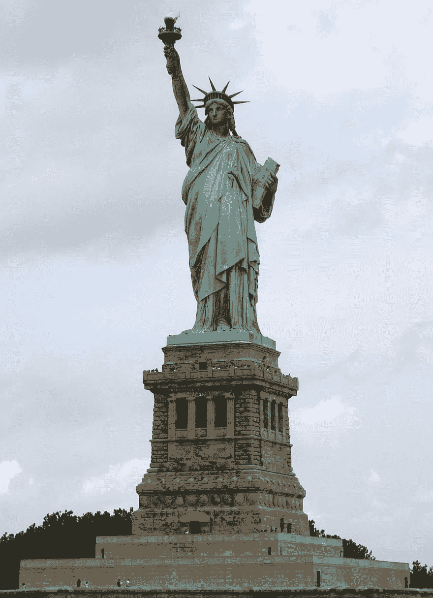
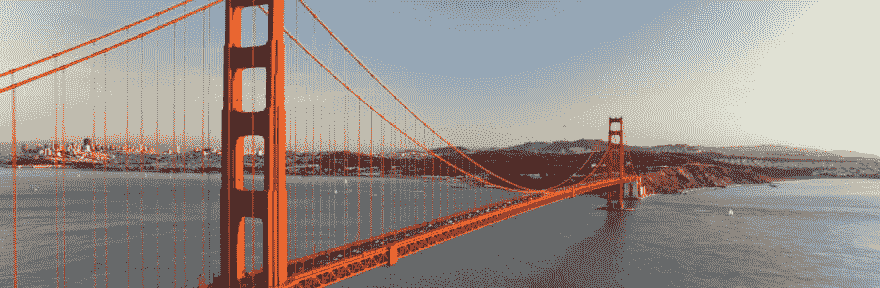

# 开始按地理位置搜索

> 原文：<https://dev.to/clarifai/getting-started-with-search-by-geo-location-42g>

事实:Clarifai 的搜索 API 允许你通过视觉相似性搜索你的图片和视频。鲜为人知的事实:它还可以让您通过地理位置数据搜索您的媒体！了解有关此功能的更多信息，以及如何将它应用到您自己的开发人员应用程序中。

* * *

Search API 允许您将图像发送到 Clarifai，并使用概念及其可视化表示对它们进行索引。它们被编入索引后，您可以使用概念(例如狗)或图像(例如视觉上相似的狗)来搜索您的输入。Clarifai 可以通过在我们的输入(如地理位置数据)中添加额外的数据点来扩展这种搜索。按地理位置搜索可作为输入的过滤器，因此您只能获得指定范围内的结果。

我们将查看将地理位置数据附加到您的输入中，然后使用不同的距离测量值查询该数据，以查看结果的变化。对于本教程，我们将使用 [Node.js](https://nodejs.org) 。让我们从用
安装官方 [Clarifai JavaScript 客户端](https://github.com/Clarifai/clarifai-javascript)开始

```
npm install clarifai 
```

Enter fullscreen mode Exit fullscreen mode

### 添加输入

你需要[注册 Clarifai 的](https://clarifai.com/developer/signup)和[创建一个应用](https://clarifai.com/developer/guide/applications#applications)才能开始。使用 [URL 或字节](https://clarifai.com/developer/guide/search#add-images-to-search-index)添加输入。除了您的输入源，我们还将添加一个包含 GPS 坐标(经度和纬度)的 geo 对象。请记住，坐标系使用的是基本方向:北、南、东和西。北和东将是正数，南和西将是负数。

下面我们将使用来自维基百科的 URL 添加[一张自由女神像的图片:](https://upload.wikimedia.org/wikipedia/commons/thumb/a/a1/Statue_of_Liberty_7.jpg/1200px-Statue_of_Liberty_7.jpg)

[](https://res.cloudinary.com/practicaldev/image/fetch/s--mVxz8IE---/c_limit%2Cf_auto%2Cfl_progressive%2Cq_auto%2Cw_880/https://upload.wikimedia.org/wikipedia/commons/thumb/a/a1/Statue_of_Liberty_7.jpg/1200px-Statue_of_Liberty_7.jpg)T3】

```
const Clarifai = require('clarifai')
const app = new Clarifai.App({ apiKey: 'YOUR_API_KEY_HERE' })

app.inputs.create({
  url: "https://upload.wikimedia.org/wikipedia/commons/thumb/a/a1/Statue_of_Liberty_7.jpg/1200px-Statue_of_Liberty_7.jpg",
  geo: {
    latitude: 40.689247,
    longitude: -74.044502
  }
}) 
```

Enter fullscreen mode Exit fullscreen mode

并且使用来自历史的金门大桥的[本地图像和用于文件到 base64 转换的函数:](http://cdn.history.com/sites/2/2015/02/golden-gate-bridge-iStock_000019197672Large-H.jpeg)

[](https://res.cloudinary.com/practicaldev/image/fetch/s--cl4w7us4--/c_limit%2Cf_auto%2Cfl_progressive%2Cq_auto%2Cw_880/http://cdn.history.com/sites/2/2015/02/golden-gate-bridge-iStock_000019197672Large-H.jpeg)T3】

```
const Clarifai = require('clarifai')
const app = new Clarifai.App({ apiKey: 'YOUR_API_KEY_HERE' })

const convert_bytes = (img) => {
  const img_file = fs.readFileSync(img)
  return new Buffer(img_file).toString('base64')
}

app.inputs.create({
  base64: convert_bytes('./golden_gate.jpg')
  geo: {
    latitude: 37.807812,
    longitude: -122.475164
  }
}) 
```

Enter fullscreen mode Exit fullscreen mode

### 搜索图片

一旦你的图片上传，你就可以在搜索中使用它们。当按地理位置搜索时，您可以使用一个点和给定的“几英里内”、“几公里内”、“几度内”或“几弧度内”的半径来优化您的结果。

假设我们只想要纽约市的帝国大厦一英里范围内的图像结果(因为它自然是世界上最好的城市)。我们的搜索应该是这样的:

```
app.inputs.search({
  input: {
    geo: {
      latitude: 40.748817,
      longitude: -73.985428,
      type: 'withinMiles',
      value: 1.0
    }
  }
}).then((response) => { console.log(response.hits)})

// Response
[] 
```

Enter fullscreen mode Exit fullscreen mode

由于范围太小，上面的示例没有返回任何结果。如果我们增加这个值，我们将得到我们的命中。

```
app.inputs.search({
  input: {
    geo: {
      latitude: 40.748817,
      longitude: -73.985428,
      type: 'withinMiles',
      value: 7.0
    }
  }
}).then((response) => { console.log(response.hits)})

// Response
[{ 
  score: 1,
  input: { 
    id: 'd7b80aac52f14399b98a9472fc201e64',
    data: [ 
      { 
        score: 1,
        input: { 
          id: 'd7b80aac52f14399b98a9472fc201e64',
          data: { 
            image: { 
              url: 'https://upload.wikimedia.org/wikipedia/commons/thumb/a/a1/Statue_of_Liberty_7.jpg/1200px-Statue_of_Liberty_7.jpg' },
              concepts: [
                { 
                id: 'statue',
                  name: 'statue',
                  value: 1,
                  app_id: 'fb70b904750c4891aecddf82082181c2' 
                },
                { 
                  id: 'bridge',
                  name: 'bridge',
                  value: 0,
                  app_id: 'fb70b904750c4891aecddf82082181c2' 
                }
              ],
              metadata: {},
              geo: { 
                geo_point: { 
                  longitude: -74.0445, 
                  latitude: 40.689247 
                }
              }
          },
          created_at: '2017-09-05T17:52:38.616686Z',
          modified_at: '2017-09-05T17:52:39.029363Z',
          status: [Object] 
        } 
      } 
    ],
    created_at: '2017-09-05T17:52:38.616686Z',
    modified_at: '2017-09-05T17:52:39.029363Z',
    status: [Object] 
  } 
}] 
```

Enter fullscreen mode Exit fullscreen mode

搜索结果会给我们一系列匹配。数组中的每个对象都是匹配搜索标准的输入之一。这还包括一个分数，该分数将指示该结果与我们的查询的匹配程度。每当想要访问与特定对象相关的任何数据时，都需要访问它的 input.data 键。您可以看到它附加了哪些自定义概念、地理位置数据或自定义元数据。您还可以在这个对象中找到输入的原始 url 或字节。

### 结论

搜索 API 是一个强大的工具，使用地理位置进行搜索只是开发者众多有用功能中的一个。您可以使用搜索 API 做更多事情，例如:

*   使用[公共](https://clarifai.com/developer/guide/searches#by-public-concepts)或[定制](https://clarifai.com/developer/guide/searches#by-custom-concepts)概念进行搜索
*   在输入中使用您自己的[自定义元数据](https://clarifai.com/developer/guide/searches#by-custom-metadata)进行搜索
*   使用[and](https://clarifai.com/developer/guide/searches#search-anding)组合搜索选项

如果您有任何问题、顾虑，甚至是友好的留言，请随时通过[hackers@clarifai.com](//mailto:hackers@clarifai.com)联系我们，或者在下面发表评论！

* * *

*原载于 [Clarifai 博客](//blog.clarifai.com)T3】*