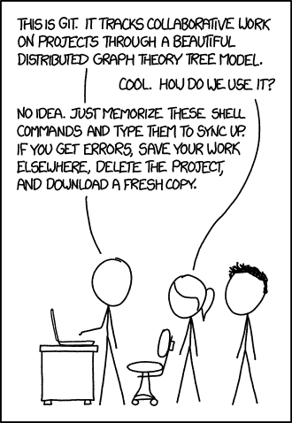
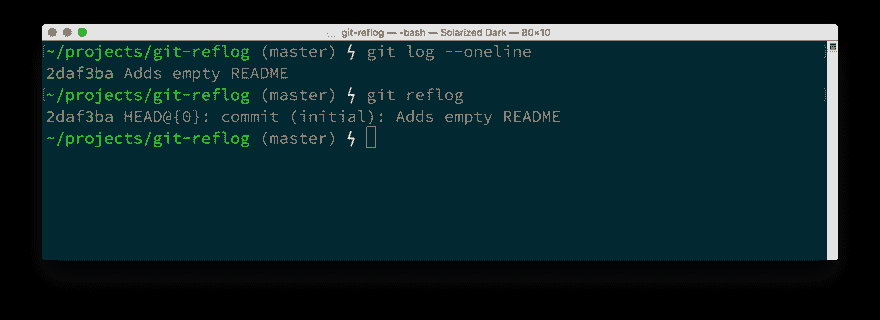
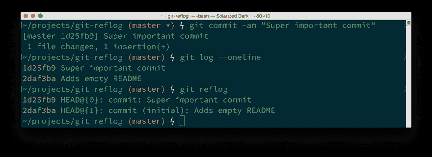
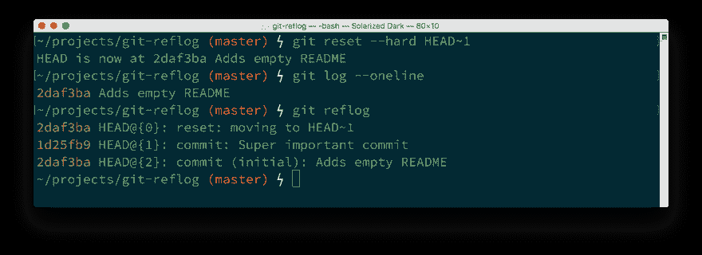
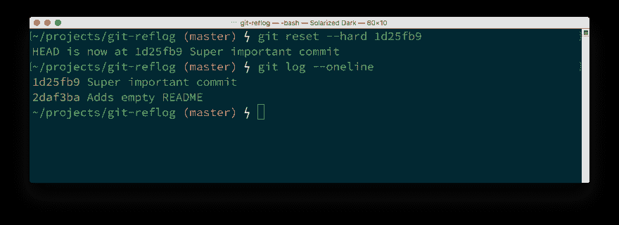
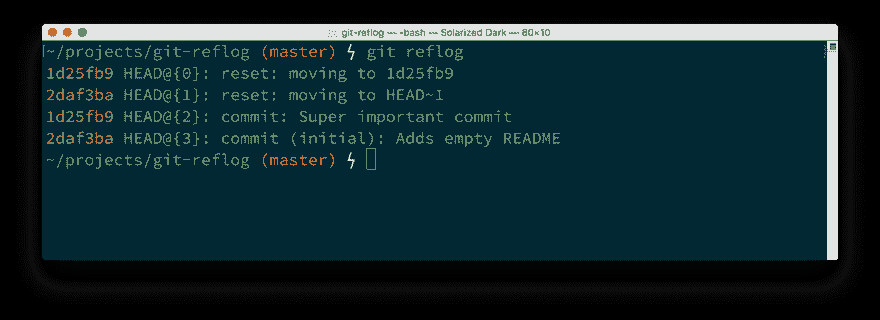

# 回到未来

> 原文：<https://dev.to/philnash/git-back-to-the-future-e2g>

Git 可能是我用过的最好的版本控制软件，但它是一个复杂的怪兽，很容易搬起石头砸自己的脚。然而，最近我学到了一种方法，你可以摆脱困境，并有可能为自己节省几个小时的工作时间。

[T2】](https://www.xkcd.com/1597/)

当你做错事时，这个词很有用。您可以让时间倒流并撤销提交。

撤消一次提交，并将该提交的工作留在工作目录中。

`git reset --hard HEAD~1`删除提交和所有工作。

`--soft`旗和`--hard`旗的区别在于你可能会搬起石头砸自己的脚。我知道我把两者搞混了，丢了工作。至少我是这么认为的。

## 输入参考日志

事实证明，git 比我们想象的更密切地关注着我们。当我们对任何分支进行更改时，git 会将这些更改存储在 reflog 中。即使我们通过用`--hard`标志重置来移除一大堆工作，git 仍然知道我们所做的提交，并且我们可以恢复它们。关键是提交仍然存在，只是目前没有任何分支指向它们。这就是 reflog 发挥作用的地方。它记录了回购中的所有提交以及其他操作，我们可以用它来恢复这些丢失的提交。

### 警告！

在我向您展示这是如何工作的之前，请注意以下几点。如果在工作目录中有未提交的更改，并且使用了`git reset --hard`,那么再多关于 reflog 的奇特的 git 知识也无法恢复。下面将只保存您已经提交的工作。被警告！

## 如何使用 reflog 恢复丢失的提交

这里有一个例子，我有一个回购，有一个提交。运行`git log --oneline`和`git reflog`都显示提交具有散列`2daf3ba`。

[T2】](https://res.cloudinary.com/practicaldev/image/fetch/s--44YLHx4Q--/c_limit%2Cf_auto%2Cfl_progressive%2Cq_auto%2Cw_880/https://philna.img/reflog1.png)

现在我们做一个承诺，当然是重要的事情。

[T2】](https://res.cloudinary.com/practicaldev/image/fetch/s--1spsRpWx--/c_limit%2Cf_auto%2Cfl_progressive%2Cq_auto%2Cw_880/https://philna.img/reflog2.png)

如果我们`git reset --hard HEAD~1`会发生什么？

[T2】](https://res.cloudinary.com/practicaldev/image/fetch/s--G3cY9zPV--/c_limit%2Cf_auto%2Cfl_progressive%2Cq_auto%2Cw_880/https://philna.img/reflog3.png)

`git log`只显示了一个提交，而`git reflog`显示了三个动作；两次提交和一次重置。请注意重置是如何指向与原始提交相同的散列的。那么，我们如何回到重置前的最后状态呢？我们可以重新设定。

[T2】](https://res.cloudinary.com/practicaldev/image/fetch/s--_MTwdmN_--/c_limit%2Cf_auto%2Cfl_progressive%2Cq_auto%2Cw_880/https://philna.img/reflog4.png)

这一次，我们使用丢失的提交的散列进行重置。你总是可以使用散列来重置，事实上`HEAD~1`实际上只是一个散列的引用。reflog 现在是什么样子的？

[T2】](https://res.cloudinary.com/practicaldev/image/fetch/s--nhjv7xN3--/c_limit%2Cf_auto%2Cfl_progressive%2Cq_auto%2Cw_880/https://philna.img/reflog5.png)

reflog 现在显示了我们采取的四个操作；两次提交，然后两次重置。现在我们已经将分支重置为之前的状态，没有丢失任何工作，松了口气。

## 愿你永远不再丢工作

git reflog 记录了我们用 git 做的所有事情。和 git 中的大多数东西一样，一旦你了解了这个特性，你就可以利用它。知道我有这个锦囊妙计让我更有信心使用 git。

我要感谢[史蒂夫·史密斯](https://twitter.com/tarkasteve)在[柏林 Codemotion】的演讲，在那里我学会了这个技巧。在 Atlassian 的教程网站](http://berlin2016.codemotionworld.com/)上有一段[的演讲录音](https://voicerepublic.com/talks/knowledge-is-power)和一篇[更详细的关于 git refs 和 reflog 的文章。](https://www.atlassian.com/git/tutorials/refs-and-the-reflog/the-reflog)

如果你需要更多的技巧来逃离噩梦般的 git 场景，看看[哦，妈的，git！](http://ohshitgit.com/)来自[凯蒂·塞勒-米勒](https://twitter.com/ksylor)的 git 技巧合集。她称 reflog 为神奇的时间机器，我当然同意，希望现在你也同意。

* * *

*Git logo 由[杰森·龙](https://twitter.com/jasonlong)制作。*

*[《回到未来》](https://philna.sh/blog/2017/01/04/git-back-to-the-future/)最初发表于 2017 年 1 月 4 日 [philna.sh](https://philna.sh) 。*