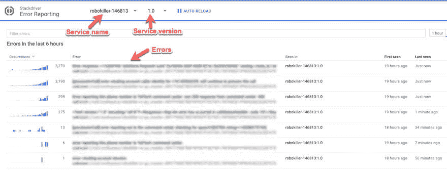

# 与 Kubernetes Stackdriver 格式兼容的 Go logger

> 原文：<https://dev.to/nikola/go-logger-with-kubernetes-stackdriver-format-compatibility-65k>

[T2】](https://res.cloudinary.com/practicaldev/image/fetch/s--RnvIlTMF--/c_limit%2Cf_auto%2Cfl_progressive%2Cq_auto%2Cw_880/https://thepracticaldev.s3.amazonaws.com/i/hdvkunaczff81azmpw9m.jpg)

*原载于[我的博客](http://www.nikola-breznjak.com/blog/go/go-logger-kubernetes-stackdriver-format-compatibility/)*

我非常自豪地宣布，我们在 [TelTech](http://teltech.co/) 的后端团队正在开发的 Go [Logger](https://github.com/teltech/logger) 软件包现已开源！这是我们的库，用于通过 Kubernetes 运行的 Go 项目的结构化日志机制，兼容 [Stackdriver 格式](https://cloud.google.com/error-reporting/docs/formatting-error-messages)。

> 对于那些想开始学习 Kubernetes 的人，这里有两个免费课程:
> 
> *   [uda city 上 Google 的 Kubernetes 的可扩展微服务](https://www.udacity.com/course/scalable-microservices-with-kubernetes--ud615)。[凯尔西·海托华](https://twitter.com/kelseyhightower)是这里的教官之一！
> *   [通过 edX 介绍 Kubernetes](https://www.edx.org/course/introduction-kubernetes-linuxfoundationx-lfs158x)
> 
> 出于好奇，这里有一个在 Kubernetes 中登录的[概述。](https://kubernetes.io/docs/concepts/cluster-administration/logging)

## 安装

`go get -u github.com/teltech/logger`

## 用法

```
package main

import (
    "github.com/teltech/logger"
)

// There should be a LOG_LEVEL environment variable set, which is read by the library
// If no value is set, the default LOG_LEVEL will be INFO

func main() {
    // Stackdriver requires a project name and version to be set. Use your environment for these values.
    // SERVICE should be your GCP project-id, e.g. robokiller-146813
    // VERSION is an arbitrary value
    log := logger.New()

    // You can also initialize the logger with a context; the values will persist throughout the scope of the logger instance
    log = logger.New().With(logger.Fields{
        "user":   "+1234567890",
        "action": "create-account",
    })

    param := "something useful here"

    // A metric is an INFO log entry without a payload
    log.Metric("CUSTOM_METRIC_ENTRY")

    // Log a DEBUG message, only visible in when LOG_LEVEL is set to DEBUG
    log.With(logger.Fields{"key": "val", "something": true}).Debug("debug message goes here")
    log.With(logger.Fields{"key": "val"}).Debugf("debug message with %s", param)

    // Log an INFO message
    log.With(logger.Fields{"key": "val", "names": []string{"Mauricio", "Manuel"}}).Info("info message goes here")
    log.With(logger.Fields{"key": "val"}).Infof("info message with %s", param)

    // Log a WARN message
    log.With(logger.Fields{"key": "val"}).Warn("warn message goes here")
    log.With(logger.Fields{"key": "val"}).Warnf("warn message with %s", param)

    // Error() prints the stacktrace as part of the payload for each entry and sends the
    // data to Stackdriver Error Reporting service
    log.With(logger.Fields{"key": "val"}).Error("error message goes here")
    log.With(logger.Fields{"key": "val"}).Errorf("error message with %s", param)
} 
```

Enter fullscreen mode Exit fullscreen mode

## 输出

这些错误需要特定的 JSON 格式才能被 Google Cloud Platform Stackdriver 日志记录和错误报告接收和处理。见[这篇文章](https://cloud.google.com/error-reporting/docs/formatting-error-messages)了解更多信息。结果输出具有以下格式，可选字段是可选的:

```
 {
  "severity": "ERROR",
  "eventTime": "2017-04-26T02:29:33-04:00",
  "message": "An error just happened!",
  "serviceContext": {
     "service": "robokiller-ivr",
     "version": "1.0"
  },
  "context": {
    "data": {
      "clientIP": "127.0.0.1"
      "userAgent": "Mosaic 1.0"
    },
    "reportLocation": {
      "filePath": "\/Users\/mc\/Documents\/src\/github.com\/macuenca\/apex\/mauricio.go",
      "functionName": "unknown",
      "lineNumber": 15
    }
  },
 "stacktrace": "goroutine 1 [running]:main.main()\n\t\/github.com\/macuenca\/mauricio.go:15 +0x1a9\n"
} 
```

Enter fullscreen mode Exit fullscreen mode

您的 Google 控制台 StackDriver 错误报告可能如下所示:

[T2】](https://res.cloudinary.com/practicaldev/image/fetch/s--ORVjpwgU--/c_limit%2Cf_auto%2Cfl_progressive%2Cq_auto%2Cw_880/https://i.imgur.com/fC8Gk0w.png)

## 执照

这个包是在 BSD 3 条款许可下授权的。

## 机遇

如果你喜欢这个项目，并想从事类似的工作，去看看我们的职业页面 -我们一直在寻找有才华的新人ðÿ™œ

## 结论

这个包对我们很有帮助，所以我们希望它也能帮助其他人。如果你对这个项目有任何意见，请提交一个错误或公关ðÿ'