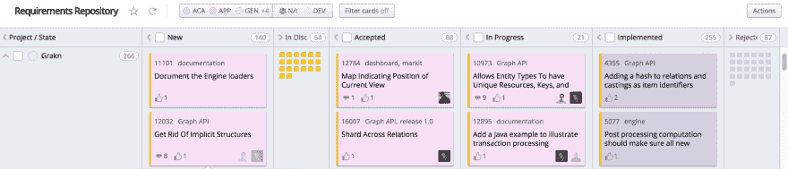
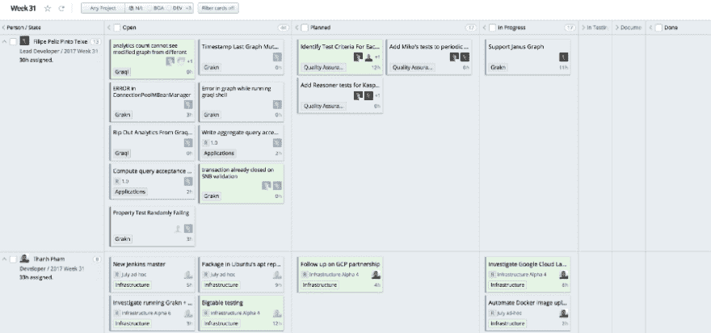
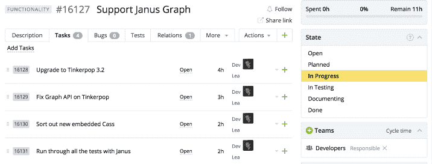

# Grakn 的(主要)敏捷方法

> 原文：<https://dev.to/fppt/grakns-mostly-agile-methodology>

*图片来源:[Mincarconsulting.com](http://mincarconsulting.com/wp-content/uploads/2015/08/herding-cats3.jpg)T3】*

这篇文章最初出现在 GRAKN 上。AI 博客。

任何曾经发现自己在监控或管理任何类型的项目的人都可能遇到过“这就像在赶猫”这个术语。如今，这指的是与管理项目中许多相互作用的组件相关的困难。最初它是针对人的:

> 管理高级程序员就像放牧猫一样。

与管理软件项目和最小化这些项目的风险相关的困难已经衍生出一个几乎完全不同的行业。你会经常听到人们吹嘘遵循一些正式的工作流程。[瀑布](https://en.wikipedia.org/wiki/Waterfall_model)、[敏捷](http://agilemethodology.org/)、 [Scrum](http://scrummethodology.com/) 、[看板](https://www.versionone.com/what-is-kanban/)，不胜枚举...有些人对这些方法非常感兴趣。我甚至听说过软件工程中的人**不**遵循这些正式的过程。就我个人而言，我认为你应该找到对你的团队有用的东西，在有用的时候坚持下去，在没用的时候调整它。

这是一个故事，回顾了我们在 Grakn 实验室是如何找到“似乎对我们有用的东西”的。这个故事可以帮助你找到你想要的东西。

与大多数软件团队相比，我们发现自己处于一个有趣的位置。我们不都是软件工程师。我们有些人更多地倒在数据科学家一边，有些人倒在快速原型一边，有些人倒在营销一边。不管怎样，当你有一个需要快速达成目标的小型混合团队时，让每个人以同样的方式工作是很重要的。所以，在我们的例子中，我们的猫着火了，每只猫都试图用不同的材料灭火。最后，正在看这个的你，也火了。

# Grakn – Day 0

这是 Grakn 的第一年，我们有模糊的需求，一个粗略的设计文档，零行代码。我们还有一个新的相对年轻的团队。从管理的角度来看，你应该**快速**让每个人都在同一个平台和流程上。由于这是一个新团队，我们的首席执行官有时间调查并介绍我们的新平台 [TargetProcess](http://targetprocess.com/) 。想想[吉拉](https://www.atlassian.com/software/jira)，但少了些臃肿，多了些专注。

该工具只是一个开始，应该用来满足团队的需求。在这个阶段，我们开始使用类似瀑布的模型。基本上所有的工作都必须通过以下管道:

1.  **需求收集—**——简单列出软件需要提供的高级功能。任何东西都可以放在这里，所以列出你认为能给你的项目增加价值的东西，只要是高水平的。鼓励这种态度很重要，因为它允许团队中的每个人以某种方式为项目的方向做出贡献。
2.  **需求讨论**——在此阶段，您将根据以下几点接受和拒绝需求:(1)需求是否符合产品愿景？以及(2)不管时间表如何，这样做是否可行？在这个阶段，避免讨论设计。目标是创建您的功能集并对这些功能进行优先级排序。您的最低可行产品的必备条件。
3.  **设计时间**——选择您的最高优先级需求，并开始设计和概述粗略的实施。确保记录所有的决定和假设。你不需要通过**所有**的要求。足够让每个人忙碌一段时间了。当时间允许时，您可以对较低优先级的需求做同样的事情。不计划所有的需求是很重要的，因为在你最终着手实现它们之前，事情可能会发生变化，而且对于一个新项目的年轻团队来说，你需要灵活性。

 
*我们用于项目子集的需求板*

这基本上负责管理进入产品的特性。如果您注意到**新的**列看起来是空的，请执行步骤 1。如果你注意到**接受的**列看起来变细了，是时候进行第二步了。最后，如果进行中的**列看起来很细，那么是时候进行第三步了。**

接下来，是任务规划和任务执行，这是我们第一次点燃猫的地方。

# 奔跑冲刺

现在你知道了需要完成什么，你需要确保进展可以被监控，并以一种非侵入性的方式进行交流。进入 [Scrum 板](https://www.scruminc.com/scrum-board/):

 
*我们每周冲刺登上 [TargetProcess](http://targetprocess.com/)*

借用 Scrum 方法论的一页，我们运行每周冲刺。在每个周末，我们分组并填写下一周的待办事项。这基本上是将接受的和设计的需求分解成可执行的任务的过程。这样做有两个目的:

1.  提前计划你要执行的任务可以最大限度地减少“停滞时间”，即当你不确定下一步该做什么时，等待别人做你需要的事情所花费的时间，或者寻找下一个可行任务所花费的时间。
2.  通过小组计划，我们可以更有效地交流我们将如何影响彼此。这减少了一周中的惊喜。例如，如果你要重构一些 API 调用，你的同事应该提前知道这些，以免他们怀疑他们的 API 去哪里了。

Scrum 板允许每个开发人员知道每个人在每个任务上的状态，而不需要戳到任何人。数字板也使这项工作变得更容易，因为改变任务的状态就像把一张卡片拖到下一列一样简单。

# 亲吻——保持简单愚蠢

**KISS**–*这个短语经常在设计软件时使用，我相信它也应该适用于管理工作流。*

这就是事情开始出错的地方。一个新的团队，一个新的工作流程，和模糊的需求会导致一些失败。在 Grakn 早期，我们有很多这样的东西。从没有恰当地定义需求，跳过所有的需求管道，到没有计划，我们在疯狂奔向我们的第一个 PoC 时经历了所有这些。

有些人可能会认为这些失败是没有严格遵守既定的和经过验证的过程的结果。换句话说，如果你去 [Scrum](http://scrummethodology.com/) ，你 [Scrum](http://scrummethodology.com/) 100%，如果你去[看板](https://www.versionone.com/what-is-kanban/)，你 100%没有偏差。这是我们尝试过的。这就是我们失败的地方。我们发现坚持特定的过程永远不够灵活。如果您有 6 个月的时间来完成 PoC，您就不能在工作流程上花费太多时间。所以这就是我们开始偏离导致事情变得更好的被证明的过程的地方。。。直到他们再次变坏。

这些过程被证明和建立是有原因的，太多的偏离会导致失败的计划和失败的计划。所以在这个阶段，我们吸取了教训，采取了不同的方法。我们把这些过程作为指导方针，选择那些有效的，而放弃那些失败的。

# 亲——估算工作量

Scrum 最常见的原则之一是估算与任务相关的工作量。许多人坚持认为你应该**而不是**用小时来估算任务难度。你应该使用[故事点](https://agilefaq.wordpress.com/2007/11/13/what-is-a-story-point/)，或者热狗大小，或者降水量，或者其他抽象层。

这背后的一个原因是工程师不喜欢把时间和任务联系起来。然而，在大多数情况下(不是全部)，这些抽象的点无论如何都会被转换成小时。所以这个抽象层的存在是为了保护我们的感受，代价是让我们有机会更好地估计执行任务所需的时间。我知道这是一个有争议的观点，但是我要说的是，知道做一件事要花多长时间对任何人来说都是一项有价值的技能。当你考虑热狗而不是时间的时候，这是一项更难发展的技能。所以**吻**——回到几个小时前，是的，你会经常弄错，但随着时间的推移，你会越来越准确。当然，如果点抽象对你的团队有用，那就坚持下去，但是在我们的小团队中，每个人都负责单独的组件，基于时间的估计对我们来说更好。

当你开始用小时来评估任务时，不要用它来记录你的时间表。如果你这样做，你将鼓励人们延长工作时间，这违背了这个练习的目的。**亲吻**——工作流程管理与保存时间表不同。

# 亲吻——交流

Scrum 的另一个常见方面是 T2 的每日站立。原则很简单，每天早上每个人都站起来，简短地谈论他们前一天做了什么，以及他们今天要做什么。这有一个常见的缺陷，就是超过了分配的时间。

每日站立应该是一天的 10 分钟简短介绍。然而，更常见的是，没有什么会被忽略，因为作为开发人员，我们是热情的人，如果有机会，我们会详细讨论任何实现细节。有人知道制表符和空格吗？这是一个非常普遍的问题，你可以在[篇文章](https://www.scrumalliance.org/community/articles/2014/july/7-mistakes-during-the-daily-stand-up-meeting)中找到解决方法。一些人使用秒表、谈话棒(你只有拿着棍子才能说话)、德鲁伊仪式和许多其他的变通方法。**亲吻—**——如果这对你的团队没用，那就除掉它。

我们用每个人在工作日结束时发送的**每日电子邮件**更新取代了每日站立。这封邮件简单地陈述了他们做了什么，他们遇到了什么问题，以及他们第二天的计划。如果对话需要继续，它可以在电子邮件线程上这样做，而不需要把不需要参与的人拖进来。除此之外，我们在每周的开始都有一个每周例会，来宣布我们下周的目标。这是一个足够高的级别，开发对话很少发生，如果我们真的运行了，也只是一周发生一次，所以我们不觉得有必要引入控制措施，如前面提到的秒表和德鲁伊。

# 熟能生巧

处理不正确的任务估计需要小心谨慎。很容易不小心营造出一种奖励高估，惩罚低估的环境。目标是奖励准确的任务估计，并帮助理解为什么某些任务被错误估计。这与它们的执行速度是预期的两倍还是两倍无关。

你可能会问为什么准确的估计如此重要？让人们提前完成工作不是一件好事吗？是的，当然！然而，如果你知道他们会提前完成，那不是更好吗？此外，如果经常低估或高估，可能会出现问题:

1.  高估会导致人们在一周的中间不确定下一步该做什么。具有良好主动性和直觉的高级职员可能很容易跳到另一个任务上，但是一些(如果不是大多数)人不愿意这样做。所以最好避免这个
2.  **低估**意味着你冒着阻碍其他开发者或错过最后期限的风险。这也意味着你不能准确地围绕某人进行计划。

过去对我们有帮助的一个一般准则是，任何超过 8 小时的任务都应该进一步分解。幸运的是 [TargetProcess](http://targetprocess.com/) 让我们这样做:

 
*更细化的任务分解*

# 【grakn】–今天

这大致涵盖了我们如何开展业务以及我们在 Grakn 实验室如何工作。它并不完美，但它让我们走到了今天。我们仍然在这里和那里进行调整，但是自从我们开始我们的旅程以来，核心原则一直保持不变。

在这个工作流程方面，我们仍然面临许多挑战。我们工作的研究方面仍然不完全符合这个工作流程。我听说过一些研究团队将敏捷原则融入到他们的工作中，我很想知道人们对如何做到这一点的想法。类似地，仍然存在非需求驱动和非技术任务的模糊性。例如，我正在写这篇需要时间的博客，这种工作是如何被考虑进去的？它应该被考虑进去吗？有人告诉我，在不同组成和背景的小团队中，这些是常见的问题。我很想听听你们的团队是如何解决这些问题的。

我希望你喜欢这篇高水平的回顾，回顾了我们是如何从一群着火的猫朝随机的方向跑，到着火的猫朝同一个方向跑。也许有一天我们不再火了。

> 感谢 Thanh 将这篇文章转换成 Markdown

* * *

请在下面给我们留言，加入我们的 [Slack](https://grakn.ai/slack.html) 社区，或者在 [Twitter](https://twitter.com/GraknLabs) 上联系我们，让我们知道你的想法！如果你喜欢这篇文章，请点击推荐。