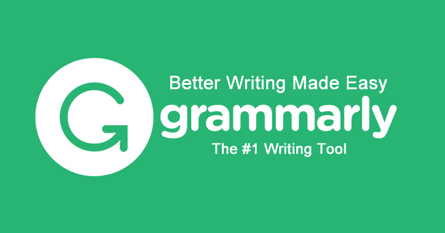

# Grammarly 是博客的必备工具

> 原文：<https://dev.to/plutov/grammarly-is-a-must-have-tool-for-bloggers>

[T2】](https://res.cloudinary.com/practicaldev/image/fetch/s--5nqA5Fzm--/c_limit%2Cf_auto%2Cfl_progressive%2Cq_auto%2Cw_880/http://pliutau.com/grammarly.png)

英语不是我的母语，我总觉得我在这里发的文章很难读。有时我发现自己在想一些最基本的问题，比如一个句子是否需要另一个逗号。我们在 Wizeline 使用语法来完善我们的客户沟通。

我发现我现在可以用它来写我博客里的所有文章。Grammarly 有免费和[高级](https://www.grammarly.com/premium)版本。此外，它还有 Chrome 扩展和桌面应用程序。

在我看来，Grammarly 是所有博主的必备工具。不管你的写作技巧如何，这个工具会帮助你变得更好。几乎没有什么必备的工具能以最优惠的价格买到——免费的——所以在他们意识到他们可以收取更多费用之前，抓住这个机会吧！点击[此处](https://www.grammarly.com/)立即获取这款超棒的语法工具！

附:此文本已按语法检入:)