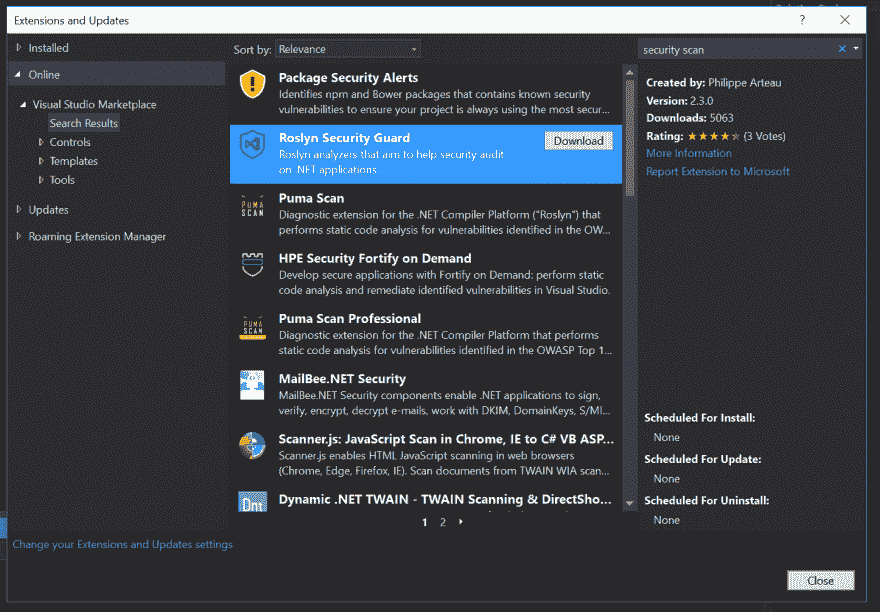
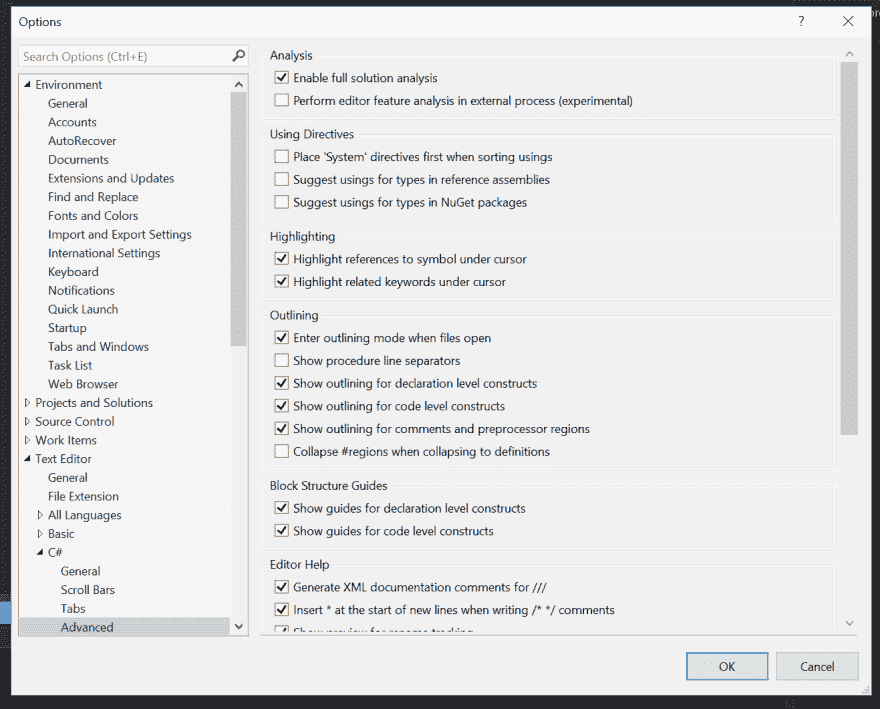
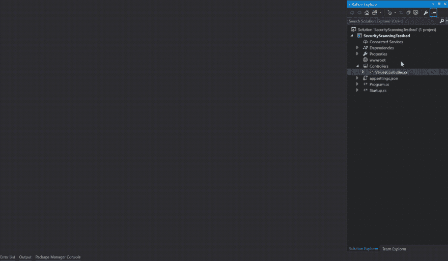
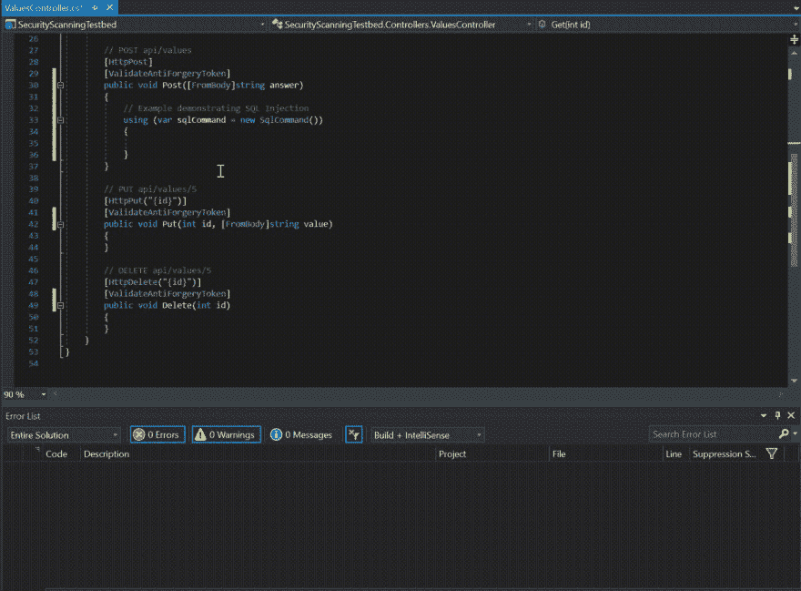
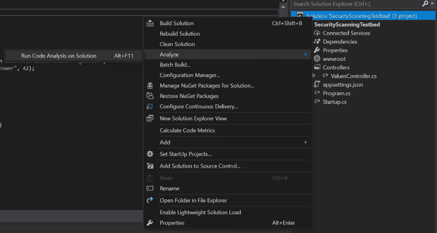

# 免提安全扫描开始。网络应用

> 原文：<https://dev.to/rionmonster/hands-free-security-scanning-in-net-applications-ddp>

*这篇文章最初发表在[我的博客](http://rion.io)上。*

我敢肯定，如果你关注任何新闻来源，你会看到无数来自各种知名公司的黑客攻击、违规和泄露，你可能会认为这些公司在保护你的信息方面会更好。现在，这些事件中的大部分可能与社会工程等非技术问题有关，但不是全部。

安全性常常是应用程序中的二等公民(或更高等级的公民),而不是一开始就成为一个问题，而是在其他事情都完成之后才被“附加”上去。这就是看似构造良好的应用程序如何成为愚蠢且通常容易预防的攻击的牺牲品，如 SQL 注入、跨站脚本(XSS)和跨站请求伪造(CSRF)。

如果你属于这一类(作为二等公民的安全感)，那么这篇帖子就是为你准备的。它引入了两个免费的工具，您可以轻松地将它们集成到您的开发环境中，以便在将您的产品发布到外界之前，在开发阶段就潜在的问题向您发出警告。

#### 安全通分机

在功能强大的 IDE(如微软的 Visual Studio)中开发软件的最大好处之一就是有大量可用的扩展。世界上几乎所有的东西都有扩展，使得开发应用程序比以前更容易，而且在这种情况下，更安全。

我提到的两个扩展是，我肯定还有其他扩展:

*   罗斯林保安
*   Puma 扫描

两者都是免费提供的，非常容易使用，并且可以检查许多您在野外可能遇到的最常见的安全漏洞。

#### 安全分析扩展入门

首先，**在 Visual Studio 的扩展和更新区域中搜索并安装一个或两个上述扩展(Roslyn Security Guard 或 Puma Scan):**

[T2】](https://res.cloudinary.com/practicaldev/image/fetch/s--Ma7uY5zB--/c_limit%2Cf_auto%2Cfl_progressive%2Cq_auto%2Cw_880/http://rion.io/conteimg/2017/09/security-scanning-extensions.PNG)

安装一个(或两个)扩展后，您需要**确保您在 Visual Studio 中的工具>选项> C# >文本编辑器>高级>启用完整解决方案分析:**下启用完整解决方案分析

[T2】](https://res.cloudinary.com/practicaldev/image/fetch/s--kCGnr4SM--/c_limit%2Cf_auto%2Cfl_progressive%2Cq_auto%2Cw_880/http://rion.io/conteimg/2017/09/full-solution-analysis.PNG)

此时，您已经做好了一切准备，可以开始在您的应用程序中寻找潜在的漏洞了，所以让我们看看是什么样子的。

#### 你好世界(现在有安全保障)

因为这两个扫描器都利用了 Roslyn 编译器平台，所以它允许它们实时工作，并在您编写代码时警告您潜在的代码漏洞。

让我们在 Visual Studio 中构建一个新的 Web API 项目来看看这一点:

[T2】](https://res.cloudinary.com/practicaldev/image/fetch/s--P8jzj4Gs--/c_limit%2Cf_auto%2Cfl_progressive%2Cq_66%2Cw_880/http://rion.io/conteimg/2017/09/csrf-detection.gif)

那么，这里发生了什么？嗯:

*   我们创建了一个全新的 Web API 项目。
*   我们打开了默认的`ValuesController.cs`文件。
*   扫描器发现所有 HTTP POST 方法都容易受到潜在的 CSRF 攻击。
*   它提供了一个建议，用一个`[ValidateAntiForgeryToken]`属性来修饰这些方法，以抑制这些攻击。

就是这么简单。让我们看另一个例子，你可能经常看到的另一个例子，SQL 注入:

[T2】](https://res.cloudinary.com/practicaldev/image/fetch/s--oPzaVD3s--/c_limit%2Cf_auto%2Cfl_progressive%2Cq_66%2Cw_880/http://rion.io/conteimg/2017/09/sqlinjection-detection.gif)

与前面的例子一样，您可以看到**在将要用作查询的字符串中检测到字符串连接的那一刻，您将意识到潜在的 SQL 注入**。

所以-这些实时特性非常好，但是值得注意的是，这些扩展只是扩展了 Visual Studio 内的内置代码分析。这意味着任何时候您在项目或解决方案级别使用 **Run Code Analysis** 特性，您都会收到其中所有可用的错误和警告:

[T2】](https://res.cloudinary.com/practicaldev/image/fetch/s--1UhaE3jS--/c_limit%2Cf_auto%2Cfl_progressive%2Cq_auto%2Cw_880/http://rion.io/conteimg/2017/09/run-analysis.png)

> **注意:**如果您发现您的错误列表中没有出现与安全相关的错误，**请确保在该部分下的可用下拉列表**中选择了 Build + Intellisense。要么这样——要么你根本没有任何错误:)

#### 超越 IDE

现在您已经对代码进行了实时安全性分析，接下来该做什么呢？那么，将它作为 CI 流程的一部分添加到您的构建服务器怎么样？

Puma Scan scanner 提供了一个专业许可证，允许您在一个构建服务器上对任意数量的项目运行各种安全规则——这非常容易做到。首先，您需要在您的项目中包含以下 NuGet 包:

*   微软。Net 编译器
*   微软。代码分析
*   Puma.Security.Rules.Pro

包括这些之后，您需要进入您首选的 CI 门户，并为该项目的 MSBuild 命令设置以下参数:

```
MSBuild.exe /p:DeployOnBuild=true /p:Configuration=Release /p:OutDir=../Publish /fl1 /fl2 /fl3 /flp1:logfile=build.log /flp2:logfile=build_errors.log;errorsonly /flp3:logfile=build_warnings.log;warningsonly %WORKSPACE%\YourSolution.sln 
```

Enter fullscreen mode Exit fullscreen mode

这将生成几个与 Puma Scan 相关的日志文件，其中包含任何安全信息，如应用程序中可能出现的警告和错误。

在生成这些文件之后，您可以使用下面的命令将警告导出到 Puma 解析器实用程序，这将允许您根据这些结果为您的组织定义阈值，以确定您是否应该推出一个构建:

```
"C:\Program Files\dotnet\dotnet.exe" "C:\Tools\Puma.Security.Parser\Puma.Security.Parser.dll" --file "%WORKSPACE%\build_warnings.log" --workspace "%WORKSPACE%" --output puma_warnings.log 
```

Enter fullscreen mode Exit fullscreen mode

#### 还有什么其他选择吗？

如果你对安全性很认真，那么我不推荐你去访问开放 Web 应用安全项目(OWASP)网站。OWASP 是一个非营利组织，致力于提高软件安全性，他们的网站提供了丰富的知识和最佳实践来保护您的应用程序。

如果您喜欢试用 Rosyln Security Guard 和 Puma 扫描工具，那么您可以尝试从 OWASP 查看以下关于静态和源代码分析工具的资源:

*   [OWASP 推荐的源代码分析工具](https://www.owasp.org/index.php/Source_Code_Analysis_Tools)
*   [OWASP 推荐的静态代码分析工具](https://www.owasp.org/index.php/Static_Code_Analysis)
*   [OWASP 十大网络安全漏洞列表](https://www.owasp.org/index.php/Category:OWASP_Top_Ten_Project)
*   [Web 开发人员清单(参见安全)](http://webdevchecklist.com/)