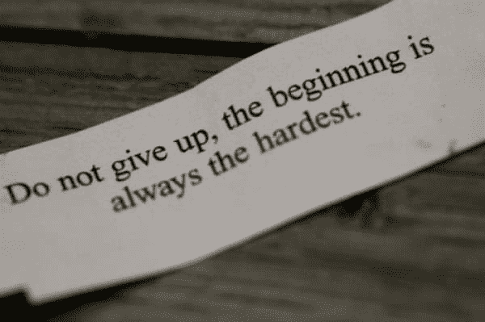

# 嗨，我是比克拉姆·巴特查亚

> 原文：<https://dev.to/bikrambhattacharya/hi-im-bikram-bhattacharya>

[T2】](https://res.cloudinary.com/practicaldev/image/fetch/s--tRj6uji4--/c_limit%2Cf_auto%2Cfl_progressive%2Cq_auto%2Cw_880/https://thepracticaldev.s3.amazonaws.com/i/72upe2ws6vqjdi8e19fn.jpg)

我已经学习编码一年了。一开始对我来说很难，现在学习新语言对我来说很有趣。

我对 Js 和 Web 开发很着迷，我选择 Web 开发是因为它给了我们一个很好的机会向世界展示我的创造力。

想了解更多关于我的信息，请访问我的博客

我必须承认，创建一个在线展示自己的博客的想法，来自于这个开发者社区的 Sam Jarman 写的一篇文章。