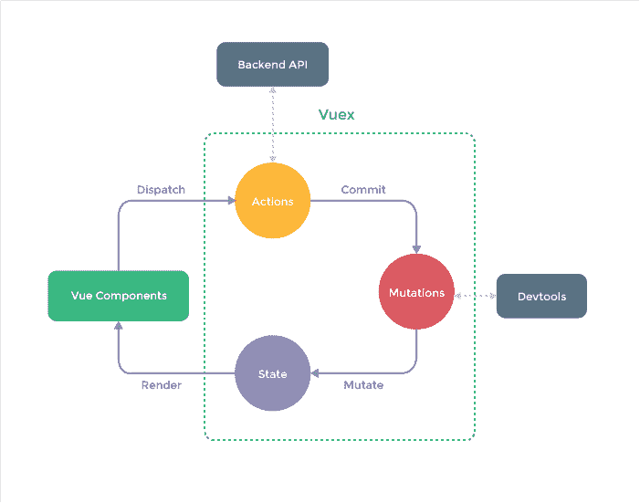

# 从头开始构建 Vuex。

> 原文：<https://dev.to/sadick/how-does-a-minimal-vuex-implementation-look-like-3eee>

#### 我把 Vuex 拆成最简单的形式

[T2】](https://res.cloudinary.com/practicaldev/image/fetch/s--KA5i9Jj_--/c_limit%2Cf_auto%2Cfl_progressive%2Cq_auto%2Cw_880/https://cdn-images-1.medium.com/max/701/1%2Avmhxmp5jRp-4Rtfh3skrgQ.png)

如果你是一个前端开发人员或者一直在玩 vuejs，那么你可能会遇到 vuex。如果不是，那么这里是它是什么。

[vuex 是什么？vuex〔t1〕](https://vuex.vuejs.org/en/intro.html)

我总是觉得很讨厌当你看一个教程，然后老师说。“你需要 npm intsall vue，vuex，vue-router，axios”等 10 个模块。我认为在你把一个库引入你的项目之前，你应该真正理解这个库是做什么的。

图书馆来来去去。[ *在此插入你的酷工具* ]今天可能会很热，但相信我，更好(或更差)的东西会取代它，如果不是今天，那就是明天。如果你是那种喜欢炒作的开发人员，请在采用库之前花点时间理解核心概念。

理解基本概念会对你有很大帮助。出于这个原因，我想让我们看一下 Vuex 的最小实现。

### 您通常如何使用 Vuex

*   您总是从组件的方法中分派一个动作