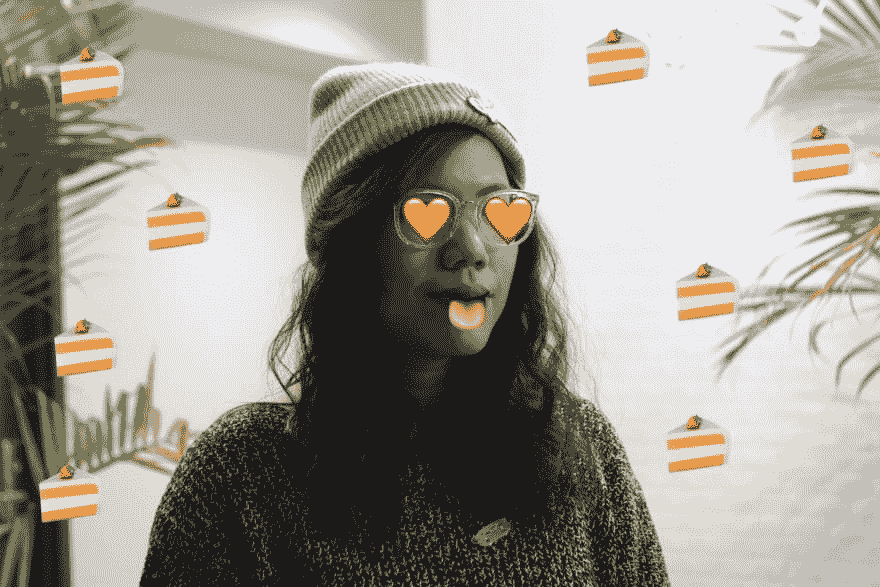

# 狗粮如何让我们成为更好的开发者

> 原文：<https://dev.to/jess/how-dogfood-makes-us-better-devs>

## 背景

我最初为受科技启发的女性生活杂志 [UNTOUCHD](https://www.untouchd.co/) 写了这篇文章。这本杂志很漂亮，鼓舞人心，有教育意义。虽然它不是以发展为中心，但它总是以坏脾气的女工程师和女企业家为特色。反正！最近一期[刚刚出版，我问创始人](https://issuu.com/untouchdmagazine/docs/untouchd02) [Holy](https://www.instagram.com/codegirlcode/) ，我是否可以在 dev.to 上交叉发表我的 dogfooding 文章，因为 dogfooding 适用于所有开发人员。我也喜欢得到元ðÿ˜ž

在问 Holy 关于在 dev.to 上重新发布的问题时，我也问了她在 UNTOUCHD 背后的动机以及 dev 社区如何支持她。以下是她的回应:

> “我想告诉年轻女孩，以及各种背景和年龄的女性，科技行业并不可怕。如果编码不是适合你的技术层，还有 UX/UI 设计、数字营销、数据科学和其他许多技术层可以参与进来。通过以一种非正式的方式帮助介绍技术，但在一个令人鼓舞的环境中，既有视觉驱动，真实，又令人谦卑。我们希望张开双臂，帮助弥合性别差距，为所有人打开一扇机会之窗！”
> 
> **如何帮忙:**分享我们走(【issuu.com/untouchdmagazine】[)——多点目光，多点影响！我们的页面上还有一个](https://issuu.com/untouchdmagazine)[支持](https://www.untouchd.co/support/)按钮来帮助降低生产成本，并继续下去！我们是一家无广告公司，但对赞助开放-如果有人感兴趣，我可以分享更多细节。我们终于开始着手印刷部分，应该会在 8 月初推出按需印刷选项。

我超级渴望拿起 UNTOUCHD 的实体副本，因为 dev.to 在其中出现过两次！因为对于这篇特别的文章...我附上了这张照片:

[T2】](https://res.cloudinary.com/practicaldev/image/fetch/s--bhXdoQu6--/c_limit%2Cf_auto%2Cfl_progressive%2Cq_auto%2Cw_880/https://thepracticaldev.s3.amazonaws.com/i/xhai4u5cf4gwaiipptzq.JPG)

## 如何让我们成为更好的开发者

我在 dev.to 工作中最喜欢的一个方面是，当我们进行 dogfood 时，我们不仅仅是在学习如何改进我们的产品，我们也在学习如何改进我们的(编程)自我。对于你们这些爱猫人士(像我一样)，吃狗粮是“吃你自己的狗粮”的简称，意思就是实践你所宣扬的。我不认为测试你自己的产品是发现错误和缺陷的非常有效的方法是一件令人惊讶的事情...在你自己的产品中。

作为一名程序员，在 dev.to 上 dogfooding 是很特别的，因为这意味着我不能不保持最新的编程。通过吃我们自己的狗粮，每个在 dev.to 工作的人每天都在学习关于编程的新东西。我们都处于不同的经验水平，有着不同的兴趣，所以我们分享这种观点是令人兴奋的。当我阅读一篇关于 git 的文章或观看一个关于微服务的视频时，我会检查是否可以通过给内容创作者留下一个独角兽表情符号来表达我的爱，或者是否可以在评论区问他们一个后续问题。如果有什么东西坏了，我可以立即创建一个标签，因为找到 bug 并不是一件苦差事。当我这么做的时候，Walker 发现发布 JavaScript 的持续流行是多么容易/奇怪/困难，这很好，因为他在收集产品反馈，也因为他在写代码。

我遇到过一些人因为他们的产品不能给他们带来价值而不自愿喂食——想想讨厌锻炼的 classpass 员工，或者讨厌与人见面的 meetup 工程师，这样的例子不胜枚举。虽然从这些类型的用户身上肯定还有很多东西要学，但我感到非常幸运的是，无论我在哪里工作，只要我称自己为程序员，我都会使用我正在构建的产品。很高兴我可以拥有我的蛋糕，也可以吃掉它。对于所有正在找工作的酷猫们，换位思考一下未来的自己，问问自己:“我会吃狗粮吗？' ðŸ