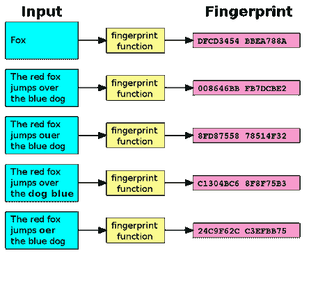

# Dropbox 如何知道你在分享受版权保护的内容？

> 原文：<https://dev.to/zeyadetman/how-dropbox-knows-when-youre-sharing-copyrighted-stuff>

## 磕磕碰碰。

在我开始之前:

A 是一个罪犯，他想抢劫银行，所以他向他的朋友 B 和 C 求助。他们成功地抢劫了银行，但不幸的是 B 在作案前把手套忘在家里了。警察提取了他的指纹，经过几天的指纹比对，警察将他们一网打尽。

[T2】](https://res.cloudinary.com/practicaldev/image/fetch/s--kKh1UJ2T--/c_limit%2Cf_auto%2Cfl_progressive%2Cq_auto%2Cw_880/https://zeyadetman.files.wordpress.com/2017/05/702px-fingerprint-svg.png%3Fw%3D480)

对于文件来说也是一样，每个小文件都有其独特的指纹，来自字符和数字，如“ah4213jn234bmn53b ”,即使您更改了位置或名称或类似的内容，指纹也不会发生任何变化——如果您想查看安装此[https://support . Microsoft . com/en-us/help/841290/avail ability-and-description-of-of-The-file-checksum-integrity-verifier-utility](https://support.microsoft.com/en-us/help/841290/availability-and-description-of-the-file-checksum-integrity-verifier-utility),并且没有什么乐趣 dropbox 有一个大表，其中包含原始文件的指纹以及何时

[在我的博客上](https://zeyadetman.wordpress.com/2017/05/31/how-dropbox-knows-when-youre-sharing-copyrighted-stuff/)