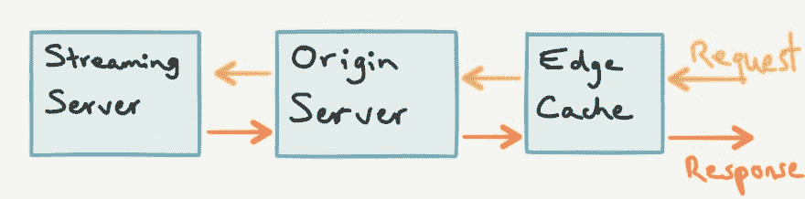
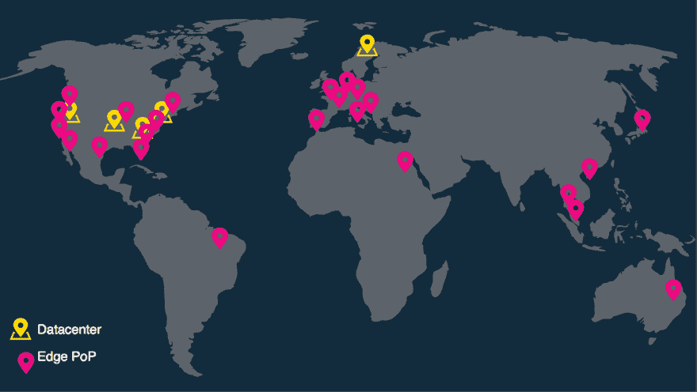

# 脸书的生活规模

> 原文：<https://dev.to/imwiss/how-facebook-live-scales>

我最近在看脸书的 F8 会议——在脸书直播上直播——这让我很好奇脸书直播是如何无缝地扩展到全世界数百万人的。

脸书生活规模如何？让我们深入分析一下！

 
*F8 2017 年主要围绕 AR/VR*

## 挑战

在分析架构以及脸书 Live 如何扩展到这种程度之前，让我们看看构建这样一个产品所面临的一些挑战。

该公司首席产品官克里斯·考克斯(Chris Cox)在 2016 年 4 月接受了《连线》 [1](#fn1) 的采访，考虑到截至 2016 年底脸书上的**月活跃用户超过 18.6 亿，他列举了以下挑战:**

*   需要能够同时提供数百万个**流**
*   需要能够支持同一流上的数百万用户

引用 Chris Cox 的话来说，这个“*原来是一个非常困难的基础设施问题*”，这使得解构和分析变得更加令人兴奋。

直播视频的另一个独特挑战是流量会出现峰值，您的基础设施必须能够处理巨大的流量峰值。例如，当一位名人开始直播视频流时，当用户加入时，视频仍在直播时，流量会出现巨大的峰值，然后当视频结束时，流量会急剧下降，但用户仍可观看，即使它不再是直播。主要的挑战将是在直播时优雅地处理峰值。

## 建筑

出于本文的目的，我将专门关注当拥有数百万粉丝的用户(例如名人)开始直播时出现的高流量峰值。在这种情况下，可能会有 100 多万人同时观看广播，当他们几乎同时加入时，这会给服务器和基础架构带来巨大压力。

当所有这些请求同时到来时——这被称为*雷群问题*[2](#fn2)——它可能会导致延迟、丢包甚至阻止用户加入广播等流媒体问题。

当你有可能遇到这样的问题时，你应该做的第一件事是防止所有的请求直接命中你的流媒体服务器，**这可能是致命的，并一起丢弃服务器**。相反，您应该致力于添加多个层来过滤这些请求，并确保只有必要的请求才能到达流服务器。

这可以通过许多不同的方式来实现，取决于你的产品的大小和用户的数量。在脸书的案例中，他们选择了以下架构:

[T2】](https://res.cloudinary.com/practicaldev/image/fetch/s--ndkNNwTX--/c_limit%2Cf_auto%2Cfl_progressive%2Cq_auto%2Cw_880/https://designingforscale.com/conteimg/2017/04/facebookLiveArchitecture_1-1.jpg)

这里需要注意的是，边缘缓存服务器分布在全球各地，以支持脸书的全球影响力。在源服务器和边缘缓存之间还有一个**一对多**的关系，多个边缘缓存服务器可以向同一个源服务器发送请求。

### 流程如下:

1.  请求首先命中离用户最近的边缘缓存服务器，以便减少用户和服务器之间的延迟。边缘缓存服务器**本质上是一个缓存层**，不做太多处理。
2.  如果所请求的分组在边缘缓存中，则它们被返回给用户。
3.  如果它们不在边缘缓存中，则请求被转发到源服务器，源服务器是另一个缓存服务器，并且具有与边缘缓存服务器类似的架构。
4.  如果所请求的分组在源服务器中，则它们被返回到边缘高速缓存，边缘高速缓存在将它们返回给用户之前缓存它们。
5.  如果它们不在源服务器中，则请求被转发到处理该实况广播的特定流服务器。然后，流服务器将数据包返回到源服务器，源服务器在将数据包返回到边缘缓存之前对其进行缓存。边缘缓存缓存响应并将数据包返回给用户。
6.  未来对 **same 数据包**的请求将由边缘缓存处理，不会超出该层，这极大地加快了处理速度，并降低了流媒体服务器的负载。

正如我们所看到的，这种架构大大减少了发送到流媒体服务器的请求数量。例如，如果 5 个请求按顺序到达边缘缓存**，只有第一个请求会到达流媒体服务器并返回，而其他 4 个请求会立即从边缘缓存获得响应，因为边缘缓存已经缓存了它。**

 **然而，这对脸书来说仍然不够。事实上，根据脸书 [3](#fn3) 发布的一篇文章，这种架构仍然会向流媒体服务器泄露大约 1.8%的请求。在他们的规模上，有数百万个请求，1.8%是一个巨大的泄漏量，给流媒体服务器带来了很大的压力。

 
*脸书的全球范围:边缘缓存服务器为粉红色，源服务器为黄色。来源:[http://cs.unc.edu/xcms/wpfiles/50th-symp/Moorthy.pdf](http://cs.unc.edu/xcms/wpfiles/50th-symp/Moorthy.pdf)T7】*

## 为什么会泄露这么多请求？

上述架构的第一个缺陷是，对同一个边缘缓存的**个同时的**个请求将到达源服务器。由于边缘缓存将所有丢失数据包的请求转发到下一层，如果同时请求数据包 A，而该数据包不在缓存中，则所有这些请求都将被转发。在脸书的尺度上外推，我们可以很快看到如此多的请求是如何被泄露的。

该架构的第二个缺陷是,**多个边缘缓存**盒可以向源服务器发送相同的数据包请求，源服务器又会将所有这些同时发生的请求转发给流媒体服务器，因为数据包不在其缓存中。这与第一个缺陷类似，但它发生在原始服务器级别。

同样，对于普通产品来说，1.8%似乎不是很多，但在脸书的规模下，这确实是一个需要解决的重要问题。

## 调整架构实现高可扩展性

脸书对这个问题的解决方案很有创意，但也很容易理解。当对同一数据包的多个请求到达边缘缓存时，它们被组合在一个请求队列中，并且只有一个请求到达源服务器。这被称为*请求合并*。一旦响应来自服务器，它就被存储在缓存中，然后队列中的请求从缓存中得到响应。

例如，当 10 个并发请求到达边缘缓存时，它们都被添加到同一个请求队列中，只有一个通过，这有助于减少请求的泄漏。如果我们将这个场景与最初的设置进行比较，在最初的设置中，所有 10 个并发请求都可以通过，我们看到性能有了巨大的提高。

相同的概念也应用于原始服务器级别，其中对同一分组的所有请求(来自一个或多个边缘缓存端点)被分组在一起，并且其中只有一个请求到达流服务器。不用说，这大大减少了流媒体服务器的开销，尤其是考虑到直播可能收到的请求量。

## 负载均衡

脸书实施的另一个重要调整是边缘缓存服务器的负载平衡。在某些情况下，由于巨大的流量峰值，边缘缓存服务器可能会过载，不再一致地运行，尽管使用了请求合并。为了避免这种情况，负载平衡器将请求重定向到对于该请求具有可用性的**最近的边缘缓存。例如，如果离您最近的边缘缓存已经在为 200 000 个请求提供服务，那么负载均衡器可能会将您转发到稍远的边缘缓存，但这只是为一半的请求提供服务，这意味着您仍然可以更快地获得响应。**

脸书通过不断测量这些服务器上的负载并跟踪其性能来确定哪个边缘缓存可用。它甚至走得更远，并使用一种算法在负载发生之前预测负载，这太不可思议了。该算法的基础非常复杂，它需要自己的文章，所以我现在不会深入讨论，但这是一个非常有趣的话题，我可能会在不久的将来讨论。

## 使用 Nginx 请求合并

对于那些使用 *Nginx* 的人来说，可以通过将`proxy_cache_lock`配置设置为`on`(默认值为`off`)来启用请求合并，如这里的文档[中所解释的:](http://nginx.org/en/docs/http/ngx_http_proxy_module.html#proxy_cache_lock)

> 启用后，通过将请求传递给代理服务器，一次仅允许一个请求填充根据`proxy_cache_key`指令识别的新缓存元素。**在 proxy_cache_lock_timeout 指令设置的时间内，同一缓存元素的其他请求要么等待缓存中出现响应，要么等待该元素的缓存锁被释放**。

## 结论

我在研究和剖析脸书 Live 的架构以及工程师们如何能够将产品扩展到数百万用户的过程中获得了很多乐趣。尽管我们可能永远也不会开发出拥有如此多用户的产品，但是我们可以在自己的产品中借鉴这些经验，比如在架构中添加多层如何帮助过滤到达处理服务器的请求数量。这反过来提高了服务器的性能和可用性，从而为用户提供了更好的产品，并有助于扩展它。

*本帖最初发表于[为规模](https://designingforscale.com/?utm_source=scalingfacebooklive&utm_medium=guest-post&utm_campaign=devto)设计*

##### 学分

1.  [在*@秤大会*上的秤脸书直播](https://atscaleconference.com/videos/scaling-facebook-live/)
2.  [在*@尺度大会*上的【脸书直播(2)】](https://atscaleconference.com/videos/scaling-facebook-live-2/)

* * *

1.  [扎克伯格真的希望你在 Facebook 上直播视频](https://www.wired.com/2016/04/facebook-really-really-wants-broadcast-watch-live-video/) [↩](#fnref1)

2.  [维基百科:雷人问题](https://en.wikipedia.org/wiki/Thundering_herd_problem) [↩](#fnref2)

3.  [幕后:向数百万人直播视频](https://code.facebook.com/posts/1653074404941839/under-the-hood-broadcasting-live-video-to-millions/)T2】↩**