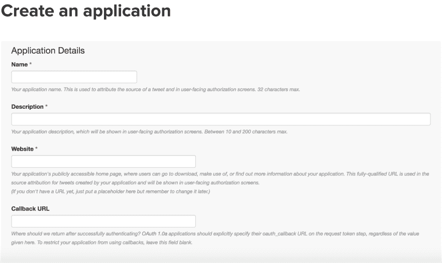
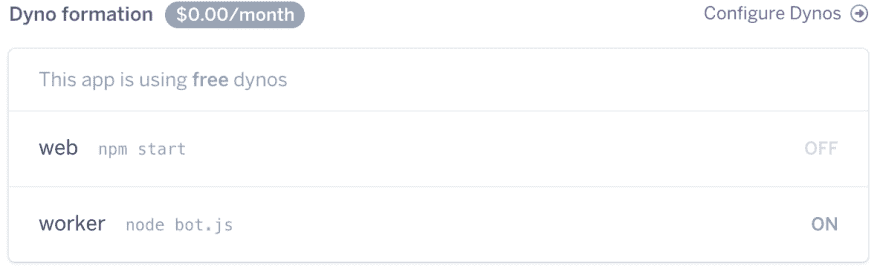

# 我如何创建两个推特机器人

> 原文：<https://dev.to/bengreenberg/how-i-created-two-twitter-bots-a97>

[T2】](https://res.cloudinary.com/practicaldev/image/fetch/s--JbcIYm6y--/c_limit%2Cf_auto%2Cfl_progressive%2Cq_auto%2Cw_880/https://thepracticaldev.s3.amazonaws.com/i/sfqaog9tsql968kb8nwk.png)

随着每天的新闻周期从不忘记提到在 2016 年选举周期中造成混乱的阴险的 Twitter 机器人，我开始好奇 Twitter 机器人的创建过程。让一个运行起来有多难？在我正在进行的文科程序员系列*编码*的最新文章中，我们将分解创建我们第一个 Twitter 机器人的过程。

从昨晚开始，我创建了两个 Twitter 机器人:

1.  Web 开发人员职位:转发开发人员职位信息的机器人
2.  [记住我们所有人](https://twitter.com/RememberUsAll):一个响应@realdonaldtrump Twitter 账户的机器人，它发布了今年的大规模枪击统计数据，数据来自[枪支暴力档案](http://www.gunviolencearchive.org/)。

希望在这篇文章结束时，你也能够创建自己的 Twitter 机器人。

**入门**

创建 Twitter bot 的第一步是从 Twitter 获取适当的访问密钥。你可以前往 [Twitter 新应用表单](https://apps.twitter.com/app/new)并注册你的应用。该表单是不言自明的，出于我们的目的，将回调 URL 条目留空。

[T2】](https://res.cloudinary.com/practicaldev/image/fetch/s--2jn1Bl3V--/c_limit%2Cf_auto%2Cfl_progressive%2Cq_auto%2Cw_880/https://i.imgur.com/V5xQcqN.png)

一旦你注册了你的应用，点击*键和访问令牌*标签，然后点击*生成访问令牌*。请务必在安全的地方记下您将需要的四个令牌:`consumer_key`、`consumer_secret`、`access_token`和`access_token_secret`。

现在，你已经正式拥有了你的机器人的 Twitter 账户，并且拥有了在 Twitter 网站之外与它互动所需的密钥。你可以花些时间用标题和个人资料图片、简历等来设计你的应用程序的 Twitter 个人资料页面。现在或者等你完成后。

**初始节点设置**

此时，您需要开始实际的机器人工作。这部分其实相对容易。首先在终端中创建一个空目录，然后从该目录运行`npm init`。您将被引导通过一系列提示，您的答案将被用于生成新 NodeJS 应用程序所需的`package.json`文件。当提示中要求输入`main`文件的文件名时，不要默认按 enter 键进入`index.js`，而是将其命名为类似 twitterBot.js 的名称。这很快就会派上用场。

**创建您的文件、环境变量和节点包**

现在您已经完成了`package.json`的初始设置，让我们继续创建我们的第一个文件。从终端运行`touch twitterBot.js`。这将在您的目录中创建文件。你还需要在某个地方存储你的 Twitter 访问密钥，有不同的方法可以做到这一点。在本练习中，我们将把它们存储为环境变量。这确保了我们不会不小心把它们提交给 Github，让全世界都看到！为了将它们保存为节点应用程序的环境变量，您可以从命令行运行以下命令:

```
export consumer_key=YOUR KEY HERE
export consumer_secret=YOUR SECRET KEY HERE
export access_token=YOUR TOKEN HERE
export access_token_secret=YOUR ACCESS TOKEN SECRET HERE 
```

Enter fullscreen mode Exit fullscreen mode

我们将在下一步研究如何在应用程序中访问这些键。我们这里的最后一步是安装 [twit](https://www.npmjs.com/package/twit) 节点包，我们将使用它来与 Twitter API 交互。您可以通过从命令行运行`npm install --save twit`来做到这一点。

**编写你的机器人**

在这一点上，我们已经准备好开始编码我们的机器人！在你最喜欢的文本编辑器中打开`twitterBot.js`，让我们开始吧。

最初，我们想要定义我们的依赖关系，并设置我们的初始变量:

```
// define the dependencies
const twit = require('twit');

const config = {
  consumer_key: process.env.consumer_key,
  consumer_secret: process.env.consumer_secret,
  access_token: process.env.access_token,
  access_token_secret: process.env.access_token_secret
}

const Twitter = new twit(config); 
```

Enter fullscreen mode Exit fullscreen mode

这里我们创建一个名为`twit`的`const`变量，它依赖于我们的`twit`节点包。我们创建了一个带有名为`config`的`const`的对象来保存我们的密钥。注意，我们使用`process.env...`来调用我们在环境变量中定义的键。我们还创建了一个名为`Twitter`的`twit`的新实例，并将这些键作为参数传入。

我们的第一个 Twitter 机器人将在 Twitter 中搜索某些搜索参数，并转发符合这些参数的帖子。因此，我们需要定义这些参数。我们将通过创建一个函数来实现这一点，该函数包含两个参数，即从 Twitter 调用`get`的结果和在 Twitter 上调用`post`。首先是参数:

```
let retweet = function() {
    let params = {
        q: '#thepracticaldev, #coding',
        result_type: 'mixed',
        lang: 'en'
    } 
```

Enter fullscreen mode Exit fullscreen mode

你会注意到我们在参数中使用了`mixed`中的`result_type`。关于搜索时可以使用的所有选项的列表，请查看 Twitter 开发者网站上的[搜索推文](https://developer.twitter.com/en/docs/tweets/search/api-reference/get-search-tweets)文档。

接下来我们将定义函数的主体，它将封装`get`和`post`动作:

```
// search through all tweets using our params and execute a function:
Twitter.get('search/tweets', params, function(err, data) {
        // if there is no error
        if (!err) {
           // loop through the first 4 returned tweets
          for (let i = 0; i < 4; i++) {
            // iterate through those first four defining a rtId that is equal to the value of each of those tweets' ids
          let rtId = data.statuses[i].id_str;
            // the post action
          Twitter.post('statuses/retweet/:id', {
            // setting the id equal to the rtId variable
            id: rtId
            // log response and log error
          }, function(err, response) {
            if (response) {
              console.log('Successfully retweeted');
            }
            if (err) {
              console.log(err);
            }
          });
        }
      }
        else {
            // catch all log if the search could not be executed
          console.log('Could not search tweets.');
        }
    });
} 
```

Enter fullscreen mode Exit fullscreen mode

然后，我们可以用一个简单的`retweet()`调用文件中的函数。这将在初始化时执行一次。如果我们想多次执行，我们可能想用`setInterval()`设置它执行的间隔，并给它一个参数 time pass。例如，`600000`将设置应用程序每 10 分钟运行一次。如果你最终部署到 Heroku 这样的服务并使用免费账户，这也很有帮助，因为免费账户如果不活动就会进入睡眠状态，而`setInterval()`将确保你的账户在指定的时间定期“醒来”。

我们最终的完整代码现在看起来像这样:

```
let retweet = function() {
    let params = {
        q: '#developer, #jobs',
        result_type: 'mixed',
        lang: 'en'
    }
    Twitter.get('search/tweets', params, function(err, data) {
        // if there is no error
        if (!err) {
           // loop through the first 4 returned tweets
          for (let i = 0; i < 4; i++) {
            // iterate through those first four defining a rtId that is equal to the value of each of those tweets' ids
          let rtId = data.statuses[i].id_str;
            // the post action
          Twitter.post('statuses/retweet/:id', {
            // setting the id equal to the rtId variable
            id: rtId
            // log response and log error
          }, function(err, response) {
            if (response) {
              console.log('Successfully retweeted');
            }
            if (err) {
              console.log(err);
            }
          });
        }
      }
        else {
            // catch all log if the search could not be executed
          console.log('Could not search tweets.');
        }
    });
}
retweet();
setInterval(retweet, 600000); 
```

Enter fullscreen mode Exit fullscreen mode

**运行我们的机器人**

要启动我们的机器人，我们只需要从命令行运行`node tweetBot.js`。如果您刷新您的 Twitter 个人资料页面，您现在应该会看到我们的机器人提交的一些新的转发。恭喜你！你现在已经创建了你的第一个 Twitter 机器人。

**部署到 Heroku**

一旦你的机器人启动并运行，你会觉得有点像生活在科学怪人的世界里。你肯定不希望每次关闭终端窗口或关闭电脑时，你的新作品就寿终正寝了。是时候给你的机器人一个永久的家了。本指南不包括在 Heroku 上创建帐户的步骤。Heroku 站点本身有许多入门资源，所以根据我们的需要，我们将在您设置好帐户后开始。

为了让你的应用程序在 Heroku 上运行，你需要一个 Procfile 来启动你的机器人。从命令行运行`touch Procfile`,然后在文本编辑器中将`worker: node tweetBot.js`添加到文件中。

接下来，在命令行中运行`heroku create NAME-YOUR-BOT`，用您想要的名称替换`NAME-YOUR-BOT`。然后运行`git add .`、`git commit -m "deploying to Heroku"`和`git push heroku master`。现在，您需要将您的访问键定义为 Heroku 环境变量，这个过程与您在上面为本地副本所做的非常相似。只需对每种按键类型运行`heroku set:config key_name=key_value`(即`consumer_key`、`consumer_secret`等)。).

你需要确定的一件事是 Heroku 正在从你的 Procfile 运行`worker`。转到你的应用程序的 Heroku 个人资料页面，检查你的“免费 dynos”是否被“工人”使用，确保那里的切换设置为 on。

[T2】](https://res.cloudinary.com/practicaldev/image/fetch/s--jCmZdidw--/c_limit%2Cf_auto%2Cfl_progressive%2Cq_auto%2Cw_880/https://i.imgur.com/ZsviuLV.png)

就是这样！您的 Twitter 机器人现在已经部署并运行在 Heroku 上，当您关闭计算机时，它将不再存在。有了新的机器人能力，请记住蜘蛛侠的古老智慧:“能力越大，责任越大。”