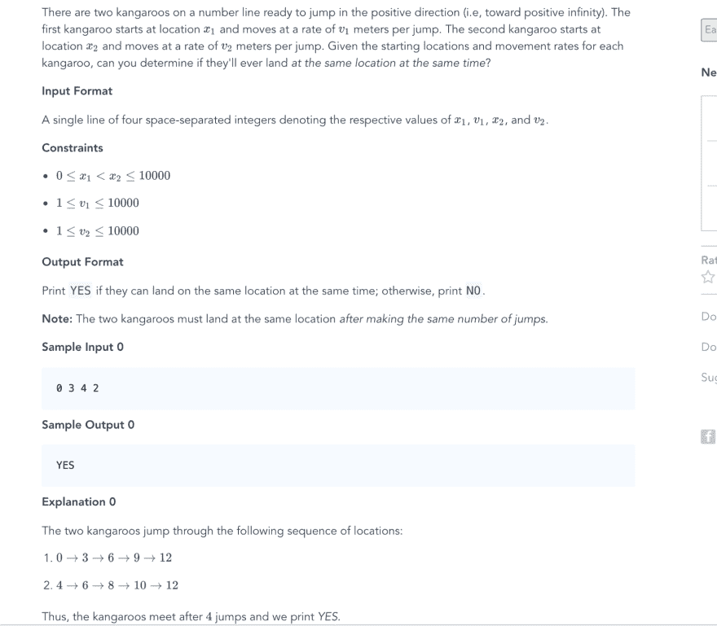

# 数学在计算机编程中有多重要？

> 原文：<https://dev.to/douglasmakey/how-important-is-math-in-computer-programming-cnf>

我写这篇文章是因为我最近在 HackerRank 做了这个练习:

[T2】](https://res.cloudinary.com/practicaldev/image/fetch/s--RNQrWwd4--/c_limit%2Cf_auto%2Cfl_progressive%2Cq_auto%2Cw_880/https://cdn-images-1.medium.com/max/1600/0%2ATmLt5hQq0tArckCj.png)

我没有计算机科学或类似的学位(但我在过去的 3 年里一直是一名软件工程师)，所以我真的没有扎实的数学知识，乍一看这个练习似乎很容易，对吗？

你们大多数人会认为是，但对我来说不是。我的第一个方法是思考一个合乎逻辑的解决方案(至少我愿意这样认为)，然后我想，如果我想知道袋鼠是否会在同一时间降落在同一地点，我必须移动袋鼠，直到它们都在同一地点

我设计了一个循环来移动袋鼠，并检查它们是否在同一位置。

忘记了其他验证，我只编写了必要的代码:

```
for i:=0 ; i<10000; i++ {
    kOnePosition = moveKangoro(x1, v1)
    kTwoPosition = moveKangoro(x2, v2)
    if kOnePosition == kTwoPosition {
        fmt.Println(“YES”)
        break;
    }
} 
```

Enter fullscreen mode Exit fullscreen mode

我写了这个代码的变体和其他代码，但是都没有通过测试。10 或 20 分钟后，我想出了一个数学解决方案。

验证 n 次跳跃中袋鼠是否会在同一位置的等式是这样的:

x1 + (v1 * n) = x2 + (v2 * n) ->其中 n 是跳跃的次数。

所以，我们要解这个方程:

(v1 * n) — (v2 * n) = x2 — x1

n(v1 — v2) = x2 — x1

n = (x2 — x1) / (v1 — v2)

我们知道 n 的值需要是一个整数，所以我们要用模除法替换除法，并检查运算是否留下余数 0

(x2 — x1) % (v1 — v2) == 0

这意味着，对于一组初始位置和每次跳跃的米数，我们可以知道，只有当余数为 0 时，袋鼠才会在同一时间处于同一位置。

同样，我忘记了其他验证，我只写了必要的代码:

```
if x1 == x2 && v1 == v2 {
       fmt.Println("YES")
   } else if x1 == x2 && v1 != v2{
       fmt.Println("NO")
   } else {
       if v1 > v2 && ((x2-x1)%(v1-v2)) == 0 {
           fmt.Println("YES")
       } else {
           fmt.Println("NO")
       }
   } 
```

Enter fullscreen mode Exit fullscreen mode

这个算法通过了所有的测试，我们只能用数学来有效地完成它。

有时我听到开发人员说“数学不是很重要”或类似“一个好的程序员不擅长数学”的短语，我认为他们是错误的，因为正如我们在这个案例中看到的，数学帮助我们以一种有效的方式解决问题。

我有很多东西要学，每天发现这些问题需要改进是令人兴奋的。

[Github 中的代码](https://github.com/douglasmakey/hackerrank/blob/master/Algorithms/Implementation/kangaroo.go)