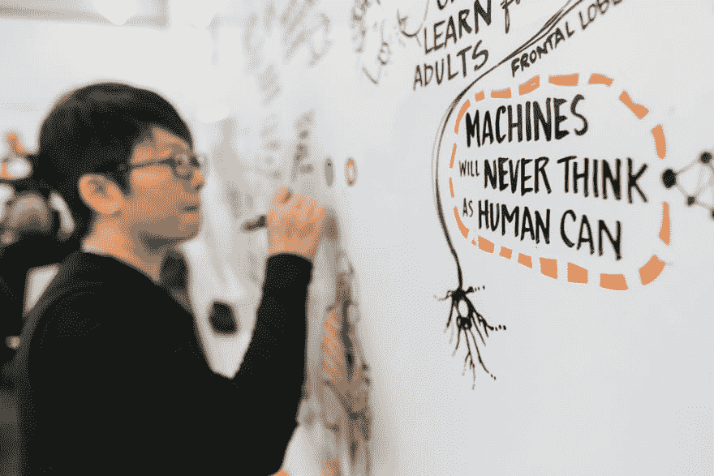

# 机器学习和人工智能如何最终取代开发工作

> 原文：<https://dev.to/theodesp/how-machine-learning-and-ai-could-eventually-replace-development-work>

[T2】](https://res.cloudinary.com/practicaldev/image/fetch/s--GbwmRjNh--/c_limit%2Cf_auto%2Cfl_progressive%2Cq_auto%2Cw_880/https://thepracticaldev.s3.amazonaws.com/i/evnjzrsc3o00t7q8qpld.jpg)

最近我看到了更多关于人工智能和机器学习现状的文章。一些世界末日的预言，如代码的终结，其他人说这将使人类依赖人工智能助手。

虽然我同意大多数关于这些话题的观点，但我认为未来不仅仅是完全依赖或取代这些领域的人的因素。

> 这肯定会是一个跨越未来数年的转变阶段。

人工智能和人工智能将有越来越多的实际应用，将有助于取代危险和鲁莽的人为因素，例如，[驾驶车辆](https://www.wired.com/2015/05/oh-look-evidence-humans-shouldnt-driving/)或[飞机](http://nypost.com/2016/10/18/pilots-could-soon-lose-their-jobs-to-robots/)。当然，人类只会是观察者，只有当他们的头脑清醒时，才会去检查是否有任何事情会出错，这样他们才能跳出来纠正错误。

这是一个自然的转变，因为我们人类是工匠。我们习惯于创造工具来帮助我们完成比自己更大的工作。在远古时代，我们用斧头、镐、铁锻件、机器、自动化工具使自己变得更强大。现在我们只是试图从我们身上创造一些更聪明的东西(理论上)。这是无法避免的。

这些工具无论多么复杂，都有一些局限性，这些局限性表现为我们自身的思维局限性。

例如，除非我们证明我们可以构建一个没有任何错误的程序，否则我们的工具只能到此为止。[见相关链接](http://wiki.c2.com/?ProofsCantProveTheAbsenceOfBugs)。

> 这是根本。如果我们能够构建这样一个证明，那么我们就可以训练机器来创建 100%无 bug 的程序，从而使软件工程师变得多余。

你怎么能有 100%的把握证明这一点？事实证明，在时限内是不可能的。

> 然而，证明不存在许多常见种类的错误是完全可能的。或者代码看起来确实不错，并且具有良好的设计特性。它不会在一组有限的变量内做任何危及规则的事情。

因此，事实上，我们几乎可以肯定我们的程序确实如预期的那样工作，也许 99.99%正确，这意味着我们仍然需要人为因素来解释最后的 0.01%，只是确保没有明显的风险。

因此，对于目前的情况，我们可能会头脑风暴各种可能的转换，ML 和 AI 可以在不久的将来取代某些开发工作。

在本文的其余部分，我将提出一些潜在的转换。

## 转型 1:自动化代码审查和代码检查

[T2】](https://res.cloudinary.com/practicaldev/image/fetch/s--khUP04Ks--/c_limit%2Cf_auto%2Cfl_progressive%2Cq_auto%2Cw_880/https://thepracticaldev.s3.amazonaws.com/i/a2pcc53bh2ixfkubd3sy.jpg)

> 当我们将代码推送到存储库时，ML 和 AI 助手将执行自动代码审查。他们将注释掉不寻常的代码块，并执行漏洞和静态代码分析。他们将纠正这些问题，并再次进行公关审查。

这些机器人助手将变得更加智能，他们将执行自动化的代码审查，并在基于类似代码或代码库的训练数据没有意义的情况下对代码进行评论。他们将执行更正修复，并为 PR 推回更改。只需要一个人作为第二双眼睛来完成合并。

## 转型二:声明式编程模型

[T2】](https://res.cloudinary.com/practicaldev/image/fetch/s--_UzyTPMO--/c_limit%2Cf_auto%2Cfl_progressive%2Cq_auto%2Cw_880/https://thepracticaldev.s3.amazonaws.com/i/795nviiyunwtppad118x.png)

> 我们将为系统的许多部分使用更具声明性的模型，而不是编写命令式代码。在这种情况下，我们将使用自然语言风格编写代码。我们将声明我们的功能性和非功能性需求以及我们的技术需求，ML assistant 将训练模型来生成遵守这些约束的代码。

越来越多的功能块可以转移到这个模型中。比如 http 服务器，CLI 应用，UI 应用都有很多样板。这可以用作训练 ML 助手产生匹配声明文件的代码的模型。因此，不用触摸键盘就能轻松启动应用程序。

**你将说出你的应用程序是做什么的，它只是为你自己写的**。

## 转型 3:自动部署、流程编排、配置、灾难恢复和测试

[T2】](https://res.cloudinary.com/practicaldev/image/fetch/s--pb5sh7NT--/c_limit%2Cf_auto%2Cfl_progressive%2Cq_auto%2Cw_880/https://thepracticaldev.s3.amazonaws.com/i/db4h2d2ls29uwaw1yh7b.jpg)

> 应用程序将能够自动部署自己，在出现错误时自动编写测试用例，并将测试用例推送到存储库。他们将拥有智能自我检测能力，并加入编排平台。在需要调整配置的情况下，ML 助手可以即时执行这些校正。在发生灾难时，它们将根据所需的状态执行自我修补和自我修复。

在这种情况下，在你部署应用程序的时候，人类只会在其中扮演很小的角色。AI 和 ML 助手将拥有自己的连续交付管道，它们将以最有效的方式执行智能和自主部署以及配置管理。

如果发生灾难，他们将执行所有必要的操作来恢复服务。修补系统、卸载流量、回滚等。

未来，一切都将作为[容器](https://en.wikipedia.org/wiki/Linux_containers)部署在一个更加[分散的](https://en.wikipedia.org/wiki/Decentralization)云空间中。当然，它们将是私人和公共的例子，但它将更加普遍和无摩擦。

## 转变 4:整个软件开发生命周期将只是一个高级的描述

[T2】](https://res.cloudinary.com/practicaldev/image/fetch/s--ZKde5ic8--/c_limit%2Cf_auto%2Cfl_progressive%2Cq_auto%2Cw_880/https://thepracticaldev.s3.amazonaws.com/i/yhi6ubqp5lkf8gu1xz8g.jpg)

> 从最初的概念到最终产品以及整个生命周期:产品发布运行、维护产品增强和产品退役将在单个文件中声明和控制。

在那个阶段，人类在发展和权限方面都只是观察者。他们只会表达想法，其余的由 ML 助手处理。他们将能够根据他们在项目申报文件中添加的因素来测试想法，并且可能根据可用的资源来测试一些约束。ML 和 AI 助手将能够解决剩下的问题。

因此，开发人员的角色将主要与改进算法相关联，以产生最具成本效益和最有利可图的结果。

编程的新时代将集中于生产软件模型，这些模型在智能解决方案和实现方面相互竞争。

> 与编程相关的一切都将是一个智能的解决方案，它将使人类将日常生活的风险降低到 99.99%，同时将幸福和长寿最大化到 99.99%。

当前传统的编程方式将会过时，因为它将胜过任何人工解决方案。

> 每个人都将拥有由人工智能和人工智能软件驱动的助手，这些软件将帮助我们在飞行中将想法转化为现实世界的应用。
> 
> 这将极大地推动创业和创新。人们将讨论训练算法模型的最佳方法，以带我们去最近的类地行星，或者找到一种可持续环境的解决方案，使我们的生活更加幸福。

当然，必须有某种控制，因为人类也有自我毁灭和互相利用的倾向。也许我们会有助手来阻止我们伤害他人！谁知道呢！

## 裁决

你准备好迎接未来了吗？太刺激了！

我参考了一些链接来开始:

1.  [牛逼的机器学习](https://github.com/josephmisiti/awesome-machine-learning)

2.  [牛逼的人工智能](https://github.com/owainlewis/awesome-artificial-intelligence)

3.  [Azure 机器学习](https://azure.microsoft.com/en-us/services/machine-learning/)

4.  [Udacity 纳米度](https://www.udacity.com/course/machine-learning-engineer-nanodegree--nd009)

**如果这篇文章有帮助，请分享并关注我的其他[文章](https://medium.com/@fanisdespoudis/)。你可以在 [GitHub](https://github.com/theodesp) 和 [LinkedIn](https://www.linkedin.com/in/theofanis-despoudis-7bb30913/) 上关注我。如果你有任何想法和改进，请随时与我分享。**

快乐编码。

**如果您想安排一次指导会议，请访问我的[共同导师简介](https://www.codementor.io/theofanisdespoudis)** 。