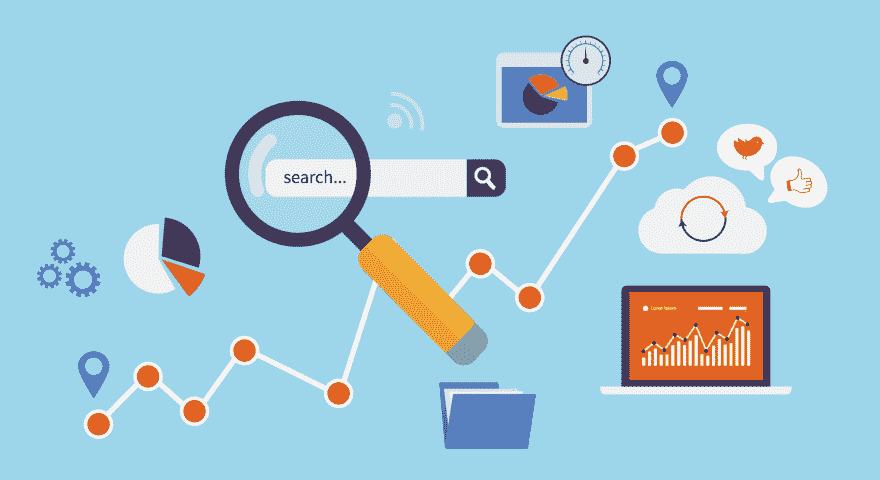

# 移动应用开发公司如何帮助移动营销

> 原文：<https://dev.to/harniloza/how-mobile-app-development-companies-can-help-with-mobile-marketing-c2p>

[T2】](https://res.cloudinary.com/practicaldev/image/fetch/s--U-UhiAjS--/c_limit%2Cf_auto%2Cfl_progressive%2Cq_auto%2Cw_880/https://smejoinup.com/wp-content/uploads/2016/10/stay-ahead.jpg)

顶级应用开发公司在移动营销中的作用怎么强调都不为过。技术已经发展到这样的程度，你现在可以在移动设备上开展在线业务或进行在线营销。人们现在对在网上营销他们的业务非常感兴趣，因为它更便宜，而且受众更广。因此，需要一个好的内容营销策略。

内容营销要有知识性、教育性、娱乐性。它应该能够吸引顾客的注意力。不仅仅是吸引他们的注意力，而是让他们购买你的产品或要求你的服务。记住，目标是让你获得更多的客户。你的顾客越多，你的销售额就越多。因为顾客是任何企业的生命线。没有他们，企业将会停止。

内容营销的强大工具是社交媒体、博客和视频。

### 社交媒体

社交媒体平台允许营销人员直接向目标受众分享其产品和服务的图片和视频。社交媒体平台的增长也归功于销售额的增长。我们有社交媒体平台，比如脸书、推特、Instagram、Snapchat 等等。这些社交媒体平台具有使营销人员能够直接接触其追随者或客户的功能。

社交媒体的一个很好的优势是它们都有展示视频的设施。

在你的追随者的移动设备上安装社交媒体应用程序，他们可以直接与你交流。你可以教育他们，也可以从他们那里得到反馈。

### 博客

Android 应用程序开发公司可以帮助开发一个应用程序，支持您的博客上的图片。没有图片的博客通常读起来没有吸引力。看起来令人沮丧。有句话说得好，一张图胜过千言万语。这是绝对正确的，因为读者通过查看图片可以获得更清晰的信息。

在为你的博客撰写营销内容时，尽量让你的信息简短明了。冗长的信息可能会把人吓跑。简明扼要，因为这样被阅读的机会更高，如果你附上高质量和有吸引力的图片，这种机会就更高了。请记住，这些读者基本上会在他们的手持设备上阅读。

同样，你应该努力把最重要的信息放在第一位。你的读者可能会浏览你的博客，寻找重要的观点。这将使他们能够决定是否采取行动。所以，为了让你的博客读者对你的产品或服务感兴趣，高质量的图片和视频应该包括在内。

光是图片和视频就应该能够吸引你的读者对你的产品或服务的兴趣，并让他们想要购买它。

由于 android 应用程序的开发，通过博客进行内容营销已经成为可能。两个非常有用的博客工具是“WordPress”和“Blogger”。

WordPress 是一个非常受欢迎的博客工具，可以用于个人和商业事务。它的应用程序可以让你在手持或移动设备上轻松更新你的博客。只要您随身携带移动设备，您就可以随时随地编辑帖子和管理用户评论。

另一个强大的博客工具是博客。这个应用程序还拥有 wordpress 的所有功能，这使得它们在移动营销中非常有效。

你的博客内容应该包含有价值的信息，因为读者更喜欢你向他们做广告。

### 视频

视频对于内容营销非常有帮助。视频有助于观众做出更快、更明智的决定。你的观众可以观看、学习和了解你的产品和服务。例如，如果你从事机器制造，就有必要上传关于你的机器以及如何操作它们的视频。如果一台机器可以执行多种功能，就让它出现在你的视频中。另外，在你的视频中包括如何维护它。当您的观众观看视频时，他们可能会对您的机器感兴趣，从而想购买它。

你必须让你的视频非常容易理解，这样才不会让你的观众对你的产品或服务失去兴趣。事实上，制作一个激动人心的视频是可取的。让观看视频变得有趣。一段解说视频就足够了。与静态图像或静止图片相比，解说视频将帮助你更有效地解释这一过程。你也可以附上一段满意的客户或顾客的简短评价视频。证明提供了一种信任感和对你的产品和服务的保证。

但是，你应该尽量避免长视频。你的观众不是在看电影。两三分钟的视频可能没问题。如果还不够，尽量确保不超过五分钟。

视频的一个非常好的优势是它有搜索引擎优化的好处。搜索引擎喜欢视频。统计显示，用视频做广告增加了百分之四十的销售额。

Youtube 是一种非常受欢迎的视频应用。在您的设备或智能手机上使用这款移动应用程序，您可以在线观看、上传、下载甚至播放视频。你需要做的就是用手机或者移动设备拍照，点击 app，上传。上传视频后，您就可以开始分享了。

所有的移动营销应用都有“分享选项”。这个选项可以让你与其他 Android 或智能手机用户共享文件、图片和视频。

Android 应用开发极大地支持了[移动应用营销](http://customerthink.com/4-tips-to-achieve-success-with-mobile-app-marketing-strategy/)。移动设备用户现在可以在他们的设备上接收促销内容。由于这些应用程序开发公司开发的应用程序，实现这些服务的功能是可能的。

移动设备或智能手机制造商现在也将应用程序整合到他们的设备中。随着企业主和营销人员开始上网，这变得非常必要。这对他们来说非常容易，因为他们在移动设备上拥有业务所需的所有工具。