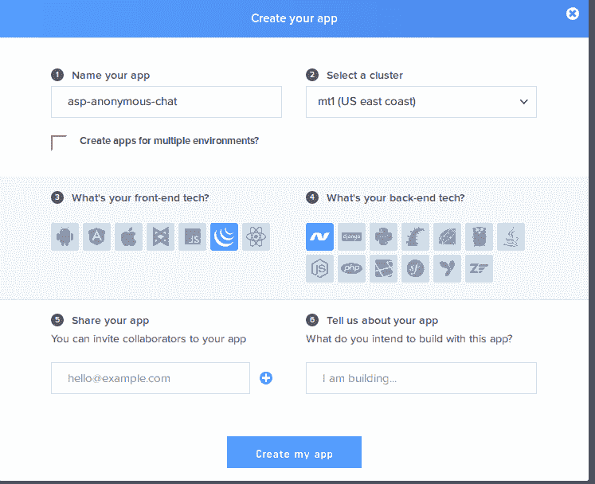
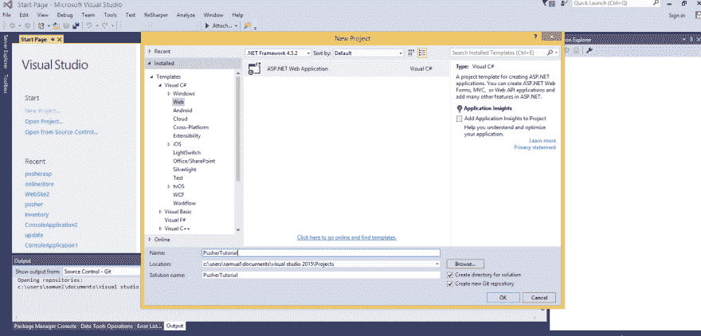
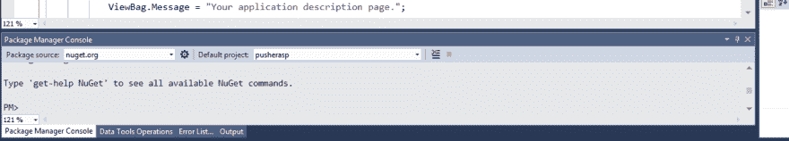
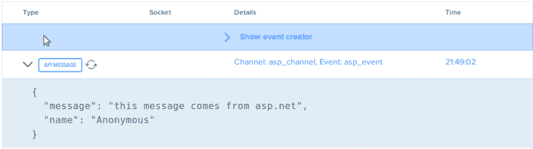
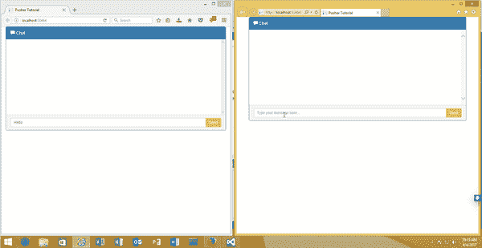

# 如何建立一个公共匿名聊天应用程序？网和推动器

> 原文：<https://dev.to/mezie/how-to-build-a-public-anonymous-chat-app-using-net-and-pusher-pbj>

匿名提供了伪装的可能性，最终成为你想成为的任何人。此外，匿名交流让你不再害羞，表现得自然。总的来说，这是一个吸引那些你没有信心去了解的人的机会。

今天，我们将使用 C # ASP.NET 和 Pusher 创建一个实时公共匿名群聊应用程序。本教程假设读者对 C # ASP.NET 有基本的了解。

## 设置推杆 App

我们需要在 [Pusher](https://pusher.com/signup) 上注册并创建一个新的应用程序，还需要复制我们的秘密、应用程序密钥和应用程序 id。

[T2】](https://res.cloudinary.com/practicaldev/image/fetch/s--Zj6-rip7--/c_limit%2Cf_auto%2Cfl_progressive%2Cq_auto%2Cw_880/http://blog.pusher.com/wp-content/uploads/2017/06/how-to-build-a-public-anonymous-chat-app-using-.NET-and-pusher-setup-pusher.png)

## 在 Visual Studio 中设置 Asp.Net 项目

我们需要创建一个新的 Asp.Net MVC 应用程序，所以我们打开 Visual Studio，从侧栏中选择 new project，在 templates 下，选择`Visual C#`，接下来，选择 web，最后在中间部分，选择`ASP.NET Web Application`。

[T2】](https://res.cloudinary.com/practicaldev/image/fetch/s--k0dpWeWk--/c_limit%2Cf_auto%2Cfl_progressive%2Cq_auto%2Cw_880/http://blog.pusher.com/wp-content/uploads/2017/06/how-to-build-a-public-anonymous-chat-app-using-.NET-and-pusher-setup-visual_studio.png)

现在我们差不多准备好了。下一步将是使用 NuGet 包为`.Net`安装官方 Pusher 库。为此，我们转到顶栏上的工具，单击`NuGet Package Manager`，在下拉菜单中选择`Package Manager Console`。这样做之后，我们将在 Visual Studio 的底部看到`Package Manager Console`，如下所示。

[T2】](https://res.cloudinary.com/practicaldev/image/fetch/s--nnUlFaDx--/c_limit%2Cf_auto%2Cfl_progressive%2Cq_auto%2Cw_880/http://blog.pusher.com/wp-content/uploads/2017/06/how-to-build-a-public-anonymous-chat-app-using-.NET-and-pusher-nuget-command.png)

下一步是通过在控制台中运行以下命令来安装库。

```
 Install-Package PusherServer 
```

完成后，我们的环境就设置好了。

## 制作聊天应用

现在我们的环境已经设置好了，让我们开始编写一些代码。
默认情况下，Visual Studio 为我们创建了三个控制器，但是我们将使用`HomeController`作为聊天应用程序的逻辑。
我们要做的第一件事是删除`Views/Home`文件夹下的默认`index.cshtml`文件，并创建一个名为`index.cshtml`的没有主布局的新视图文件。在我们新的`index.cshtml`文件中，让我们将以下内容复制到其中。

```
 @{
        Layout = null;
        Response.ContentType = "text/HTML";
    }
    <html>
    <head>
        
            Pusher Tutorial
        
    </head>
    <link rel="stylesheet" href="https://maxcdn.bootstrapcdn.com/bootstrap/3.3.7/css/bootstrap.min.css" />
    <script src="https://cdnjs.cloudflare.com/ajax/libs/jquery/3.1.1/jquery.min.js"></script>
    <script src="//js.pusher.com/4.0/pusher.min.js"></script>
    <style>
        .chat {
            list-style: none;
            margin: 0;
            padding: 0;
        }

            .chat li {
                margin-bottom: 10px;
                padding-bottom: 5px;
                border-bottom: 1px dotted #B3A9A9;
            }

                .chat li.left .chat-body {
                    margin-left: 60px;
                }

                .chat li.right .chat-body {
                    margin-right: 60px;
                }

                .chat li .chat-body p {
                    margin: 0;
                    color: #777777;
                }

            .panel .slidedown .glyphicon, .chat .glyphicon {
                margin-right: 5px;
            }

        .panel-body {
            overflow-y: scroll;
            height: 250px;
        }

        ::-webkit-scrollbar-track {
            -webkit-box-shadow: inset 0 0 6px rgba(0,0,0,0.3);
            background-color: #F5F5F5;
        }

        ::-webkit-scrollbar {
            width: 12px;
            background-color: #F5F5F5;
        }

        ::-webkit-scrollbar-thumb {
            -webkit-box-shadow: inset 0 0 6px rgba(0,0,0,.3);
            background-color: #555;
        }
    </style>
    <body>
        <div class="container">
            <div class="row">
                <div class="col-md-12">
                    <div class="panel panel-primary">
                        <div class="panel-heading">
                            <span class="glyphicon glyphicon-comment"></span> Chat
                        </div>
                        <div class="panel-body">
                            <ul class="chat" id="chat"></ul>
                        </div>
                        <div class="panel-footer">
                            <div class="input-group">
                                <input id="btn-input" class="form-control input-sm" placeholder="Type your message here..." type="text">
                                <span class="input-group-btn">
                                    <button class="btn btn-warning btn-sm" id="btn-chat">
                                        Send
                                    </button>
                                </span>
                            </div>
                        </div>
                    </div>
                </div>
            </div>
        </div>    
    </body>
    </html> 
```

在上面这段代码中，我们将布局定义为`null`，将内容类型定义为`"text/HTML"`，这样 Asp.Net 就不会试图将页面解析为`XML`。在定义 HTML 结构之前，我们需要引导 CSS、jQuery 库以及 Pusher JavaScript 库。如果我们保存我们的文件并运行我们的项目，我们应该看到这个。

[T2】](https://res.cloudinary.com/practicaldev/image/fetch/s--vRu1DM8c--/c_limit%2Cf_auto%2Cfl_progressive%2Cq_auto%2Cw_880/http://blog.pusher.com/wp-content/uploads/2017/06/how-to-builda-a-public-anonymous-chat-app-using-.NET-and-pusher-app-view.png)

现在，当有人输入一些文本并点击发送按钮时，我们必须触发一个事件。让我们再次打开我们的`index.cshtml`文件，并在页面末尾添加以下内容。

```
 <script>
        $(document).ready(function(){
            $("#btn-chat").click(function(){
                var message = $('#btn-input').val();

                $.post({
                    url: '@Url.Action("Pushermessage", "Home")',
                    dataType: 'text/HTML',
                    contentType: "application/json",
                    data: JSON.stringify({
                        "message": message
                    }),
                    success: function (data) {
                        $("#btn-input").val('');
                    }
                });
            })
        })
    </script> 
```

在上面的代码中，我们为 ID 为`btn-chat`的元素附加了一个点击事件监听器，这个元素恰好是我们的按钮。单击按钮后，代码将获取 id 为`btn-input`的元素的值，这个元素恰好是我们的文本框，并向我们的`HomeController`中的`Pushermessage`函数发送一个 AJAX 调用。然而，我们还没有创建响应 AJAX 调用的`Pushermessage`函数。

让我们转到我们的`HomeController`，在`index`函数后粘贴下面的代码。

```
 [HttpPost]
            public async Task<ActionResult> Pushermessage(String message)
            {
                var options = new PusherOptions();
                options.Cluster = "XXX_CLUSTER";
                var pusher = new Pusher("XXX_APP_ID", "XXX_APP_KEY", "XXX_APP_SECRET", options);
                ITriggerResult result = await pusher.TriggerAsync("asp_channel", "asp_event", new { message = message, name = "Anonymous" });

                return new HttpStatusCodeResult((int)HttpStatusCode.OK);

            } 
```

不要忘记在文件的顶部，在类声明之前添加以下引用

```
 using PusherServer;
    using System.Net;
    using System.Threading.Tasks; 
```

在最后两个代码块中，我们已经定义了我们的`Pushermessage`函数，我们还用`[HttpPost]`装饰器装饰了它，所以 Asp.Net 知道它是一个用于 POST 请求的函数。在这个函数中，我们分别使用 appId、appKey 和 appSecret 实例化 Pusher。然后我们继续触发一个名为`asp_channel`的通道和一个名为`asp_event`的事件，用它发送两个值。

此时，如果我们重新加载我们的应用程序，键入一条消息并发送，当我们访问 Pusher 仪表板上的调试控制台时，我们应该会看到以下内容:

[T2】](https://res.cloudinary.com/practicaldev/image/fetch/s--b7jOSXjX--/c_limit%2Cf_auto%2Cfl_progressive%2Cq_auto%2Cw_880/http://blog.pusher.com/wp-content/uploads/2017/06/how-to-build-a-public-anonymous-chat-app-using-.NET-and-pusher-pusher-debug.png)

至此，我们已经完成了向数据发送消息的工作。现在让我们继续在客户端监听事件并显示新消息。

让我们打开我们的`index.cshtml`文件，并在我们的`click`事件后添加以下代码行。

```
 var pusher = new Pusher('PUSHER_APP_KEY', {cluster: 'XXX_CLUSTER'});
    var my_channel = pusher.subscribe('asp_channel');
    my_channel.bind("asp_event", function (data) {
        var new_message = '<li class="left clearfix"><span class="chat-img pull-left">';
        new_message +='';
        new_message +=  '</span>';
        new_message +=      '<div class="chat-body clearfix">';
        new_message +=          '<div class="header">';
        new_message +=               '<strong class="primary-font">'+data.name+'</strong> <small class="pull-right text-muted">';
        new_message +=                  '</div>';
        new_message +=                      '<p>';
        new_message +=  data.message;
        new_message +=                      '</p>';
        new_message +=                   '</div>';
        new_message +=      '</li>';
    $("#chat").append(new_message);
    }); 
```

在上面的代码块中，我们声明了一个名为`pusher`的变量，并将它设置为一个新的 Pusher 对象的实例，并传入我们的`appKey`。接下来，我们声明了一个名为`my_channel`的变量，我们将 Pusher subscribe 方法调用到我们的通道，在本例中称为`asp_channel`。

接下来，我们绑定到事件，接收从事件传递来的数据，将数据包装在一些`li`标签中，然后我们将它附加到 HTML 结构中的`ul`元素，ID 为`chat`。以下是我们的功能:

[T2】](https://res.cloudinary.com/practicaldev/image/fetch/s--yis6a4rV--/c_limit%2Cf_auto%2Cfl_progressive%2Cq_66%2Cw_880/http://blog.pusher.com/wp-content/uploads/2017/06/how-to-make-a-public-anonymous-chat-app-using-.NEt-and-pusher-view-demo.gif)

在本文中，我们展示了如何使用 C # ASP.NET 和 Pusher 创建一个公共匿名聊天应用程序。我们已经讨论了设置环境的过程，使用 NuGet 包控制台安装包以及实现聊天应用程序。

许多其他实时应用程序可以使用 Pusher 和 ASP.NET 来构建，它留给你来决定你下一步要构建哪个令人敬畏的实时应用程序。

这篇文章最初由作者发布在 [Pusher 博客](https://blog.pusher.com/build-public-anonymous-chat-app-using-net-pusher)上。