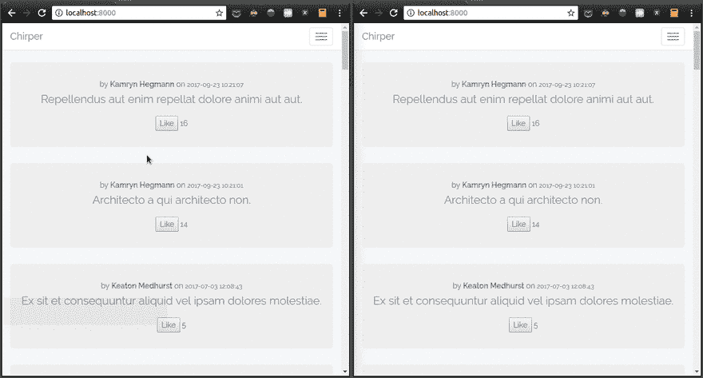
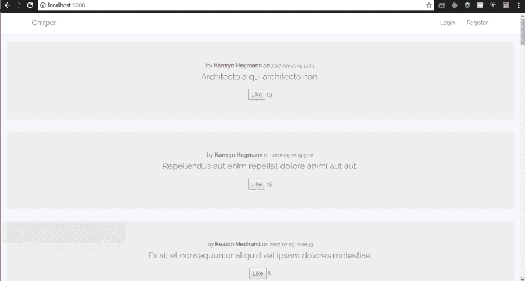
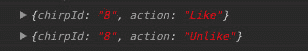

# 如何用 Laravel 事件广播建立 Twitter 的实时赞

> 原文：<https://dev.to/shalvah/how-to-build-twitters-real-time-likes-with-laravel-event-broadcasting-2g98>

2017 年 6 月，Twitter 更新了他们的 web 和 Android 应用，增加了一个有趣的功能:实时推文统计。如果你不熟悉 Twitter，它只是意味着你可以看到随着世界各地的人喜欢或转发它，一条推文的喜欢或转发数量增加(或减少)，而不必刷新页面。

在这篇文章中，我将展示如何使用 Laravel 和 Pusher 在网络上建立你自己的实时赞数。以下是我们完成后应用程序的工作方式:

[T2】](https://res.cloudinary.com/practicaldev/image/fetch/s--z3PvFLLd--/c_limit%2Cf_auto%2Cfl_progressive%2Cq_66%2Cw_880/https://d2mxuefqeaa7sj.cloudfront.net/s_4D6F7F71BD057BE1ADB57E07DC2CC1CC75AAE697AB1B9EDB4FA3A39B737B5225_1507051947175_How-to-Build-Twitters-Real-time-Likes-Feature-with-Pusher-and-Laravel-demo.gif)

我们将构建一个非常简单的应用程序(我将毫无想象力地称之为 Chirper ),并用一些假数据填充它，这样我们就可以快速行动。在我们应用程序的主页上，用户将首先看到所有最近的啁啾声，他们可以点击一个按钮来喜欢或不喜欢它们。每当用户喜欢或不喜欢啁啾，啁啾旁边显示的喜欢计数应该在页面打开的每个其他浏览器中递增或递减。

您可以在 Github 上查看完整应用程序的源代码。

## 设置项目

在这篇文章中，我将使用 Laravel 5.4，但这里的技术应该适用于 Laravel 5.3 或以上的任何版本:

```
composer create-project laravel/laravel=5.4.* chirper 
```

Enter fullscreen mode Exit fullscreen mode

然后在您的中设置您的应用程序详细信息。环境文件:

```
APP_NAME=Chirper
DB_DATABASE=chirper 
```

Enter fullscreen mode Exit fullscreen mode

记住根据您的机器设置合适的`DB_USERNAME`和`DB_PASSWORD`，并创建一个名为“Chirper”的数据库。

接下来，我们将建立我们的数据结构。为了简单起见，我们的应用程序将只有两个主要实体:用户和啁啾声。由于 Laravel 已经为我们提供了用户模型和迁移，我们只需要设置 Chirp 模型和迁移。

```
php artisan make:model Chirp -m 
```

Enter fullscreen mode Exit fullscreen mode

对于啁啾声，我们将存储:

*   正文
*   张贴的日期
*   发布它的用户，以及
*   它获得的赞数

所以我们将上面命令生成的迁移文件中的`up`方法编辑成这样:

```
public function up()
{
    Schema::create('chirps', function (Blueprint $table) {
        $table->increments('id');
        $table->string('text');
        $table->unsignedInteger('user_id');
        $table->integer('likes_count')->default(0);
        $table->timestamp('posted_at');

        $table->foreign('user_id')->references('id')->on('users');
    });
} 
```

Enter fullscreen mode Exit fullscreen mode

让我们打开我们的啁啾模型，并对其进行一些修改。首先，我们必须告诉 Laravel，这个模型没有使用常规的时间戳(`created_at`和`updated_at`)。然后，我们需要允许它的所有属性被一次性赋值。最后，我们将添加一个访问器，这样我们就可以轻松地检索发布啁啾的用户的详细信息。

```
class Chirp extends Model
{
    public $timestamps = false;

    protected $guarded = [];

    public function author()
    {
        return $this->belongsTo(User::class, 'user_id', 'id');
    }
} 
```

Enter fullscreen mode Exit fullscreen mode

接下来，我们将编写一个种子来为我们的应用程序生成一些假用户和他们的唧唧声。如果你打开文件`database/factories/ModelFactory.php`，你会注意到 Laravel 已经为我们的用户提供了一个种子。再给唧唧加一个:

```
$factory->define(App\Chirp::class, function (Faker\Generator $faker) {

    return [
        'text' => $faker->sentence(),
        'likes_count' => $faker->randomDigitNotNull,
        'posted_at' => $faker->dateTimeThisYear(),
        'user_id' => random_int(1, 10)
    ];
}); 
```

Enter fullscreen mode Exit fullscreen mode

然后我们在`database/seeds/DatabaseSeeder.php` :
中调用工厂函数

```
<?php

use App\Chirp;
use App\User;
use Illuminate\Database\Seeder;

class DatabaseSeeder extends Seeder
{
    public function run()
    {
        factory(User::class, 10)->create();
        factory(Chirp::class, 30)->create();
    }
} 
```

Enter fullscreen mode Exit fullscreen mode

现在，如果我们运行

```
php artisan migrate --seed 
```

Enter fullscreen mode Exit fullscreen mode

我们应该看到我们的数据库表已经被创建并填充了假数据。注意:如果你遇到这个错误“指定的键太长；最大密钥长度为 767 字节”当您运行迁移时，请按照以下说明进行修复。

## 设置视图

接下来，我们将运行命令:

```
php artisan make:auth 
```

Enter fullscreen mode Exit fullscreen mode

我们不会使用任何 auth 特性，但我们会运行它，因为它还会为我们设置一些前端模板和 JavaScript，从而节省我们的时间。

让我们设置我们的回家路线和看法。

首先，用我们的家乡路线:
替换您的`routes/web.php`中的家乡路线

```
Route::get('/', 'HomeController@index'); 
```

Enter fullscreen mode Exit fullscreen mode

然后在`app/Controllers/HomeController.php`中，我们将实现`index`方法。(不要忘记移除构造函数中的`auth`中间件):

```
public function index()
{
    $chirps = Chirp::with('author')
        ->orderBy('posted_at', 'desc')
        ->get();
    return view('home', ['chirps' => $chirps]);
} 
```

Enter fullscreen mode Exit fullscreen mode

在这种方法中，我们简单地检索所有啁啾及其作者的详细信息，并将它们传递给视图进行渲染。

最后，我们设置了视图，这是一个简单的用户界面，显示了唧唧喳喳的列表，包括作者姓名、发表的时间，还有一个 Like 按钮，它位于唧唧喳喳的赞数旁边。

不过，我们将为一些元素添加一些属性:

*   每个`Like`按钮的`onclick`处理程序。

*   每个按钮上都有一个`data-chirp-id`,这样我们就可以识别按钮引用的是哪种啁啾声。

*   在每个`likes_count`上有一个`id`，包括唧唧的 id，这样我们就可以通过`document.querySelector`很容易地找到它。

@extends('layouts.app ')

@section('内容')

```
 @foreach($chirps as $chirp)
      <div class="jumbotro">
          <div>by
              <b>{{ $chirp->author->name  }}</b>
              on
              <small>{{ $chirp->posted_at }}</small>
          </div>

          <div>
              <p>{{ $chirp->text }}</p>
          </div>

          <div class="row">
              <button onclick="actOnChirp(event);" data-chirp-id="{{ $chirp->id }}">Like</button>
              <span id="likes-count-{{ $chirp->id }}">{{ $chirp->likes_count }}</span>
          </div>

      </div>
          @endforeach
  </div> 
```

Enter fullscreen mode Exit fullscreen mode

@结束部分

让我们启动我们的应用程序，以确保到目前为止一切正常:

```
php artisan serve 
```

Enter fullscreen mode Exit fullscreen mode

现在访问你在 http://localhost:8000 的主页，你应该会看到所有的啁啾整齐地显示。

[T2】](https://res.cloudinary.com/practicaldev/image/fetch/s---Xlz4mIQ--/c_limit%2Cf_auto%2Cfl_progressive%2Cq_auto%2Cw_880/https://d2mxuefqeaa7sj.cloudfront.net/s_4D6F7F71BD057BE1ADB57E07DC2CC1CC75AAE697AB1B9EDB4FA3A39B737B5225_1507052074669_How-to-Build-Twitters-Real-time-Likes-Feature-with-Pusher-and-Laravel-home-page.png)

## 实现了`Like`逻辑

现在我们将实现喜欢和不喜欢啁啾的逻辑。

首先，我们将看看我们的前端。当用户点击“喜欢”时，我们希望发生几件事:

1.  按钮上的文字从`Like`变为`Unlike`。
2.  唧唧声旁边显示的点赞数加 1。
3.  向服务器发出一个 AJAX 请求，将数据库中的 likes_count 增加 1。
4.  在该页面打开的所有其他标签页/窗口中，啁啾旁边显示的喜欢数增加 1。(这就是 Pusher 的用武之地。)

同样，对于“不像”:

1.  按钮上的文字从`Unlike`变为`Like`。
2.  唧唧声旁边显示的点赞数减 1。
3.  向服务器发出一个 AJAX 请求，将数据库中的 likes_count 减 1。
4.  在页面打开的所有其他标签页/窗口中，唧唧声旁边显示的喜欢数会减少 1。(再次，推手魔术。)

为了便于我们管理这两种类型的事件，我们将引入啁啾行为的概念。对于我们这里的基本用例，我们只有两种类型的动作:喜欢和不喜欢。这两个操作都将转到同一个端点，在那里服务器将进行数据库更新并返回一个 200 OK 响应。让我们为此定义一条路线:

```
Route::post('/chirps/{id}/act', 'HomeController@actOnChirp'); 
```

Enter fullscreen mode Exit fullscreen mode

喜欢按钮应该提出这个形式的请求:

```
{
  "action": "Like"
} 
```

Enter fullscreen mode Exit fullscreen mode

在不像的情况下，动作会“不像”。在我们的控制器中，我们检索动作值，并根据需要增加或减少。为了简单起见，我们将使用同一个 home controller:

```
public function actOnChirp(Request $request, $id)
{
    $action = $request->get('action');
    switch ($action) {
        case 'Like':
            Chirp::where('id', $id)->increment('likes_count');
            break;
        case 'Unlike':
            Chirp::where('id', $id)->decrement('likes_count');
            break;
    }
    return '';
} 
```

Enter fullscreen mode Exit fullscreen mode

现在让我们实现喜欢/不喜欢的 JavaScript。因为代码不多，我们将把它直接添加到 home.blade.php 的“内容”部分:

在您的基本布局(`layouts/app.blade.php`)中，在包含`app.js`的脚本标签后添加一个脚本部分(这样它在 Echo 和 Axios 初始化后运行):

```
<script src="{{ asset('js/app.js') }}"></script>
@yield('js') 
```

Enter fullscreen mode Exit fullscreen mode

我们将把页面的 JavaScript 注入到 home.blade.php 的那个部分中

```
@section('js')
<script>
    var updateChirpStats = {
        Like: function (chirpId) {
            document.querySelector('#likes-count-' + chirpId).textContent++;
        },

        Unlike: function(chirpId) {
            document.querySelector('#likes-count-' + chirpId).textContent--;
        }
    };

    var toggleButtonText = {
        Like: function(button) {
            button.textContent = "Unlike";
        },

        Unlike: function(button) {
            button.textContent = "Like";
        }
    };

    var actOnChirp = function (event) {
        var chirpId = event.target.dataset.chirpId;
        var action = event.target.textContent;
        toggleButtonText[action](event.target);
        updateChirpStats[action](chirpId);
        axios.post('/chirps/' + chirpId + '/act',
            { action: action });
    };

</script>
@endsection 
```

Enter fullscreen mode Exit fullscreen mode

首先，我们有两个对象，每个对象包含两个方法，对应于两个可能的操作。这些方法的名称都是大写的，因此我们可以通过按钮上的文本轻松地调用它们。

第一个对象包含更新显示在 chirp 下方的 likes count 的方法，而第二个对象包含更改按钮上的文本的方法。我们之所以将这两个功能分开，是因为我们上面的第四条标准:对于同时查看这个页面的不同用户，只有赞数应该更新；按钮上的文本不应改变。

我们将一个`onclick`处理程序(`actOnChirp`)附加到每一个被渲染的类似啁啾声的按钮上。在这个方法中，我们执行所需的操作:更改按钮文本，更新赞数，并使用 Axios 将操作发送到服务器，Axios 与 Laravel 捆绑在一起。

在这一点上，访问主页并点击 Like 按钮可以像预期的那样工作。目前为止一切顺利。

## 用推动器广播事件

我们需要做的另一件事是，当一个啁啾被喜欢或不喜欢时，确保在该页面的每个浏览器中显示的喜欢数显示最新更新的值。我们将通过每当一个啁啾被执行时广播一个新事件来做到这一点。Pusher 通过他们的消息传递系统为我们提供了实现这一点的方法，Laravel 提供了一个支持 Pusher 开箱即用的事件和广播系统。

首先，让我们创建事件类:

```
php artisan make:event ChirpAction 
```

Enter fullscreen mode Exit fullscreen mode

为了让浏览器相应地更新 UI 上的赞数，它需要知道两件事:

*   对哪个啁啾进行了操作
*   什么样的行动

我们需要在广播这个事件时发送这个数据，所以让我们打开生成的`app/Events/ChirpAction.php`并添加这两个。我们的类应该是这样的:

```
<?php

namespace App\Events;

use Illuminate\Queue\SerializesModels;
use Illuminate\Foundation\Events\Dispatchable;
use Illuminate\Broadcasting\InteractsWithSockets;

class ChirpAction
{
    use Dispatchable, InteractsWithSockets, SerializesModels;

    public $chirpId;
    public $action;

    public function __construct($chirpId, $action)
    {
        $this->chirpId = $chirpId;
        $this->action = $action;
    }
} 
```

Enter fullscreen mode Exit fullscreen mode

现在，每当新的啁啾声动作发生时，我们需要触发该事件。所以我们编辑了我们的`HomeController`的`actOnChirp`方法来包含这个:

```
public function actOnChirp(Request $request, $id)
{
    $action = $request->get('action');
    switch ($action) {
        case 'Like':
            Chirp::where('id', $id)->increment('likes_count');
            break;
        case 'Unlike':
            Chirp::where('id', $id)->decrement('likes_count');
            break;
    }
    event(new ChirpAction($id, $action)); // fire the event
    return '';
} 
```

Enter fullscreen mode Exit fullscreen mode

在这一点上，每当一个啁啾被喜欢或不喜欢时，该事件将被触发。但是它只对服务器是本地的，所以让我们通过实现对其他客户机的广播来解决这个问题。

如果您还没有免费的推销者帐户，请创建一个。然后访问您的仪表盘并创建一个新的应用程序，记下您的应用程序凭据。我们一会儿需要它们。

让我们在前端设置一些东西。我们将使用 Laravel Echo 通过 Pusher 监听和响应广播。

首先安装需要的依赖项:

```
npm install --save laravel-echo pusher-js 
```

Enter fullscreen mode Exit fullscreen mode

在您的`resources/assets/bootstrap.js`中，取消注释/添加这些行:

```
import Echo from 'laravel-echo'

window.Pusher = require('pusher-js');

window.Echo = new Echo({
    broadcaster: 'pusher',
    key: 'your-pusher-key',
    cluster: 'your-app-cluster'
}); 
```

Enter fullscreen mode Exit fullscreen mode

将`your-pusher-key`和`your-app-cluster`替换为您的应用程序的按钮键和群组，如您的按钮仪表盘所示。在我们的`home.blade.php`的脚本部分，我们将告诉 Echo 监听唧唧的动作，并相应地更新唧唧的点赞数:

```
Echo.channel('chirp-events')
    .listen('ChirpAction', function (event) {
        console.log(event);
        var action = event.action;
        updateChirpStats[action](event.chirpId);
    }) 
```

Enter fullscreen mode Exit fullscreen mode

我把我的频道命名为“啁啾事件”，但你可以使用任何你喜欢的。传递给该函数的事件变量将包含我们在前面的`ChirpAction`事件中定义的属性(`action`和`chirpId`)，因此我们可以简单地访问它们并为相应的啁啾声更新 UI。

我们将事件数据记录到我们的控制台，只是为了调试目的，这样我们就可以看到发生了什么。

然后我们安装我们所有的依赖项并编译我们的前端资产，这样我们对`bootstrap.js`的更新就会出现:

```
npm install && npm run dev 
```

Enter fullscreen mode Exit fullscreen mode

现在，让我们在服务器上设置 Echo 和 Pusher。首先，我们将安装 Pusher 库:

```
composer require pusher/pusher-php-server 
```

Enter fullscreen mode Exit fullscreen mode

接下来，我们将配置我们的服务器通过 Pusher 使用广播。将此添加到您的`config/app.php` :
的`aliases`数组中

```
'Pusher' => Pusher\Pusher::class 
```

Enter fullscreen mode Exit fullscreen mode

另外，从`providers`数组中取消对该行的注释，以启用广播:

```
App\Providers\BroadcastServiceProvider::class, 
```

Enter fullscreen mode Exit fullscreen mode

让我们配置我们的广播和推送设置。Laravel 已经为此提供了一个从`.env`文件中提取值的`config/broadcasting.php`，所以打开`.env`文件并编辑它:

```
BROADCAST_DRIVER=pusher

PUSHER_APP_ID=XXXXXXXXX
PUSHER_APP_KEY=YYYYYYYY
PUSHER_APP_SECRET=ZZZZZZZZ 
```

Enter fullscreen mode Exit fullscreen mode

将上面的存根替换为您 Pusher 仪表盘中的应用凭据。

最后，将你的集群添加到`config/broadcasting.` `php`的`options`数组中。

完成这些更改后，您可能需要运行`php artisan config:cache`，这样您的更改就会从`.env`保存到配置文件中。

为了能够广播我们的事件，我们将让它实现`ShouldBroadcastNow`接口。(通常，我们会使用`ShouldBroadcast`接口，但是我们需要设置和配置队列。使用`ShouldBroadcastNow`强制立即调度事件。)

我们还将实现一个`broadcastOn`方法，该方法返回我们希望在其上广播事件的频道。我们将使用与前端相同的通道名。

此时，我们的事件类看起来是这样的:

```
namespace App\Events;

use Illuminate\Broadcasting\Channel;
use Illuminate\Queue\SerializesModels;
use Illuminate\Foundation\Events\Dispatchable;
use Illuminate\Broadcasting\InteractsWithSockets;
use Illuminate\Contracts\Broadcasting\ShouldBroadcastNow;

class ChirpAction implements ShouldBroadcastNow
{
    use Dispatchable, InteractsWithSockets, SerializesModels;

    public $chirpId;
    public $action;

    public function __construct($chirpId, $action)
    {
        $this->chirpId = $chirpId;
        $this->action = $action;
    }

    public function broadcastOn()
    {
        return new Channel('chirp-events');
    }
} 
```

Enter fullscreen mode Exit fullscreen mode

好了，我们都准备好了！在两个不同的选项卡中打开你的应用程序的主页，尝试在不同的窗口中喜欢和不喜欢。您应该会看到事件被记录到您的浏览器控制台，如下所示:

[T2】](https://res.cloudinary.com/practicaldev/image/fetch/s--3txOiimr--/c_limit%2Cf_auto%2Cfl_progressive%2Cq_auto%2Cw_880/https://d2mxuefqeaa7sj.cloudfront.net/s_4D6F7F71BD057BE1ADB57E07DC2CC1CC75AAE697AB1B9EDB4FA3A39B737B5225_1507058185747_How-to-Build-Twitters-Real-time-Likes-Feature-with-Pusher-and-Laravel-console.png)

注意:如果您发现控制台记录了一个关于 WebSocket 连接被关闭的错误，请尝试重新启动浏览器。

排除发件人

你可能已经注意到我们有一个小问题:当你点击“喜欢”或“不喜欢”时，计数增加或减少两个，而不是一个。发生这种情况是因为该事件当前正在向每个人广播，包括发送它的选项卡。所以第一次增加是由于按钮点击，第二次是由于接收到的消息。我们需要找到一种方法来阻止消息的发送者接收它。幸运的是，我们可以用 Laravel 轻松地做到这一点，只需在我们的`HomeController`的`actOnChirp`方法:
中修改一行代码

```
// replace this...
event(new ChirpAction($id, $action));

// with this...
broadcast(new ChirpAction($id, $action))->toOthers(); 
```

Enter fullscreen mode Exit fullscreen mode

现在，如果您喜欢或不喜欢啁啾声，您应该会看到它出现在其他窗口中，并且在此窗口中仅增加 1。实际情况是这样的:

*   Pusher 为每个连接的标签提供一个标识符，称为插座 ID。无论何时发送包含该 id 的 Pusher 消息，Pusher 都知道不要将消息发送给拥有该 ID 的标签。
*   Laravel Echo 自动将这个 socket ID 附加到 Axios 发送的请求中，作为一个头，`X-Socket-Id`。你可以在你的控制台上运行`Echo.socketId()`来查看。
*   通过使用`broadcast...toOthers`组合，我们让 Laravel 知道它应该在其消息数据中包含 socket ID，这样 Pusher 就可以排除那个标签。这就是全部了。

## 结论

这只是一个概念验证，演示如何通过 Pusher 事件广播来实现这一点。有很多更复杂的用例可用，所以这是你开始用 Pusher 和 Laravel 构建更强大的东西的机会。让我们知道你在评论中构建了什么。

最初发布于[推手博客](https://blog.pusher.com/build-twitter-realtime-likes-feature-with-laravel/)