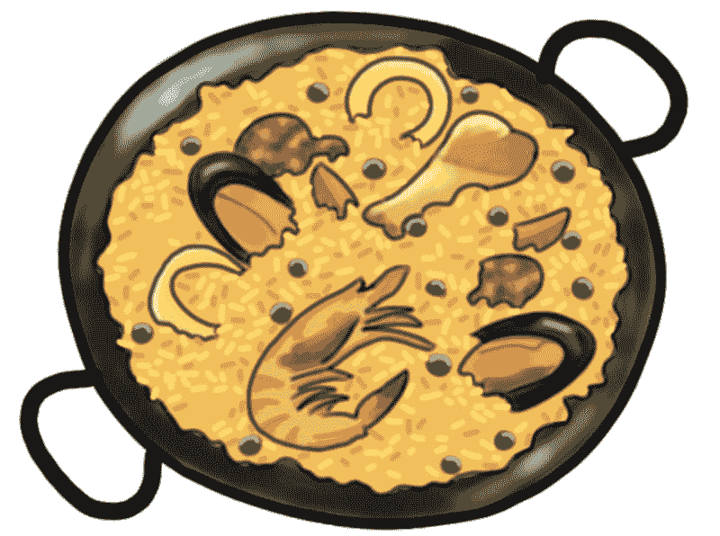
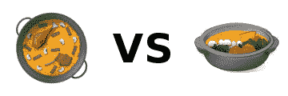
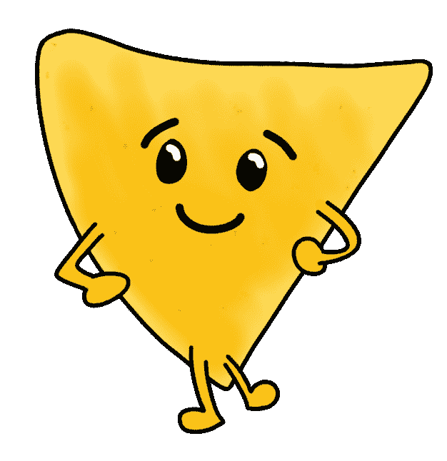
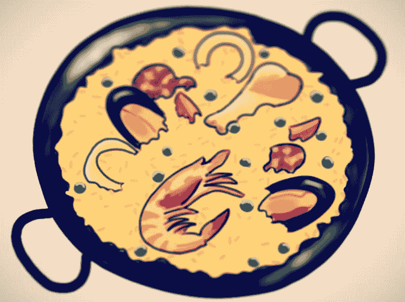

# 如何编写卫星算法并从头开始做海鲜饭

> 原文：<https://dev.to/victoria/how-to-code-a-satellite-algorithm-and-cook-paella-fromscratch>

如果我告诉你，到本文结束时，你将能够计算卫星绕地球的轨道周期，使用它们的平均高度和...你已经不听了，是吗？

好吧，这样如何:我要教你怎么做肉菜饭！

[T2】](https://res.cloudinary.com/practicaldev/image/fetch/s--SBgd2-J5--/c_limit%2Cf_auto%2Cfl_progressive%2Cq_auto%2Cw_880/https://vickylai.io/pixels/solve-paella.jpg)

事实:如果复杂性伴随着食物的承诺，人们更有可能接受它。

*和*你将编写一个函数来做*我上面提到的事情*，就像我为这个[自由代码营挑战](https://www.freecodecamp.org/challenges/map-the-debris)所做的一样。

我保证这是一个最重要的道德教训，会让你受益终生。或者至少，喂你一晚上。让我们开始吧。

# 关于海鲜饭，我唯一知道的是它是一个表情符号

[T2】](https://res.cloudinary.com/practicaldev/image/fetch/s--UgEf-EKs--/c_limit%2Cf_auto%2Cfl_progressive%2Cq_auto%2Cw_880/https://vickylai.io/pixels/solve-unicode-paella.jpg)

除非你在三星手机上阅读这篇文章，在这种情况下，你看到的是韩国火锅。

生活在当今世界上，我最喜欢的一件事是，对某件事几乎一无所知是非常好的。一百年前，你可能一辈子都不知道什么是海鲜饭，只知道它是一个表情符号。*但是今天呢？你可以简单的[查一下](https://en.wikipedia.org/wiki/Paella)。

*那是个玩笑。

就像生活中的所有事情一样，当我们不确定时，我们会求助于互联网——在这种情况下，维基百科上关于*肉菜饭*的条目是这样的:

> 西班牙海鲜饭...是一道瓦伦西亚饭。西班牙海鲜饭有着古老的渊源，但它的现代形式起源于 19 世纪中期西班牙东海岸靠近巴伦西亚城的阿尔布费拉泻湖附近。许多非西班牙人认为西班牙海鲜饭是西班牙的国菜，但大多数西班牙人认为它是巴伦西亚的一道地方菜。反过来，巴伦西亚人把肉菜饭视为他们的身份象征之一。
> 
> 肉菜饭的种类包括巴伦西亚肉菜饭、素食/纯素肉菜饭(西班牙语:西班牙肉菜饭)、海鲜肉菜饭(西班牙语:马里斯科肉菜饭)和混合肉菜饭(西班牙语:混合肉菜饭)等等。([维基百科](https://en.wikipedia.org/wiki/Paella))

此时，你可能充满了疑问。我需要和一个巴伦西亚人谈谈吗？我应该上西班牙历史的在线课程吗？我应该尝试做什么类型的肉菜饭？现代厨师对海鲜饭类型的普遍看法是什么？

如果你带着回答所有这些问题的意图出发，有一件事是肯定的:你永远不会真正做西班牙海鲜饭。你会花上几个小时在搜索引擎中输入问题，几年后醒来，你会发现巴伦西亚烹饪大师。

# “最重要问题”法

当我在公共场合大声自言自语的时候(不是每个人都这样吗？)我称之为“MIQ”(与“尼克”押韵)。我还想象 MIQ 是一个相当脆，相当可爱的拟人化的玉米片。不知道为什么。

[T2】](https://res.cloudinary.com/practicaldev/image/fetch/s--LNnGs-HU--/c_limit%2Cf_auto%2Cfl_progressive%2Cq_auto%2Cw_880/https://vickylai.io/pixels/solve-miq.png)

MIQ 摆动着他脆脆的三角形身体，给我指了一个正确的方向，而正确的方向总是以最重要的问题的形式出现，你需要在解决问题的任何阶段问自己。第一个最重要的问题总是这样:

我想达到的目标范围是什么？

你想做肉菜饭。

下一个 MIQ 变成了:为了开始做肉菜饭，我到底需要了解多少？

你以前听过这个建议:任何大问题都可以分解成多个，但更容易管理的小问题。在这个微小问题的小星座中，为了让*在大部分情况下*得到一个完整的解决方案，你只需要解决*一个*。

就做西班牙海鲜饭而言，我们需要一份食谱。这是一个搜索引擎可以为我们解决的小问题:

> **简单的海鲜饭菜谱**
> 
> 1.  在一个中等大小的碗中，混合 2 汤匙橄榄油、辣椒粉、牛至、盐和胡椒。加入鸡块搅拌均匀。盖上盖子，冷藏。
>     
>     
> 2.  在一个大煎锅或肉菜饭锅中用中火加热 2 汤匙橄榄油。加入大蒜、红辣椒片和大米搅拌。烹饪，搅拌，用油包裹米饭，大约 3 分钟。加入藏红花丝、月桂叶、欧芹、鸡汤和柠檬皮搅拌。烧开，盖上盖子，关小火。炖 20 分钟。
>     
>     
> 3.  同时，在另一个煎锅中用中火加热 2 汤匙橄榄油。拌入腌制好的鸡肉和洋葱；煮 5 分钟。拌入甜椒和香肠；煮 5 分钟。拌入虾仁；翻炒虾，直到两面都变成粉红色。
>     
>     
> 4.  将米饭混合物铺在托盘上。上面放上肉和海鲜混合物。([allrecipes.com](http://allrecipes.com/recipe/84137/easy-paella/)

然后*瞧*！信不信由你，我们已经到了*的大部分路程*了。

拥有一套易于理解的分步说明实际上已经完成了大部分工作。剩下的就是走过场，收集材料，然后做肉菜饭。从这一点开始，您的 Miq 可能会变得越来越少，它们相对于整个问题的重要性可能会慢慢降低。(哪里买辣椒粉？我怎么知道香肠什么时候熟？我如何把手机的定时器设置为 20 分钟？我如何停止思考这种美味的气味？哪个 Instagram 过滤器最能捕捉到这道海鲜饭的狂喜？)

[T2】](https://res.cloudinary.com/practicaldev/image/fetch/s--IYA-ezlg--/c_limit%2Cf_auto%2Cfl_progressive%2Cq_auto%2Cw_880/https://vickylai.io/pixels/solve-insta-paella.jpg)

最后一个问题的答案是“纳什维尔”。

# 我仍然对计算卫星的轨道周期一无所知

好吧。让我们检查一下这个问题:

> 返回一个新的数组，将元素的平均高度转换成它们的轨道周期。
> 
> 该数组将包含{name: 'name '，avgAlt: avgAlt}格式的对象。
> 
> 你可以在维基百科上读到轨道周期。
> 
> 这些值应该四舍五入到最接近的整数。绕轨道运行的物体是地球。
> 
> 地球半径为 6367.4447 公里，地球 GM 值为 398600.4418 km3s-2。
> 
> `orbitalPeriod([{name : "sputnik", avgAlt : 35873.5553}])`应返回`[{name: "sputnik", orbitalPeriod: 86400}].`

事实证明，为了计算卫星的轨道周期，我们还需要一个配方。太神奇了，这些天你能在网上找到的东西。

承蒙[dummies.com](http://www.dummies.com/education/science/physics/how-to-calculate-the-period-and-orbiting-radius-of-a-geosynchronous-satellite/)(没错！#noshame)，这是我们的食谱:

[T2】](https://res.cloudinary.com/practicaldev/image/fetch/s--F8HcqbTT--/c_limit%2Cf_auto%2Cfl_progressive%2Cq_auto%2Cw_880/https://vickylai.io/pixels/solve-orbital-period.png)

某种程度上，这很可爱。

这看起来可能很复杂，但是正如我们已经看到的，我们只需要回答下一个 MIQ:为了开始使用这个公式，我实际上需要知道多少？

在这种情况下的挑战，不太多。我们已经给定了`earthRadius`，而`avgAlt`是我们参数对象的一部分。它们一起形成了半径， *r* 。通过几个搜索查询和一些对你的初级数学课的心理时间旅行，我们可以用一点点英语描述这个公式:

***T* ，轨道周期，等于 2 乘以π，依次乘以半径的平方根， *r* 的立方，除以引力质量， *GM* 。**

JavaScript 有一个`Math.PI`属性，还有`Math.sqrt()`函数和`Math.pow()`函数。利用这些结合简单的计算，我们可以把这个方程用一行赋值给一个变量:

```
var orbitalPeriod = 2 * Math.PI * (Math.sqrt(Math.pow((earthRadius + avgAlt), 3) / GM)); 
```

Enter fullscreen mode Exit fullscreen mode

从内到外:

1.  添加`earthRadius`和`avgAlt`
2.  对步骤 1 的结果进行立方运算
3.  将步骤 2 的结果除以 GM
4.  取第 3 步结果的平方根
5.  将 2 乘以 Pi 乘以步骤 4 的结果
6.  将返回值赋给`orbitalPeriod`

信不信由你，我们已经大有进展了。

这个挑战的下一个 MIQ 是接受 arguments 对象，提取我们需要的信息，并以要求的格式返回等式的结果。有很多方法可以做到这一点，但是我喜欢一个简单的`for`循环:

```
function orbitalPeriod(arr) {
  var resultArr = [];

  for (var teapot = 0; teapot < arguments[0].length; teapot++) {
    var GM = 398600.4418;
    var earthRadius = 6367.4447;
    var avgAlt = arguments[0][teapot]['avgAlt'];
    var name = arguments[0][teapot]['name'];
    var orbitalPeriod = 2 * Math.PI * (Math.sqrt(Math.pow((earthRadius + avgAlt), 3) / GM));
    var result = {
      name: name,
      orbitalPeriod: Math.round(orbitalPeriod)
    }
    resultArr.push(result);
  }

  return resultArr;
} 
```

Enter fullscreen mode Exit fullscreen mode

如果你需要复习遍历数组，看看我的关于迭代的文章[，包括早餐数组](https://vickylai.io/verbose/iterating-objects-arrays/)！(阅读 5 分钟)

别看现在，你刚刚获得了计算卫星轨道周期的能力。如果你愿意，你甚至可以一边做肉菜饭一边做。说真的。把它写进你的简历。

# Tl；博士:最重要的道德教训

无论是烹饪、编码还是其他任何事情，问题可能一开始看起来令人困惑、不可克服或者非常无聊。如果你面临这样的挑战，请记住:配上一口大小的 MIQ 薯片，它们更容易消化。

[T2】](https://res.cloudinary.com/practicaldev/image/fetch/s--pE7z2k85--/c_limit%2Cf_auto%2Cfl_progressive%2Cq_auto%2Cw_880/https://vickylai.io/pixels/solve-miq-bowl.png)

感谢阅读！