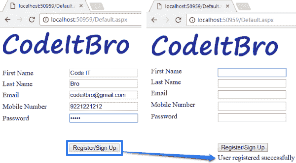

# 如何使用 C#和 SQL Server 在 ASP.NET 创建一个简单的注册表单

> 原文：<https://dev.to/codeitbro/how-to-create-a-simple-registration-form-in-aspnet-using-c-and-sql-server-464n>

**原文发表于此:**【ASP.NET】使用 C#和 SQL Server 数据库的注册表。

[T2】](https://res.cloudinary.com/practicaldev/image/fetch/s--yNkVMOyl--/c_limit%2Cf_auto%2Cfl_progressive%2Cq_auto%2Cw_880/https://thepracticaldev.s3.amazonaws.com/i/vx1hmc5sr3wcaut5ymsl.png)

**ASP.NET 登记表背后的逻辑:**

这里不涉及火箭科学——用户只需在注册表上输入他们的详细信息，如电子邮件、名字、姓氏和其他详细信息。之后，他们会点击一个按钮在你的网站上注册。

**代码运行时实际发生了什么:**

用户将在用户注册表单中输入他们的详细信息，然后点击注册按钮。之后，将建立一个到数据库的连接，并执行一个 SQL Insert 查询，将所有用户输入存储在 user details 表中。

**下面是完整流程的分解:**

1.  创建一个空的 ASP.NET 网站。

2.  设计用户注册表单。

3.  将 SQL 数据库添加到项目中，我们将在其中创建一个表来存储用户详细信息。

4.  正在配置 web.config 文件。

5.  编码用户注册表单的后端。

6.  尝试并测试应用程序。

按照上面的教程链接详细阅读这些步骤。

干杯:)我们来编码吧！