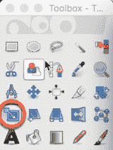
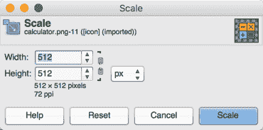
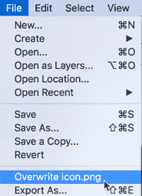

# 如何在 Ionic framework 3 中自动创建图标和闪屏图像

> 原文：<https://dev.to/nikola/how-to-create-icons-and-splash-screen-images-automatically-in-ionic-framework-3>

[T2】](https://res.cloudinary.com/practicaldev/image/fetch/s--u21QcSh8--/c_limit%2Cf_auto%2Cfl_progressive%2Cq_auto%2Cw_880/https://thepracticaldev.s3.amazonaws.com/i/vj0rcfynhdrnmej02v8l.jpg)

*原载于[我的博客](http://www.nikola-breznjak.com/blog/javascript/ionic3/create-icons-splash-screen-images-automatically-ionic-framework-3/)*

> 如果你正在寻找如何在 Ionic framework 版本 1 中自动创建图标和闪屏图像，那么你可以看看这篇文章。关于 Ionic framework 3 的更多帖子，请查看[如何在 Windows 和 Mac 上开始使用 Ionic framework 3 的分步信息](http://www.nikola-breznjak.com/blog/javascript/ionic3/get-started-ionic-framework-3-mac-windows/)。

## TL；速度三角形定位法(dead reckoning)

只需在你的 Ionic 3 项目根文件夹中执行`ionic cordova resources`命令。

## [T1】！TL；速度三角形定位法(dead reckoning)](#tldr)

图标是应用程序的重要组成部分，因为它代表了应用程序的品牌，有助于快速识别应用程序在手机上的位置。如果你熟悉创建应用程序，那么你会记得为 iOS 和 Android 平台创建大量不同大小的图像是一个乏味的过程。

同样，每次应用程序启动时出现的所谓闪屏也是如此。虽然闪屏不是强制性的，但它确实给人一种完整而专业的应用程序的感觉，这也是一个人在应用程序中想要表达的。

Ionic 在这方面帮助很大，它提供了一个 Ionic CLI 命令来自动生成所有需要的图标和闪屏尺寸。此外，Ionic 创建了 [Photoshop 闪屏模板](http://code.ionicframework.com/resources/splash.psd)，你可以免费下载，并将其用作创建图标的指南。然而，如果你使用`ionic start`命令创建你的项目，就像我们所做的，那么你已经在`resources`文件夹中有了`icon.png`和`splash.png`文件，你可以编辑它们。

因为当你创造一个品牌产品时，定制图标是绝对必要的。然而，在这种情况下，我将向您展示如何使用一个免费服务来搜索一个免费图标，然后您可以在您的应用程序中使用它(即使您的应用程序是一个商业应用程序)。

我倾向于大量使用 [IconFinder](https://www.iconfinder.com?ref=Hitman666) ，这里是你必须使用的设置，以过滤出免费的(价格)计算器图像，可以在商业应用程序中使用，甚至不需要链接回来(许可证类型)。

当然，你也可以选择购买一个图像，如果你碰巧找到一个你喜欢的。您还可以按格式、大小和背景进行搜索。过滤器应该是这样的(或者使用这个[准备好的链接自动设置它们](https://www.iconfinder.com/search/?q=calculator&license=2&minimum=512&maximum=512&price=free&ref=Hitman666)):

[T2】](https://res.cloudinary.com/practicaldev/image/fetch/s--QbInCjYy--/c_limit%2Cf_auto%2Cfl_progressive%2Cq_auto%2Cw_880/http://i.imgur.com/IIi4opI.png)

我要用第一排的最后一个。只需点击它，您应该会看到如下所示的下载页面:

[T2】](https://res.cloudinary.com/practicaldev/image/fetch/s--EgNJDD80--/c_limit%2Cf_auto%2Cfl_progressive%2Cq_auto%2Cw_880/http://i.imgur.com/BtvGIBC.png)

要下载它，只需点击绿色的“下载 PNG”按钮。

现在，在`resources`文件夹中找到并使用您选择的图像编辑器打开`icon.png`文件。在这个例子中，我将使用 [Gimp](https://www.gimp.org/) ，因为它是免费的跨平台图像编辑器，可用于所有主要的操作系统(Linux、OS X、Windows)。您应该会看到类似这样的内容:

[T2】](https://res.cloudinary.com/practicaldev/image/fetch/s--Fbvhax6Z--/c_limit%2Cf_auto%2Cfl_progressive%2Cq_auto%2Cw_880/http://i.imgur.com/lLbXt9G.png)

现在我们需要做几个步骤:

*   选择整个区域(`Ctrl + a`或`Command + a`)并按下键盘上的`DEL`按钮。这会给你留下一张空白的画布。
*   在这块白色画布上拖动计算器图标，您应该会看到类似这样的内容:
*   单击缩放工具
*   
*   然后点击计算器图像。您应该会看到这个弹出窗口:
*   
*   将弹出菜单中的宽度和高度值更改为`1024px`，并点击`Scale`按钮。
*   单击对齐工具，然后单击计算器图像，然后单击下图中带圆圈的两个按钮。这将水平和垂直对齐计算器图像
*   

现在转到`File->Overwrite icon.png`保存文件:

[T2】](https://res.cloudinary.com/practicaldev/image/fetch/s--wPkeqeo1--/c_limit%2Cf_auto%2Cfl_progressive%2Cq_auto%2Cw_880/http://i.imgur.com/4C8mzLi.png)

重复该过程以创建闪屏图像，并将其命名为`splash.png`(将其改写为)。我想到的图像是这样的:

[T2】](https://res.cloudinary.com/practicaldev/image/fetch/s--WCek-Cnj--/c_limit%2Cf_auto%2Cfl_progressive%2Cq_auto%2Cw_880/http://i.imgur.com/a10DZi5.png)

现在你已经准备好了 icon.png 的**和 splash.png 的**的**图像，使用你的终端/命令提示符导航到应用程序的根文件夹，并运行下面的命令:**

`ionic cordova resources`

如果此时出现如下错误:

`[ERROR] No platforms have been added. Please run: ionic cordova platform add`

这意味着你还没有添加任何 Ionic 应该构建的平台。由于我们要为苹果商店和安卓游戏商店构建应用，我们将使用以下两个命令:

```
ionic cordova platform add android
ionic cordova platform add ios 
```

您应该会看到类似如下的输出:

```
ionic cordova platform add ios
> cordova platform add ios --save
✔ Running command - done!
Using cordova-fetch for cordova-ios@~4.4.0
Adding ios project...
Creating Cordova project for the iOS platform:
    Path: platforms/ios
    Package: io.ionic.starter
    Name: MyApp
iOS project created with cordova-ios@4.4.0
Discovered plugin "cordova-plugin-console" in config.xml. Adding it to the project
Installing "cordova-plugin-console" for ios
Adding cordova-plugin-console to package.json
Saved plugin info for "cordova-plugin-console" to config.xml
Discovered plugin "cordova-plugin-device" in config.xml. Adding it to the project
Installing "cordova-plugin-device" for ios
Adding cordova-plugin-device to package.json
Saved plugin info for "cordova-plugin-device" to config.xml
Discovered plugin "cordova-plugin-splashscreen" in config.xml. Adding it to the project
Installing "cordova-plugin-splashscreen" for ios
Adding cordova-plugin-splashscreen to package.json
Saved plugin info for "cordova-plugin-splashscreen" to config.xml
Discovered plugin "cordova-plugin-statusbar" in config.xml. Adding it to the project
Installing "cordova-plugin-statusbar" for ios
Adding cordova-plugin-statusbar to package.json
Saved plugin info for "cordova-plugin-statusbar" to config.xml
Discovered plugin "cordova-plugin-whitelist" in config.xml. Adding it to the project
Installing "cordova-plugin-whitelist" for ios
Adding cordova-plugin-whitelist to package.json
Saved plugin info for "cordova-plugin-whitelist" to config.xml
Discovered plugin "ionic-plugin-keyboard" in config.xml. Adding it to the project
Installing "ionic-plugin-keyboard" for ios
Adding ionic-plugin-keyboard to package.json
Saved plugin info for "ionic-plugin-keyboard" to config.xml
--save flag or autosave detected
Saving ios@~4.4.0 into config.xml file ...
✔ Copying default image resources into ./resources/ios - done!

> cordova platform add android --save
✔ Running command - done!
Using cordova-fetch for cordova-android@~6.2.2
Adding android project...
Creating Cordova project for the Android platform:
    Path: platforms/android
    Package: io.ionic.starter
    Name: MyApp
    Activity: MainActivity
    Android target: android-25
Subproject Path: CordovaLib
Android project created with cordova-android@6.2.3
Installing "cordova-plugin-console" for android
Installing "cordova-plugin-device" for android
Installing "cordova-plugin-splashscreen" for android
Installing "cordova-plugin-statusbar" for android
Installing "cordova-plugin-whitelist" for android

               This plugin is only applicable for versions of cordova-android greater than 4.0\. If you have a previous platform version, you do *not* need this plugin since the whitelist will be built in.

Installing "ionic-plugin-keyboard" for android
--save flag or autosave detected
Saving android@~6.2.3 into config.xml file ...
✔ Copying default image resources into ./resources/android - done! 
```

在这之后，您可以安全地运行`ionic cordova resources`命令，并且您应该得到以下输出:

```
✔ Collecting resource configuration and source images - done!
✔ Filtering out image resources that do not need regeneration - done!
✔ Uploading source images to prepare for transformations - done!
✔ Generating platform resources: 48 / 48 complete - done!
✔ Modifying config.xml to add new image resources - done! 
```

从输出中，您可以看到创建了 48 个图像，希望现在您意识到这样节省了多少时间。所有关于图标和闪屏的配置都是由 Ionic 生成的，并放在 **config.xml** 文件中。

值得注意的是，当使用浏览器测试或 Ionic View 测试时，您既不会看到图标，也不会看到闪屏。相反，只有当您将它们部署到实际的物理设备或模拟器时，您才会看到它们。

> 如果你在 Windows 机器上开发，你可以添加一个 iOS 平台，然后`ionic cordova resources`命令会为它生成图标和闪屏。然而，记住**你不能在你的 Windows 机器**上为 iOS 构建项目。相反，你需要一台 Mac 电脑来完成这项工作。