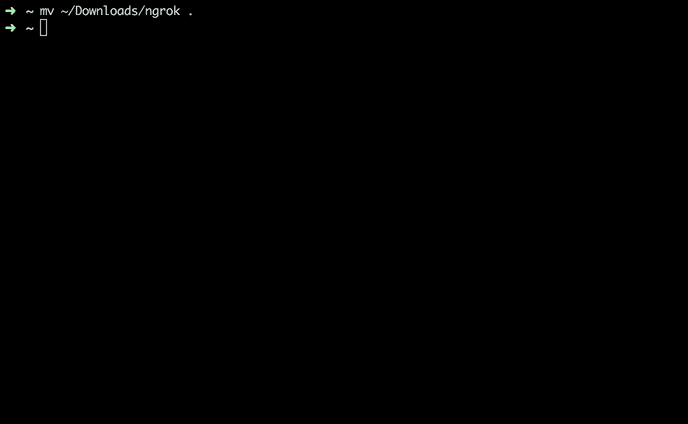
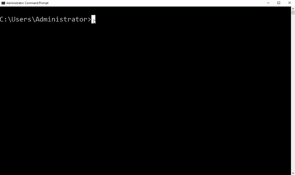
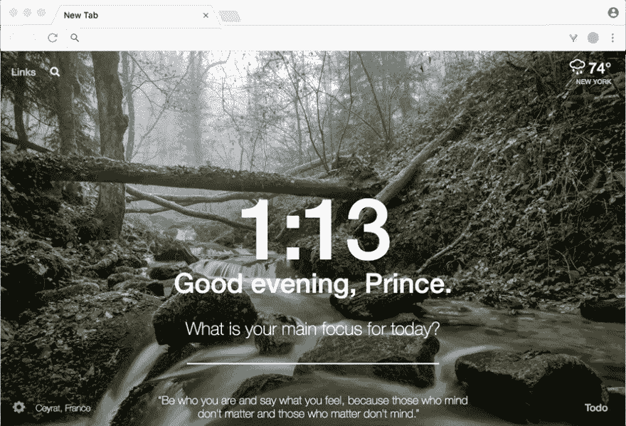

# 如何使用 ngrok 演示您的本地主机应用程序

> 原文：<https://dev.to/clarifai/how-to-demo-your-localhost-app-using-ngrok>

Ngrok 是一个反向代理，它允许你向其他开发者公开本地运行的 web 服务。对于开发者来说，展示一个项目可以节省时间。请继续学习，了解如何将它应用到您的应用工具箱中！

大家好！你是否曾经想在黑客马拉松上展示一个你创建的惊人项目；或者向客户展示您正在构建的应用程序的进度，而无需将其部署到某个服务器上？像 [ngrok](https://ngrok.com/) 这样的反向代理工具可以解决这个问题。让我们看看它是如何工作的。

### 示例 App

我们需要从本地运行的服务器开始。如果你没有要测试的网络应用程序，你可以使用一个快捷的 [Sinatra](http://sinatrarb.com) “你好，世界”:

```
# app.rb
require 'sinatra'

get '/' do
  'Hello World!'
end 
```

Enter fullscreen mode Exit fullscreen mode

我们要确保拿到辛纳特拉宝石。使用
通过终端安装 gem

```
$ gem install sinatra 
```

Enter fullscreen mode Exit fullscreen mode

要运行我们的应用程序，请进入终端并写下:

```
$ ruby app.rb 
```

Enter fullscreen mode Exit fullscreen mode

[T2】](https://res.cloudinary.com/practicaldev/image/fetch/s--NS7HtYDo--/c_limit%2Cf_auto%2Cfl_progressive%2Cq_66%2Cw_880/http://blog.clarifai.com/wp-content/uploads/2017/08/sinatra.gif)

还有 BOOOM！！3 行 Hello World 应用程序。

[T2】](https://res.cloudinary.com/practicaldev/image/fetch/s--VstSXmDZ--/c_limit%2Cf_auto%2Cfl_progressive%2Cq_66%2Cw_880/http://blog.clarifai.com/wp-content/uploads/2017/08/thats-wicked.gif)

### Ngrok

Ngrok 是由 Alan Shreve 制作的一个工具，他把它分解成三个简单的步骤，使它尽可能的容易使用:

1.  [为您的操作系统下载 ngrok】](https://ngrok.com/download)
2.  拉开拉链
3.  发射它！

嗒哒！你是天生的！

在这里，我们将通过 macOS/Linux 和 Windows 启动 ngrok。让我们将可执行文件从“我的下载”移动到 macOS/Linux 朋友的主文件夹(标记为波浪号或~)。打开一个新的终端，写下:

```
$ mv /your/path/to/ngrok ~ 
```

Enter fullscreen mode Exit fullscreen mode

对于 Windows，我们将 ngrok.exe 移动到我的特定用户目录。我的名字叫管理员，但你的可能是你的名字(例如“威尔逊王子”)。

```
$ move \your\path\to\ngrok \Users\<PC_Name> 
```

Enter fullscreen mode Exit fullscreen mode

我们将直接从当前目录执行 ngrok。在 macOS 中，您可以在脚本前面加上“”。/'来执行它，在 Windows 中，您可以使用\\。\'.否则你的终端会在你的路径中寻找 ngrok。ngrok 至少需要两个字段:1)协议(即 HTTP)和 2)我们想要公开的端口。如果你在使用的端口上运行你自己的应用 pop，那么 Sinatra 默认使用 4567 端口。

```
$ ./ngrok http 4567 
```

Enter fullscreen mode Exit fullscreen mode

[](https://res.cloudinary.com/practicaldev/image/fetch/s--n3Yq8WFq--/c_limit%2Cf_auto%2Cfl_progressive%2Cq_66%2Cw_880/http://blog.clarifai.com/wp-content/uploads/2017/08/ngrok.gif)T3】

```
$ .\ngrok http 4567 
```

Enter fullscreen mode Exit fullscreen mode

[T2】](https://res.cloudinary.com/practicaldev/image/fetch/s--0D2F5PYF--/c_limit%2Cf_auto%2Cfl_progressive%2Cq_66%2Cw_880/http://blog.clarifai.com/wp-content/uploads/2017/08/ngrok_windows.gif)

它会产生一堆输出，但我们现在只关心转发 url。我的是“ [http://da0dcb04.ngrok.io](http://da0dcb04.ngrok.io) ”或者“ [http://f4fcf6f0.ngrok.io](http://f4fcf6f0.ngrok.io) ”。请注意，它指向我们的示例服务器所在的位置，这意味着任何点击我们链接的人都将被转发到我们的示例应用程序！

[T2】](https://res.cloudinary.com/practicaldev/image/fetch/s--aRZLXxvg--/c_limit%2Cf_auto%2Cfl_progressive%2Cq_66%2Cw_880/http://blog.clarifai.com/wp-content/uploads/2017/08/hello_world.gif)

### 结论

至此，您已经了解了 ngrok 的基础知识。但是，还有很多东西要学！尝试以下方法来改善您的体验:

*   要检查通过的流量并重放请求，请查看 [http://localhost:4040](http://localhost:4040) 。在 [ngrok 文档](https://ngrok.com/docs#inspect)中了解更多信息。
*   如果您想使用自己的基本身份验证，请注册一个 ngrok 帐户。有什么损失呢？
*   你也可以从支持这个项目中得到很多东西，所以如果你有资金来帮助软件发展，那就掏钱吧。

如果你有任何问题或者想分享你的 ngrok 经验，请随时给我发邮件到[hackers@clarifai.com](//mailto:hackers@clarifai.com)；我很想收到你的来信！