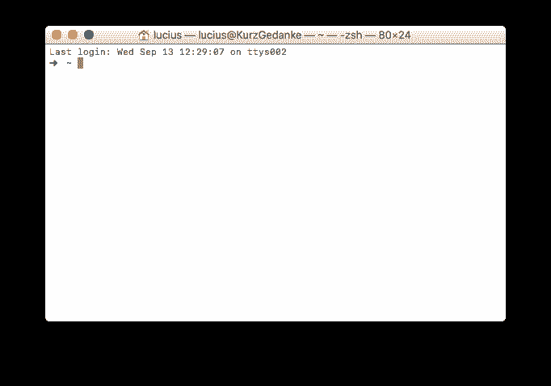

# 如何用 AES 加密文件

> 原文：<https://dev.to/kurzgedanke/how-to-encrypt-files-with-aes-doe>

在大规模监控、公共 Wi-fi 和许多坏人试图窃取您的数据时，您需要在通过互联网发送数据之前对其进行加密。

这有可能通过叫做 *OpenSLL* 和 *AES* 的东西实现。 *AES* 是一种加密你的数据的密码算法， *OpenSSL* 是一套里面有密码的东西供你使用。 *OpenSSL* 应该预装在所有 **nix* 操作系统上。

### 我们开始吧:

在 Mac 上，使用 spotlight 搜索打开您的终端并输入`terminal`。按回车键启动它。

[T2】](https://res.cloudinary.com/practicaldev/image/fetch/s--HS91iERA--/c_limit%2Cf_auto%2Cfl_progressive%2Cq_auto%2Cw_880/https://kurzgedanke.de/img/encrypt_with_aes/terminal.png)

您需要导航到要加密的文件所在的文件夹。在我的情况下，这是桌面。如果你想了解更多关于终端导航的信息，这里有一个教程链接。

> 当然，您可以只是复制命令，但是没有`$`。这表示您可以在终端中输入一行。

```
$ cd Desktop/ 
```

Enter fullscreen mode Exit fullscreen mode

要显示桌面上有哪些文件，您可以使用`ls`命令。

```
$ ls
very_important_file.txt 
```

Enter fullscreen mode Exit fullscreen mode

你可以看到，我的桌面上有一个`very_important_file.txt`，我想在发送给我的朋友之前对它进行加密。要加密这个文件，你可以使用下面的命令:

```
$ openssl aes-256-cbc -a -salt -in very_important_file.txt -out someRandomName.enc

enter aes-256-cbc encryption password:
Verifying - enter aes-256-cbc encryption password: 
```

Enter fullscreen mode Exit fullscreen mode

它现在要求您输入密码。你应该使用真正的强度和长密码，并将其传送到安全通道。如果你问，互联网，即使有一个超级花哨的加密信使，也不是一个安全的渠道。让我们简短地分解一下这个命令。

*   `openssl`就是我前面说的密码套件。
*   `aes-256-cbc`是加密密码。cbc 模式下的 256 密钥 aes。
*   `-a`是可选的，用于 base64 编码，使您能够在文本编辑器中查看文件。
*   向加密中添加一个随机数，使其更加强大
*   `-in`告诉 *OpenSSL* 它应该加密哪个文件
*   `-out`告诉 *OpenSSL* 输出文件的名字应该是什么。您应该使用不带扩展名的随机名称，这样就没有人能猜出底层文件的类型。

如果你的朋友想要解密这个文件，他/她可以使用下面的命令:

```
$ openssl aes-256-cbc -d -a -in someRandomName.enc -out very_important_file.txt

enter aes-256-cbc decryption password: 
```

Enter fullscreen mode Exit fullscreen mode

当然，您的朋友需要密码来解密文件。但是让我们也分解这个命令。

*   `openssl`就是我前面说的密码套件。
*   `aes-256-cbc`是加密密码。cbc 模式下的 256 密钥 aes。
*   `-d`告诉 *OpenSSL* 使用解密，而不是加密。
*   `-a`告诉 *OpenSSL* 文件是 base 64 编码的。如果你把`-a`从加密中去掉，你也必须把 If 从解密中去掉。
*   `-in`告诉 *OpenSSL* 它应该解密哪个文件。
*   `-out`告诉 *OpenSSL* 解密文件的输出名称。

请记住，这只是一种加密。该文件可能在通过互联网的途中被攻击者修改。