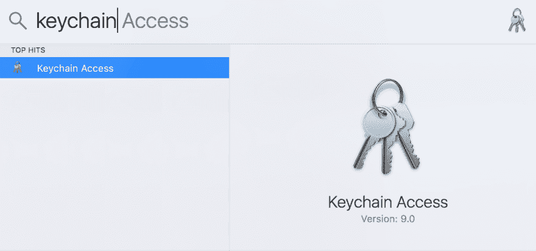
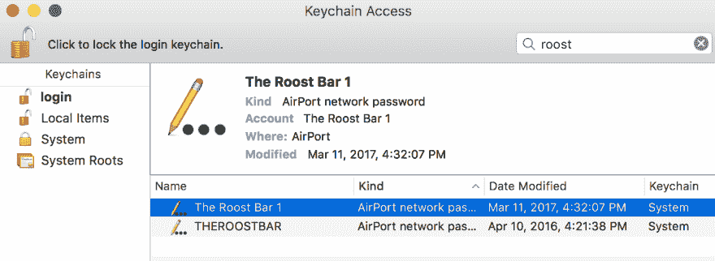
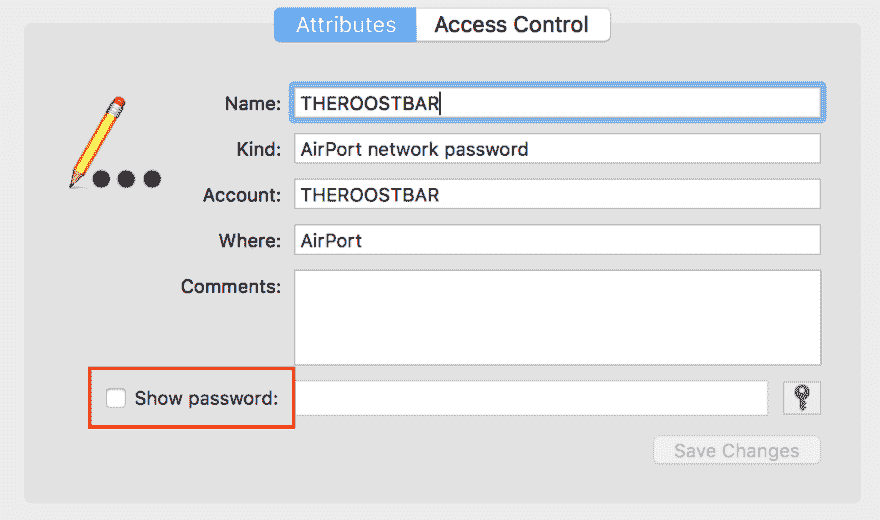

# 如何找到您存储在 Mac 上的 wifi 密码

> 原文：<https://dev.to/peter/how-to-find-a-wifi-password-youve-saved-on-your-computer-8j>

有时候，我需要找到我多年前加入的 wifi 网络的密码。可能是因为我要在咖啡店见一个需要密码的朋友，或者我想从我的电话加入，或者我只是想在告诉别人之前再确认一下。

我之前以为这些信息会藏在网络设置中的某个地方。运气不好。在那里搜索之后，我最终偶然发现了快速/简单的解决方案，我将在这里分享。

假设您使用的是 Mac，只需打开“钥匙串访问”。
[T3】](https://res.cloudinary.com/practicaldev/image/fetch/s--5EhyIU2u--/c_limit%2Cf_auto%2Cfl_progressive%2Cq_auto%2Cw_880/https://cl.ly/2M2w0j331u1l/Image%25202017-10-09%2520at%252012.23.50%2520PM.png)

从那里，您可以搜索网络名称。
[T3】](https://res.cloudinary.com/practicaldev/image/fetch/s--84DiA0YU--/c_limit%2Cf_auto%2Cfl_progressive%2Cq_auto%2Cw_880/https://cl.ly/2P2j2U0T001m/Image%25202017-10-09%2520at%252012.31.39%2520PM.png)

选择该条目并点击“显示密码”
[T3】](https://res.cloudinary.com/practicaldev/image/fetch/s--WO7bEI77--/c_limit%2Cf_auto%2Cfl_progressive%2Cq_auto%2Cw_880/https://cl.ly/2Z3q1A3r1Q3l/Image%25202017-10-09%2520at%252012.28.21%2520PM.png)

您可能需要提供系统访问权限，但是您应该已经准备好了。

希望这个快速提示能帮你在下一次需要找到一个保存的网络密码时避免一些挫折！