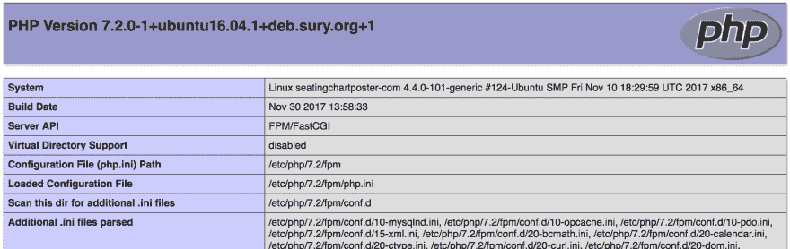

# 如何在 Ubuntu 16.04 上安装并启用 Imagick for PHP 7

> 原文：<https://dev.to/mariordev/how-to-install-and-enable-imagick-for-php-7-on-ubuntu-16-04-4k21>

Imagick 是一个 PHP 扩展，允许你操作图像。有些库或包要求在服务器上安装 Imagick。但是，因为 Imagick 是可选的，所以默认情况下它不会随 PHP 一起安装。以下是如何在你的 Ubuntu 服务器上安装和启用 Imagick。

## 安装

首先，下载并安装 Imagick。在终端中，运行以下命令。这将为 PHP 7 安装 Imagick:

```
$ sudo apt-get update
$ sudo apt-get install php-imagick 
```

Enter fullscreen mode Exit fullscreen mode

验证 Imagick 现在是否已安装。如果安装成功，该命令应该输出单词`imagick`:

```
$ php -m | grep imagick 
```

Enter fullscreen mode Exit fullscreen mode

## imagick.so

找出 PHP 扩展的安装目录。该命令应该输出该目录的路径(例如:`/usr/lib/php/20170718`，您的路径可能不同):

```
$ php-config --extension-dir 
```

Enter fullscreen mode Exit fullscreen mode

验证文件`imagick.so`是否存在于目录
中

```
$ ll /usr/lib/php/20170718 
```

Enter fullscreen mode Exit fullscreen mode

## 编辑 php.ini

现在我们需要编辑`php.ini`配置文件。为了找到这个文件的位置，我们需要查看当前的 php 配置。为此，创建一个可以从浏览器访问的 php info 文件。你可以称之为`info.php` :

```
// info.php
<?php phpinfo(); ?> 
```

Enter fullscreen mode Exit fullscreen mode

在浏览器中加载该文件，并查找`Loaded Configuration File`设置。它应该有我们需要编辑的 php.ini 文件的路径(您的 php.ini 文件的路径可能与本例中显示的不同):

[T2】](https://res.cloudinary.com/practicaldev/image/fetch/s--xuPR96YG--/c_limit%2Cf_auto%2Cfl_progressive%2Cq_auto%2Cw_880/http://www.mariorodriguez.co/assets/img/posts/install-enable-imagick.png)

打开那个`php.ini`文件:

```
$ sudo pico /etc/php/7.2/fpm/php.ini 
```

Enter fullscreen mode Exit fullscreen mode

添加下面一行(可以添加在文件的末尾)并保存:

```
extension=imagick 
```

Enter fullscreen mode Exit fullscreen mode

## 重启

如果您在本地开发环境中这样做，请重启您的计算机或虚拟机。如果你在一个真实的服务器上这样做，重启它。你可能只想重启你的网络服务器(apache，nginx 等)，但这可能行不通。更有效的方法是重启机器，这样所有的修改都会生效。

重新启动后，通过再次在浏览器中加载您的`info.php`文件来验证 Imagick 是否可用，这一次您应该会在其中看到许多对 Imagick 扩展的引用。