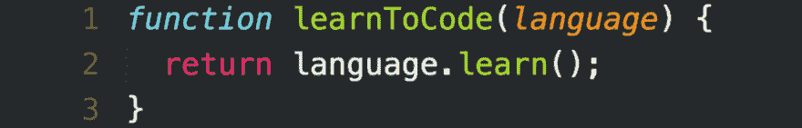

# 如何在创纪录的时间内学会一门编程语言

> 原文：<https://dev.to/joshghent/how-to-learn-a-programming-language-in-record-time--448b>

### 如何在创纪录的时间内学会一门编程语言

[T2】](https://res.cloudinary.com/practicaldev/image/fetch/s--rwi7g5vp--/c_limit%2Cf_auto%2Cfl_progressive%2Cq_auto%2Cw_880/https://cdn-images-1.medium.com/max/1024/1%2A8CZLKCJ926_bhBSmSJj2ww.png)

注意:这篇文章主要是针对那些可能只懂一种语言，但希望开始学习另一种语言的初学者。

当学习一门新的编程语言时，你的第一站可能是[文档](https://developer.mozilla.org/bm/docs/Web/JavaScript) [文档](http://php.net/docs.php) [版本](http://guides.rubyonrails.org/)，可能是通读你欣赏的某个项目的一些代码，或者可能是你通过构建最有效地学习[。无论是哪种情况，我们都可以将帕累托法则应用于学习语言的 20%特征。如果你来自一个知道](https://github.com/karan/Projects)[设计模式](https://en.wikipedia.org/wiki/Creational_pattern)和通用编程特性([控制流](https://en.wikipedia.org/wiki/Control_flow)，循环*等等*的背景，那么这是不太可能的。

当我最初想到这个想法的时候，我不认为把一门语言浓缩到如此程度是可能的。不过话说回来，你上次用 [clz32](https://developer.mozilla.org/en-US/docs/Web/JavaScript/Reference/Global_Objects/Math/clz32) 或者 [bzflush](http://php.net/manual/en/function.bzflush.php) 是什么时候？随着时间的推移，编程语言已经发展到可以实现一些在日常开发中基本不需要的特性。因此，学习一门新的编程语言似乎是一件令人生畏的事情——但事实并非如此。

当我尝试学习 Java 时，我应用了这种学习模式，并且效果相对较好。有些事情我并不知道，比如确切的遗传模式，但在非常基本的层面上，我可以坚持自己的观点——这就是我的目的。当你更深入地研究你选择的新编程语言时，你会了解其中的细微差别，为什么和如何解决特定的问题，以及什么是最佳实践。这至少会给你一个有效的语言基础。

以下是我列出的需要优先处理的事情，这样你就能以创纪录的速度学会一门新语言:

1.  **变量创建** —如果它是一种强类型或静态类型的语言，那么这扩展到如何声明不同类型的变量(整数、字符串、对象、数组)。如果语言有这个特性，那么我们也可以学习如何创建一个常量。
2.  **循环‘n’次** —在 Javascript 中，这将通过— `for(var i = 0; i \< n; i++) {}`来实现
3.  **循环一个*键:值*存储** — *键:值*存储在 Javascript 中被称为对象，在其他语言中它们被称为哈希(Ruby)或字典(Python)。尽管如此，它们都是相同的，并且通常有一个特定的方法来迭代它们，因为它们是由“键”而不是索引号引用的(就像数组一样)。
4.  **引用数组**中的项目——在 javascript 中，可以引用数组的第二个项目`arr[1]`。除了基本的引用，可能还有像`end()`这样的特殊方法来获取数组的最后一个元素。
5.  **函数** —如何创建它们，带或不带参数。
6.  **添加到一个数组** —我们怎样才能给一个数组添加一个元素呢？
7.  **从数组中移除** —同样，我们如何从数组中移除特定的项(索引为‘n’)？
8.  **类创建和构造函数**——这是我发现语言在语法细节上有很大不同的地方。例如，PHP 有一个特殊的 __construct 函数，您必须使用它来构造类。
9.  **StdOut 方法** —在 javascript 中是`console.log`，在 PHP 中是`print`。这可能是我调试时用的最多的方法了。
10.  **比较运算符** —如何检查一个变量是假还是真？你如何比较一个较大的数字和一个较小的数字？
11.  **字符串的长度** —任何语言都必须有。我发现自己一直在使用这种方法，但是一个常见的用例是在向用户显示字符串之前检查我们是否应该截断它。
12.  **数组的长度**——当 99%的时间都在使用循环时，无论数组有多长，你都要迭代数组。
13.  **公共和私有方法** —所有的语言(尤其是那些有类的语言)都应该有这个，当你想禁止访问类外的函数时，这是必不可少的。
14.  **Try…catch blocks**——我只在整合 Stripe 支付时使用它们，但它们在其他时候也很方便，也许是在你测试一个 bug 并希望为你的 bug 跟踪软件捕获它的时候。
15.  **从函数返回** —不是所有语言都用`return`！([见锈](https://rustbyexample.com/fn.html))。

就是这样！这绝不是教你一门语言*本身*，但它将为你熟悉语法提供一个良好的基础。

这种学习模式依赖于了解概念和设计模式；这表明你的学习是如何从一种语言转移到另一种语言的！

记住一门语言的核心概念和特征才是最重要的。

*附加阅读/资源*

[https://tim.blog/2009/01/20/learning-language/](https://tim.blog/2009/01/20/learning-language/)—这是受到启发的原文。

[https://learxinyminuts . com/](https://learnxinyminutes.com/)

* * *