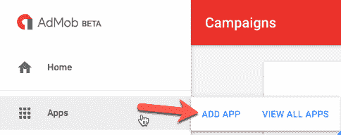
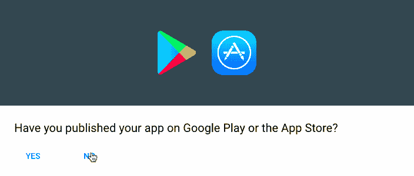
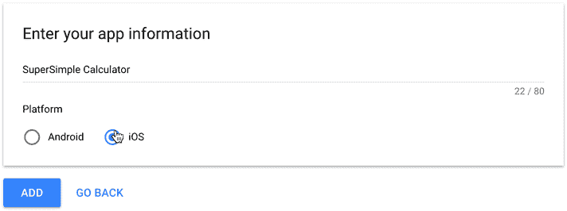
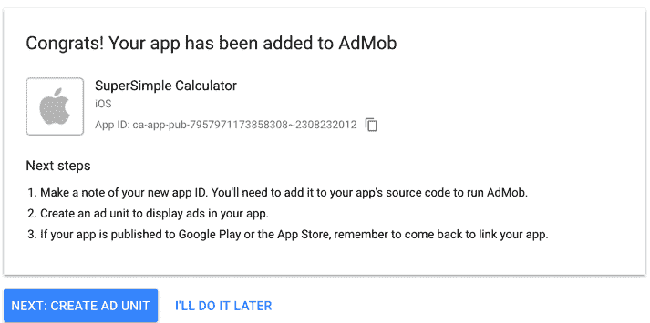
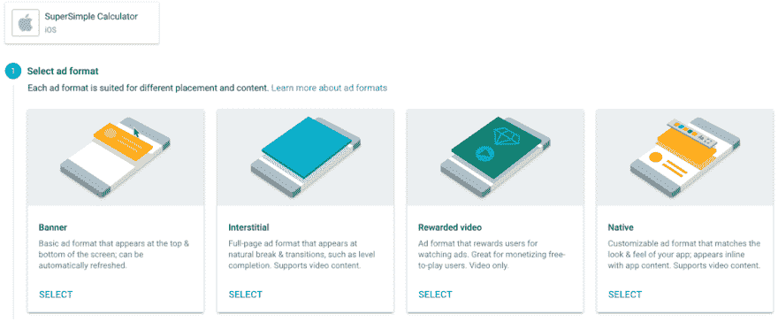
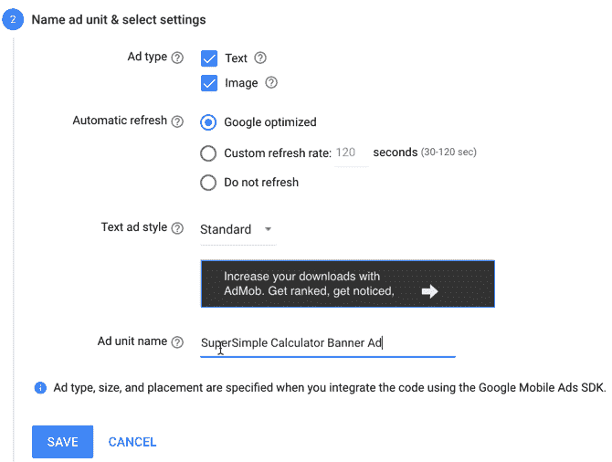
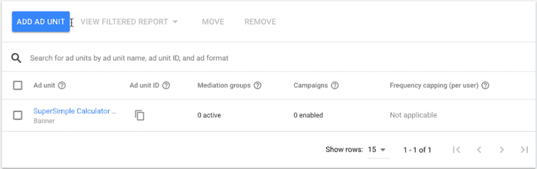
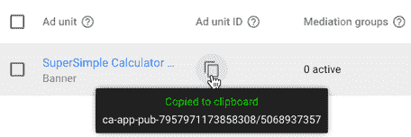
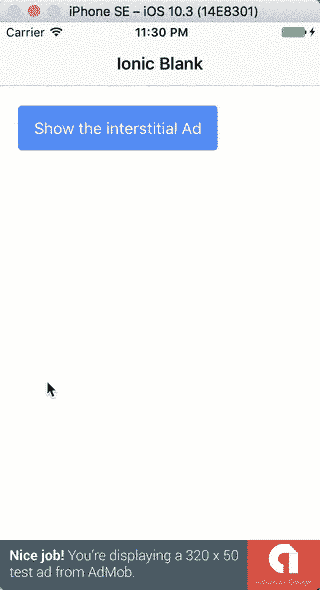
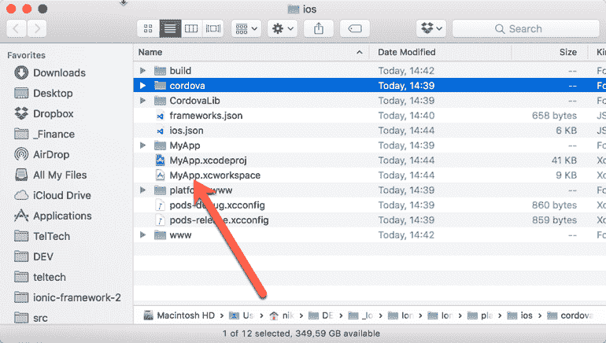

# 如何在 Ionic framework 3 中用 Google AdMob 广告赚钱

> 原文：<https://dev.to/nikola/how-to-make-money-with-google-admob-ads-in-ionic-framework-3>

[T2】](https://res.cloudinary.com/practicaldev/image/fetch/s--MMOKi5NH--/c_limit%2Cf_auto%2Cfl_progressive%2Cq_auto%2Cw_880/http://www.nikola-breznjak.com/blog/wp-content/uploads/2017/08/makeMoneyWithIonic.jpg)

*最初发布于[我的博客](http://www.nikola-breznjak.com/blog/javascript/ionic3/make-money-google-admob-ads-ionic-framework-3/)。*

> 如果你正在寻找一种在 Ionic framework 1 中实现 Google AdMob 广告的方法，那么看看这个教程:[一步一步地将 AdMob 添加到 Ionic framework 应用程序中](http://www.nikola-breznjak.com/blog/codeproject/adding-admob-to-ionic-framework-application-step-by-step/)。

## 简介

如今，你可以通过多种方式用你的应用赚钱，以下是其中几种:

*   **付费应用** -直接在 App/Play 商店为你的应用设定价格，用户在下载你的应用前需要付费
*   免费增值(free mium)-免费提供应用程序，但对应用内购买收费，如添加一些额外的功能(想想游戏应用中更多的黄金或更快的生产)
*   **基于广告的** -在你的应用程序中显示广告。可能提供应用内购买来移除广告

在这篇文章中，我将介绍基于广告的货币化选项，并向您展示如何将 Google AdMob 广告添加到一个简单的 Ionic 3 空白模板应用程序中。在 Ionic 项目中实现 Google AdMob 广告有两个部分，我将它们分为: **AdMob 设置**和 **Ionic 设置**。

## 演示 app 和回购

你可以在 [Github](https://github.com/Hitman666/Ionic3AdMobTest) 上查看最终代码。当你克隆它时，在项目中运行`npm install`。如果您已经为 Ionic 设置了开发机器，那么您可以使用`ionic emulate ios`或`ionic emulate android`来运行项目。如果你不想，但想看，请看这篇关于如何在 Mac 和 Windows 上开始使用 Ionic framework 3 的文章。

您应该在模拟器/仿真器中看到类似这样的内容:

[T2】](https://res.cloudinary.com/practicaldev/image/fetch/s--NzSlpT2o--/c_limit%2Cf_auto%2Cfl_progressive%2Cq_66%2Cw_880/https://thepracticaldev.s3.amazonaws.com/i/lda7tsm82wzebuzxack9.gif)

## AdMob 设置

让我们从 AdMob 设置开始:

1.  在[https://www.google.com/admob/](https://www.google.com/admob/)登录/注册 AdMob
2.  点击**应用**，然后点击**添加应用**按钮:

[T2】](https://res.cloudinary.com/practicaldev/image/fetch/s--IWI3xHik--/c_limit%2Cf_auto%2Cfl_progressive%2Cq_auto%2Cw_880/http://i.imgur.com/QVyB7xP.png)

1.  由于我们的应用程序尚未发布，我们将点击**否**按钮:

[T2】](https://res.cloudinary.com/practicaldev/image/fetch/s--QfRjRwci--/c_limit%2Cf_auto%2Cfl_progressive%2Cq_auto%2Cw_880/http://i.imgur.com/0Gv0dMe.png)

1.  填写应用名称和平台，点击**添加**按钮:

[T2】](https://res.cloudinary.com/practicaldev/image/fetch/s--vz8PvLyk--/c_limit%2Cf_auto%2Cfl_progressive%2Cq_auto%2Cw_880/http://i.imgur.com/6lvQBKD.png)

1.  将应用 ID 保存在某处，然后继续创建广告单元

[T2】](https://res.cloudinary.com/practicaldev/image/fetch/s--z_zVddSU--/c_limit%2Cf_auto%2Cfl_progressive%2Cq_auto%2Cw_880/http://i.imgur.com/RtiQyeP.png)

1.  选择横幅广告格式:

[T2】](https://res.cloudinary.com/practicaldev/image/fetch/s---DmoRbh0--/c_limit%2Cf_auto%2Cfl_progressive%2Cq_auto%2Cw_880/http://i.imgur.com/zRG8SgJ.png)

1.  配置添加类型、大小、位置、样式、名称:

[T2】](https://res.cloudinary.com/practicaldev/image/fetch/s--gu6wIRGm--/c_limit%2Cf_auto%2Cfl_progressive%2Cq_auto%2Cw_880/http://i.imgur.com/pQYT4uG.png)

1.  您可以阅读关于如何实现 GA 和 AdMob 的其他信息，但现在我们只需单击“完成”:

[T2】](https://res.cloudinary.com/practicaldev/image/fetch/s--dasseCBP--/c_limit%2Cf_auto%2Cfl_progressive%2Cq_auto%2Cw_880/http://i.imgur.com/kbZY18b.png)

1.  您现在将看到以下类似的屏幕:

[T2】](https://res.cloudinary.com/practicaldev/image/fetch/s--lvaeKYAU--/c_limit%2Cf_auto%2Cfl_progressive%2Cq_auto%2Cw_880/http://i.imgur.com/MujS4pC.png)

这里最需要注意的是这个**广告单元 ID** ，在我的测试用例中是**ca-app-pub-7957971173858308/5068937357**。记下这个字符串，因为它是这个设置中最重要的部分。*你可以点击“复制到剪贴板”按钮，将它作为评论粘贴到你的应用程序中。*

[T2】](https://res.cloudinary.com/practicaldev/image/fetch/s--xCrF7UEZ--/c_limit%2Cf_auto%2Cfl_progressive%2Cq_auto%2Cw_880/http://i.imgur.com/6f1MO7a.png)

1.  创建尽可能多的广告单元(针对每个平台[iOS、Android]和广告格式[横幅广告、插播广告等]。]).在我的例子中，我刚刚创建了额外的插播广告，并将在 iOS 和 Android 设备上使用它们来进行演示。

[T2】](https://res.cloudinary.com/practicaldev/image/fetch/s--62GPawzn--/c_limit%2Cf_auto%2Cfl_progressive%2Cq_auto%2Cw_880/http://i.imgur.com/6qb2dum.png)

## 离子设置

熟悉 Ionic 1 的人都知道，多亏了名为 [ngCordova](http://ngcordova.com/) 的项目，你可以在 Ionic 项目中添加任何插件。对于爱奥尼亚 3，也有同样的东西叫做[爱奥尼亚原生](https://ionicframework.com/docs/native/)。

Ionic Native 是一个用于 Cordova/PhoneGap 插件的 TypeScript 包装器，它可以轻松地将您可能需要的任何本机功能添加到 Ionic 应用程序中。Ionic Native 将插件回调封装在一个 Promise 或 Observable 中，为所有插件提供一个公共接口，并确保 Native 事件触发 Angular 中的变化检测。

首先，让我们基于空白模板启动一个空的 Ionic 3 应用程序:

`ionic start Ionic3AdMobTest blank --cordova`

您应该会看到以下输出:

```
✔ Creating directory ./Ionic3AdMobTest - done!
[INFO] Fetching app base (https://github.com/ionic-team/ionic2-app-base/archive/master.tar.gz)
✔ Downloading - done!
[INFO] Fetching starter template blank (https://github.com/ionic-team/ionic2-starter-blank/archive/master.tar.gz)
✔ Downloading - done!
✔ Updating package.json with app details - done!
✔ Creating configuration file ionic.config.json - done!
[INFO] Installing dependencies may take several minutes!
> npm install
✔ Running command - done!
> npm install --save-dev --save-exact ionic@latest
✔ Running command - done!
> npm install --save-dev --save-exact @ionic/cli-plugin-ionic-angular@latest
✔ Running command - done!
> npm install --save-dev --save-exact @ionic/cli-plugin-cordova@latest
✔ Running command - done!
> npm dedupe
✔ Running command - done!
> git init
✔ Running command - done!
> git add -A
✔ Running command - done!
> git commit -m "Initial commit" --no-gpg-sign
✔ Running command - done!

♬ ♫ ♬ ♫ Your Ionic app is ready to go! ♬ ♫ ♬ ♫

Run your app in the browser (great for initial development):
ionic serve

Run on a device or simulator:
ionic cordova run ios

Test and share your app on a device with the Ionic View app:
http://view.ionic.io

Next Steps:
Go to your newly created project: cd ./Ionic3AdMobTest 
```

Enter fullscreen mode Exit fullscreen mode

使用您的终端/命令提示符导航到应用程序的根目录，并执行以下命令来添加 [cordova-plugin-admobpro](https://ionicframework.com/docs/native/admob-pro/) 插件:

`ionic cordova plugin add cordova-plugin-admobpro`

运行该命令后，您应该会看到以下输出:

```
✔ Running command - done!
Adding cordova-plugin-admobpro to package.json
Saved plugin info for "cordova-plugin-admobpro" to config.xml 
```

Enter fullscreen mode Exit fullscreen mode

此外，您还需要运行以下命令:

`npm install --save @ionic-native/admob-pro`

如果成功完成，只会向控制台输出类似于`added 1 package in 3.331s`的内容。

您还需要添加第二个命令，因为这将安装 TypeScript 所需的一些文件。

> 此时，根据您拥有的 Ionic CLI 版本，您可能需要通过执行:`ionic cordova platform add ios`或`ionic cordova platform add android`来添加平台，这取决于您尝试构建的平台。如果命令`ionic cordova platform ls`显示你在当前项目中没有安装任何平台，你必须执行这个命令:
> 
> ```
> → ionic cordova platform ls
> ✔ cordova platform ls - done!
> Installed platforms:
> Available platforms:
> android ~6.2.2
> blackberry10 ~3.8.0 (deprecated)
> browser ~4.1.0
> ios 4.4.0
> osx ~4.0.1
> webos ~3.7.0 
> ```
> 
> 如果运行`ionic cordova platform add ios`一切正常，您将看到如下输出:
> 
> ```
> Using cordova-fetch for cordova-ios@~4.4.0
> Adding ios project...
> Creating Cordova project for the iOS platform:
> Path: platforms/ios
> Package: io.ionic.starter
> Name: MyApp
> iOS project created with cordova-ios@4.4.0
> Installing "cordova-plugin-admobpro" for ios
> Installing "cordova-plugin-extension" for ios
> Discovered plugin "cordova-plugin-console" in config.xml. Adding it to > the project
> Installing "cordova-plugin-console" for ios
> Adding cordova-plugin-console to package.json
> Saved plugin info for "cordova-plugin-console" to config.xml
> Discovered plugin "cordova-plugin-device" in config.xml. Adding it to > the project
> Installing "cordova-plugin-device" for ios
> Adding cordova-plugin-device to package.json
> Saved plugin info for "cordova-plugin-device" to config.xml
> Discovered plugin "cordova-plugin-splashscreen" in config.xml. Adding > it to the project
> Installing "cordova-plugin-splashscreen" for ios
> Adding cordova-plugin-splashscreen to package.json
> Saved plugin info for "cordova-plugin-splashscreen" to config.xml
> Discovered plugin "cordova-plugin-statusbar" in config.xml. Adding it > to the project
> Installing "cordova-plugin-statusbar" for ios
> Adding cordova-plugin-statusbar to package.json
> Saved plugin info for "cordova-plugin-statusbar" to config.xml
> Discovered plugin "cordova-plugin-whitelist" in config.xml. Adding it > to the project
> Installing "cordova-plugin-whitelist" for ios
> Adding cordova-plugin-whitelist to package.json
> Saved plugin info for "cordova-plugin-whitelist" to config.xml
> Discovered plugin "ionic-plugin-keyboard" in config.xml. Adding it to > the project
> Installing "ionic-plugin-keyboard" for ios
> Adding ionic-plugin-keyboard to package.json
> Saved plugin info for "ionic-plugin-keyboard" to config.xml
> --save flag or autosave detected
> Saving ios@~4.4.0 into config.xml file ...
> ✔ Copying default image resources into ./resources/ios - done! 
> ```

Btw，AdMob Pro 插件还有一个[免费版](https://ionicframework.com/docs/native/admob-free/)。但是，老实说，如果你真的开始用你的应用赚钱，这将是一个小开销。*此外，如果你在归还你赚钱的插件时遇到问题，那么我亲爱的学徒，你还有很多要学的...*

现在，让我们将这个插件添加到我们应用程序的 NgModule 中。在`src/app/app.module.ts`文件中导入`AdmobPro`:

`import { AdMobPro } from '@ionic-native/admob-pro';`

然后将其添加到`Providers`数组中。`src/app/app.module.ts`文件的全部内容现在应该是这样的:

```
import { BrowserModule } from '@angular/platform-browser';
import { ErrorHandler, NgModule } from '@angular/core';
import { IonicApp, IonicErrorHandler, IonicModule } from 'ionic-angular';
import { SplashScreen } from '@ionic-native/splash-screen';
import { StatusBar } from '@ionic-native/status-bar';

import { MyApp } from './app.component';
import { HomePage } from '../pages/home/home';

import { AdMobPro } from '@ionic-native/admob-pro';

@NgModule({
    declarations: [
        MyApp,
        HomePage
    ],
    imports: [
        BrowserModule,
        IonicModule.forRoot(MyApp)
    ],
    bootstrap: [IonicApp],
    entryComponents: [
        MyApp,
        HomePage
    ],
    providers: [
        StatusBar,
        SplashScreen,
        AdMobPro,
        { provide: ErrorHandler, useClass: IonicErrorHandler }
    ]
})
export class AppModule { } 
```

Enter fullscreen mode Exit fullscreen mode

现在，我将向您展示`src/pages/home/home.ts`文件的最终内容，并逐步解释什么被更改:

```
import { Component } from '@angular/core';
import { NavController } from 'ionic-angular';

import { AdMobPro } from '@ionic-native/admob-pro';
import { Platform } from 'ionic-angular';

@Component({
    selector: 'page-home',
    templateUrl: 'home.html'
})
export class HomePage {
    constructor(public navCtrl: NavController, platform: Platform, private admob: AdMobPro) {
        platform.ready().then(() => {
            var admobid = {
                banner: 'ca-app-pub-7957971173858308/5068937357',
                interstitial: 'ca-app-pub-7957971173858308/5667703151'
            };

            this.admob.createBanner({
                adId: admobid.banner,
                isTesting: true,
                autoShow: true,
                position: this.admob.AD_POSITION.BOTTOM_CENTER
            })

            this.admob.prepareInterstitial({
                adId: admobid.interstitial,
                isTesting: true,
                autoShow: false
            })
        });
    }

    showInterstitialAd() {
        if (AdMobPro) {
            this.admob.showInterstitial();
        }
    }
} 
```

Enter fullscreen mode Exit fullscreen mode

首先，我们添加了导入:

```
import { AdMobPro } from '@ionic-native/admob-pro';
import { Platform } from 'ionic-angular'; 
```

Enter fullscreen mode Exit fullscreen mode

然后，通过构造函数我们注入了`Platform`和`AdMobPro`:

`constructor(public navCtrl: NavController, platform: Platform, private admob: AdMobPro)`

然后我们把一切都包在承诺里。这是**代码中最重要的**部分！如果你不这样做，你的应用程序可能会启动，插件仍然没有正确设置，你看不到显示的广告。

但话说回来，有时你会，这是它会使调试成为一场噩梦。这是一个非常常见的问题，我甚至在 Ionic 1 上回答 [StackOverflow](https://stackoverflow.com/users/534755/nikola?tab=answers) 上的问题时都见过。所以，你可能想要保持一个ðÿ'，你需要将任何插件调用包装在`platform.ready()` promise 中，这样你就可以确保在你使用它们之前所有的插件都已经加载了。

promise 解析后执行的代码用`banner`和`interstitial`属性设置我们的`admobid`对象。然后我们在注入的`admob`对象上调用`createBanner`和`prepareInterstitial`函数。请注意，当应用程序加载(`autoShow: true`)时，横幅是如何设置为自动显示的，而插页则不是。另外，请注意我们是如何将横幅广告的位置设置在底部的:

```
platform.ready().then(() => {
    var admobid = {
        banner: 'ca-app-pub-7957971173858308/5068937357',
        interstitial: 'ca-app-pub-7957971173858308/5667703151'
    };

    this.admob.createBanner({
        adId: admobid.banner,
        isTesting: true,
        autoShow: true,
        position: this.admob.AD_POSITION.BOTTOM_CENTER
    })

    this.admob.prepareInterstitial({
        adId: admobid.interstitial,
        isTesting: true,
        autoShow: false
    })
}); 
```

Enter fullscreen mode Exit fullscreen mode

然后我们添加了`showshowInterstitialAdAd`函数，显示了插播广告:

```
showInterstitialAd() {
    if (AdMobPro) {
        this.admob.showInterstitial();
    }
} 
```

Enter fullscreen mode Exit fullscreen mode

当然，此时，将`admobid`对象属性更改为您在第一部分(步骤 9)中获得的 AdMob 键。

> ðÿ'‹:如果你在这方面遇到任何问题，请在评论中留言，我会尽力帮助你。

你可能不得不为 Android 做的一件常见的事情是通过 Android SDK 管理器安装一些额外的东西。为此，打开 Android Studio 并选择`Configure->SDK Manager`:

[T2】](https://res.cloudinary.com/practicaldev/image/fetch/s--mHY8Tofh--/c_limit%2Cf_auto%2Cfl_progressive%2Cq_auto%2Cw_880/http://i.imgur.com/i4DL8zk.png)

确保你已经安装了下图中标有 **Installed** 的软件包(通常是**谷歌计费库**和**谷歌游戏服务**):

[T2】](https://res.cloudinary.com/practicaldev/image/fetch/s--lkHaM71_--/c_limit%2Cf_auto%2Cfl_progressive%2Cq_auto%2Cw_880/http://i.imgur.com/dcM2rDs.png)

## 你应该展示什么样的广告？

这个插件的文档陈述了一个有趣的事实，强烈推荐使用间隙广告类型，因为它带来的利润是横幅广告的 10 倍以上。下面是来自官方文件的表格:

| 广告格式 | 旗帜 | 空隙的 |
| --- | --- | --- |
| 点击率 | < 1% | 3-15% |

值得注意的是，这里可能没有关于何时显示插播广告的确切公式，但有一些最佳实践，这是谷歌对此的说法:

> 插播广告在有自然过渡点的应用中效果最好。一个应用程序中的一个任务的结束，比如分享一张图片或完成一个游戏关卡，就创造了这样一个点。因为用户希望在动作中有所停顿，所以很容易在不破坏用户体验的情况下呈现一个插播广告。请确保您考虑了在应用程序工作流程的哪些点上显示间隙，以及用户可能会如何回应。

你可以在这里了解更多。

无论如何，正如你在上面的演示代码中看到的，我们选择在屏幕底部一直显示横幅广告，当我们点击按钮时，我们会显示插页广告。你可以在你的应用中随意调整，但是请记住上面提到的关于最佳实践的几点。

## 最后，查看模板

将`src/pages/home/home.html`文件内容替换为:

```
<ion-header>
    <ion-navbar>
        <ion-title>
            Ionic Blank
        </ion-title>
    </ion-navbar>
</ion-header>

<ion-content padding>
    <button ion-button (click)="showInterstitialAd()">Show the interstitial Ad</button>
</ion-content> 
```

Enter fullscreen mode Exit fullscreen mode

点击`Show the interstitial Ad`按钮将调用`showInterstitialAd()`函数，该函数将显示本教程开头 gif 中所示的间质。

## 我们来测试一下这个

运行`ionic cordova emulate ios`,几秒钟后，您的模拟器将会启动并向您显示:

[T2】](https://res.cloudinary.com/practicaldev/image/fetch/s--ie8zUoid--/c_limit%2Cf_auto%2Cfl_progressive%2Cq_66%2Cw_880/http://i.imgur.com/9L5N5nj.gif)

很少有事情会出错，例如，如果你得到一个这样的错误:

```
Error: Cannot read property 'replace' of undefined

[ERROR] Cordova encountered an error.
You may get more insight by running the Cordova command above directly.

[ERROR] An error occurred while running cordova run ios (exit code 1). 
```

Enter fullscreen mode Exit fullscreen mode

然后你可以试试[这个 StackOverflow post](https://stackoverflow.com/questions/42350505/error-cannot-read-property-replace-of-undefined-when-building-ios-cordova) 的解决方案:在`platforms/ios/cordova/node_modules`文件夹中执行下面的命令:`sudo npm install ios-sim@lates`。

如果你得到一个错误，告诉你它不能打开模拟器，那么你可能想试着运行构建命令:`ionic cordova build ios`，然后从`platforms/ios`文件夹中打开`MyApp.xcworkspace`文件:

[T2】](https://res.cloudinary.com/practicaldev/image/fetch/s--tciU6neU--/c_limit%2Cf_auto%2Cfl_progressive%2Cq_auto%2Cw_880/http://i.imgur.com/PuNxN0A.png)

选择您想要在其上运行应用程序的模拟器设备，然后从 Xcode 中单击“运行”按钮:

[T2】](https://res.cloudinary.com/practicaldev/image/fetch/s--FW8TqQeP--/c_limit%2Cf_auto%2Cfl_progressive%2Cq_auto%2Cw_880/http://i.imgur.com/vTuCqy3.png)

如果你在试着运行这个的时候遇到任何其他问题，让我们试着在评论中解决它们，从而帮助其他可能也有同样问题的人，ðÿ'

## 结论

在这篇文章中，我们展示了在你的应用中添加货币化选项是多么容易。现在，你需要*‘只是’*实际制作一款会被多次使用、用户会想点击广告的应用。😉

下次见