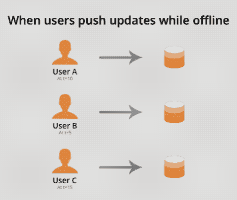
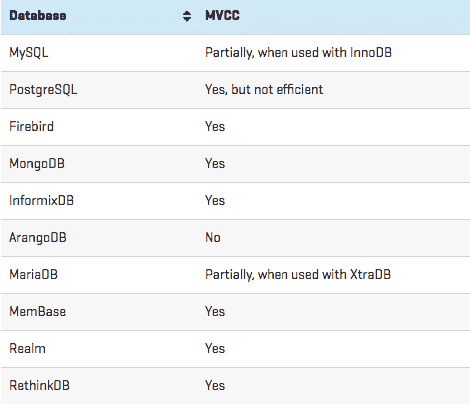

# 如何为您的 Android/iOS 应用选择合适的数据库

> 原文：<https://dev.to/jignesh_simform/how-to-select-the-right-database-for-your-androidios-application-2aca>

[T2】](https://res.cloudinary.com/practicaldev/image/fetch/s--xkr6slNt--/c_limit%2Cf_auto%2Cfl_progressive%2Cq_auto%2Cw_880/https://thepracticaldev.s3.amazonaws.com/i/k2ntx5624wr6w2bojsr2.png)

想象一下，你正在开发一个简单的应用程序，它有一个可以搜索的不同对象的列表。你的应用程序有一些基本要求，比如当用户点击一个对象时，它必须显示姓名、年龄、收入或其他信息。

如上所述的简单应用程序的数据库选择不会对功能和性能产生重大影响。但是，当您的应用程序有苛刻的要求时，事情就变得复杂了。

例如，考虑这些使用案例:

## 多个设备之间离线同步

当数据同步和离线功能成为移动应用的核心时，用户可能可以访问相同的数据并拥有相同的 CRUD 权限。

这基本上意味着您将面临多个用户同时编辑同一个数据块的情况。

在其他情况下，我们有一个使用 API 与服务器通信并执行 CRUD 操作的应用程序。当一个移动应用程序离线时，没有 API 来连接和指示读写操作。

当用户现在编辑其他人也在编辑的共享文档时，当应用程序再次上线时，服务器可能会接受也可能不会接受这些写操作。

让我们更好地想象这个挑战。假设我们有以下情况:

一些用户在脱机时编辑记录。那么，app 如何应对他们的变化呢？让我们看看哪些编辑将首先被发送到服务器。

[T2】](https://res.cloudinary.com/practicaldev/image/fetch/s--ObXP9--b--/c_limit%2Cf_auto%2Cfl_progressive%2Cq_66%2Cw_880/https://thepracticaldev.s3.amazonaws.com/i/mytf2sfbvgvhmneb9fep.gif)

评估情况会变得有多复杂有点棘手，许多人没有考虑到边缘情况。这里的解决方案需要一个锁定机制来防止同步时数据丢失。

## 当您的应用程序必须在高网络中断下工作时

当任何 SQL 数据库失去与客户端存储的网络连接时，它通常会生成一条错误消息，而不是根据需要传输数据。如果此问题经常出现，您可能需要重新配置数据库。

除此之外，应对 MySQL 和网络中断还有其他挑战:

持久保存本地数据，包括未同步的事务和应用状态
将移动事务和操作返回到主服务器端数据库
上面列出的问题代表网络中断，在这种情况下，保持一个提供更好可靠性和抵抗连接丢失的数据库是更好的选择。

## 当你想把你的应用从 0 扩展到 100 万用户

*缩放=以每小时 100 英里的速度行驶时更换汽车的所有部件
——Mike Krieger，Instagram 联合创始人*

当您考虑扩展应用程序时，您会想到以服务器的形式添加更多的资源，并使数据库引擎更加高效。

数据库应该能够利用资源和处理并行处理，这意味着数据库必须是多线程的。

多线程允许数据库在可用资源上调度并行任务，并最小化服务器端的工作负载。

除了多线程之外，数据库的分布式设计对于可伸缩性非常重要。

在分布式设计的数据库中，您可以将服务拆分到不同的线程上，以最小化主数据库的工作负载。这极大地改善了数据库的并行处理。

## 当您的应用需要多版本并发控制(MVCC)支持时

对多版本并发控制(MVCC)的支持允许同时访问，而不会阻塞所涉及的线程或进程。

MVCC 允许读取器在写入器更改之前查看数据的快照，从而允许读取和写入操作继续并行进行。

例如，查看下表，了解哪些数据库实现了 MVCC:

[T2】](https://res.cloudinary.com/practicaldev/image/fetch/s--A5KShU6V--/c_limit%2Cf_auto%2Cfl_progressive%2Cq_auto%2Cw_880/https://thepracticaldev.s3.amazonaws.com/i/dzdweruhxv3prbl23yff.png)

## 最后的想法

许多初创公司的产品都失败了，有些公司像 Crisp 和优步一样按时迁移以避免可扩展性问题。

> Baptiste Jamin@ Baptiste Jamin希望现在使用 Firebase 之前你要三思:[crisp.im/blog/why-you-s…](https://t.co/v55lnQcCIn)18:18PM-18 Sep 2016

Crisp 不得不放弃 Firebase，优步从 PostgreSQL 迁移到 MySQL。

开发人员和组织不应该忽视数据库在其应用程序中的重要性，因为它可能会在未来带来巨大的挑战。

我同意有许多数据库选择可以支持应用程序的不同特性。因此，很难做出公平的决定。

但是，如果您遵循正确的原则并正确地映射您的应用程序需求，那么您的应用程序就不会遇到数据库问题。

*这篇文章只是为移动应用开发者提供的更全面的[数据库选择指南的一个缩影。](https://www.simform.com/mobile-app-developers-database-selection)*

请随意分享您对数据库选择的想法和以往的经验。