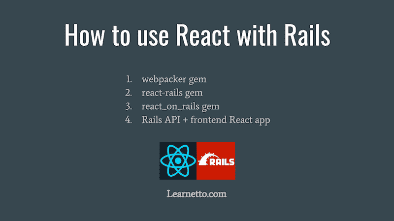

# 如何在 Ruby on Rails 5 中使用 React.js

> 原文：<https://dev.to/learnetto/how-to-use-reactjs-with-ruby-on-rails-5>

[T2】](https://res.cloudinary.com/practicaldev/image/fetch/s--wQLHdphf--/c_limit%2Cf_auto%2Cfl_progressive%2Cq_auto%2Cw_880/https://learnetto-blog.s3.amazonaws.com/blog/2017-07-15/1500116627139-howtousereactwithrails.png)

*最初发表于[Learnetto.com](https://learnetto.com/blog/3-ways-to-use-react-with-ruby-on-rails-5)T3。*

**重要更新(2017 年 7 月 6 日)**:随着 Rails 5.1 的发布，Rails 现在通过 webpacker gem 提供了对使用 React 的原生支持。在[免费的 React on Rails 课程](https://learnetto.com/users/hrishio/courses/the-free-react-on-rails-5-course)中查看如何做到这一点的免费课程，或者查看[这篇博文](https://medium.com/react-on-rails/free-tutorial-how-to-use-react-with-webpacker-and-rails-5-1-92af8e8d9d63)。

在 Ruby on Rails 应用程序中有几种不同的方式来使用 [React](https://facebook.github.io/react/) 。在这篇文章中，我将介绍 3 种最流行的方法。

**1.8 **【https://github.com/reactjs/react-rails】T2【react-rails gem】

react-rails gem 是在 rails 应用程序中开始使用 react 的最简单快捷的方式。

它使用默认的 Rails 资产管理，并使用 Ruby Babel transpiler 自动将 JSX 转换为资产管道。

假设您已经安装了最新版本的 Ruby 和 Rails gem，下面是如何开始使用 react-rails 的方法。

将宝石添加到您的宝石文件:

```
gem 'react-rails'</pre> 
```

Enter fullscreen mode Exit fullscreen mode

安装宝石:

```
bundle install 
```

Enter fullscreen mode Exit fullscreen mode

运行 react-rails 安装脚本:

```
rails g react:install 
```

Enter fullscreen mode Exit fullscreen mode

这将创建一个组件目录、清单文件，并将它们添加到 application.js 文件中。

然后创建扩展名为. jsx 的 React 组件文件，并将其保存在*app/assets/JavaScript s/components*下。

```
var HelloMessage = React.createClass({
  render: function() {
    return (
      <h1>Hello {this.props.name}!</h1>
    )
  }
}); 
```

Enter fullscreen mode Exit fullscreen mode

最后，使用视图中的组件和 *react_component* 辅助方法。

```
<%= react_component('HelloMessage', name: 'John') %> 
```

Enter fullscreen mode Exit fullscreen mode

该方法将组件的名称作为第一个参数，将任何属性作为第二个参数。它添加了一个具有相关类和属性的 div，然后 react_ujs 驱动程序使用它来挂载和呈现组件。

这就是你需要开始！Â

react-rails 提供了更多，包括为您的环境选择 react 构建、服务器端渲染、在 ES6 中编写组件和组件生成器，这些都在我们的 [React on Rails 课程](https://learnetto.com/users/hrishio/courses/the-react-on-rails-course)中有所涉及。

这个 gem 允许您从 React 逐步开始，通过将单个视图转换为 React 组件来试水。一旦你对它感到满意和自信，你可以转换更多和/或移动到一个更强大的设置。

**2.8 **【https://github.com/shakacode/react_on_rails】T2【react _ on _ rails gem】

这是在 Rails 中集成 React 的另一个非常受欢迎的工具。react-rails 的关键区别在于，它默认使用 EcmaScript 6 (ES6)和最先进的 JavaScript 工具，包括 Webpack，而不是完全依赖于 rails 资产管道。它也不依赖于 jQuery。

react_on_rails 不使用 Rails 资产管道进行 ES6 编译，而是仅使用它来包含 Webpack 编译的 JS。

您可以使用 npm 来安装 JavaScript 库，而不是必须使用 gems 或手动下载并包含它们。

它以安装和管理一些额外的东西为代价，为您提供了更多的功能。

首先，您需要安装 node，这样您就可以使用 npm 来安装 JavaScript 依赖项。你可以直接从[他们的网站](https://nodejs.org/en/)下载 node 或者使用 [nvm](https://github.com/creationix/nvm) 安装。

一旦安装了 node，我们就可以开始将 gem 添加到 Rails 应用程序的 gem 文件中:

```
gem "react_on_rails", "~> 6" 
```

Enter fullscreen mode Exit fullscreen mode

通过运行 bundle 安装:

```
bundle 
```

Enter fullscreen mode Exit fullscreen mode

现在，我们需要将它提交给 git，否则 gem 的安装脚本将无法工作。

```
git init
git add -A
git commit -m "Initial commit" 
```

Enter fullscreen mode Exit fullscreen mode

然后运行 gem 的生成器来创建 package.json 和 Procfile.dev 文件:

```
rails generate react_on_rails:install 
```

Enter fullscreen mode Exit fullscreen mode

然后再次运行 bundle 来安装 execjs，并运行 npm install 来安装 js 依赖项:

```
bundle && npm install 
```

Enter fullscreen mode Exit fullscreen mode

然后，用 foreman:
启动 Rails 服务器

```
foreman start -f Procfile.dev 
```

Enter fullscreen mode Exit fullscreen mode

除了 Rails 服务器，我们还使用 foreman 来运行 Webpack。

现在一切都设置好了，我们可以创建和使用 React 组件了

gem 的生成器还创建了一个客户端目录，这是所有客户端代码需要去的地方

客户机目录下包含一个 Hello World 示例。下面是一个组件代码的简化摘录，该组件显示一条 Hello 消息，其名称作为一个属性传递。

```
import React from 'react';

export default class HelloWorld extends React.Component {
  constructor(props, _railsContext) {
    super(props);
  }

  render() {
    return (
      <h1>Hello, {this.props.name}!</h1>
    );
  }
} 
```

Enter fullscreen mode Exit fullscreen mode

我们可以使用 react_component 辅助方法在视图中呈现组件，就像我们使用 react-rails gem 一样。

```
<%= react_component("HelloWorldApp", props: {name: 'John'}) %> 
```

Enter fullscreen mode Exit fullscreen mode

如果您已经熟悉 Webpack 和现代 JavaScript 概念和工具，那么就从 react_on_rails 开始吧。否则，最好先用 react-rails 了解一下 React 的核心概念，然后再学习 react_on_rails。

看一下 [React on Rails 信条](https://blog.shakacode.com/the-react-on-rails-doctrine-3c59a778c724)来深入了解 react_on_rails 背后的设计决策。

**3.具有独立前端反应应用程序的 rails API(Nodejs+Express)

* *使用 React with Rails 的第三个选择是将后端和前端分成两个不同的应用程序

后端可以是一个标准的 Rails 应用程序，通过 JSON 输出公开一些 API 端点，也可以是一个 Rails API 专用的应用程序。前端是一个运行在 Nodejs 上的 Express app，它使用 React 并与 Rails API 对话。

显然，构建、运行和维护两个独立的应用程序需要更多的工作。但是也有一些好处。

无论如何，制作一个 API 可能是一个好主意，使您能够构建像移动应用程序这样的其他客户端(尽管请注意，您也可以将 Rails API 与 gems 一起使用)。

Node 应用程序是 React 这样的 JavaScript 库的自然环境，因此您可能会发现自己更有效率，并且默认情况下总是可以访问最新的 JS 工具。组件的服务器端呈现也更快。

如果你在一家中大型公司工作，有专门的团队负责后端和前端开发，那么分离两个代码库是有意义的。

你必须处理运行两个应用程序的复杂性。你要么实现跨源资源共享(CORS ),要么通过 nginx 这样的服务器实现代理请求。

Alex Fedoseev 的这篇文章详细介绍了这种设置的一些细节。这是一本很好的读物，可以让你深入了解其中涉及的内容，以及它是否适合你。

这是使用 React 和 Rails 的四种最流行的方法。用你认为对你的情况最有意义的方法进行研究和实验，并请留下评论来分享你的经验！

如果您觉得这篇文章很有用，请查看完整的 React on Rails 课程,了解使用 React on Rails 的详细实践视频课程。