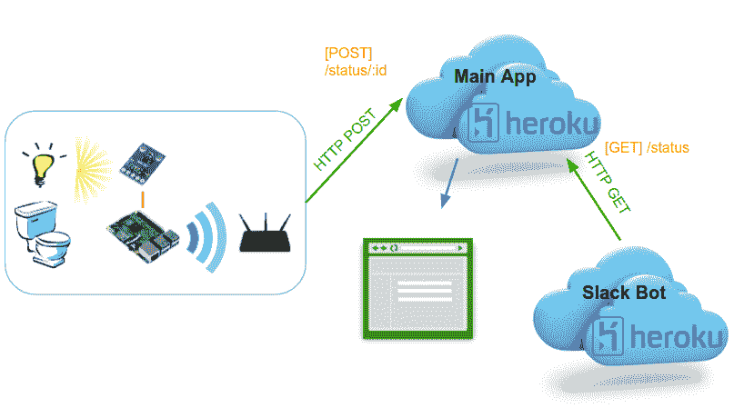

# 我们如何举办了一个很棒的公司黑客马拉松

> 原文：<https://dev.to/sprzedwojski/how-we-held-a-company-hackathon-that-was-awesome-31io>

最近，我们在我的工作场所组织了一次公司黑客马拉松。作为组织者和参与者之一，我想分享我的经历。

### 我们的目标

很长一段时间以来，我们一直在修补内部编码事件的想法。我们希望实现的主要目标如下:

1.  玩得开心
2.  学习新技术
3.  建立团队精神和协作
4.  创造一些持久有用的东西

#### 1。玩得开心

这一点是相当明显的。由于黑客马拉松是在员工的空闲时间组织的，我们希望确保活动有趣且有益。没有人愿意牺牲自己的个人时间去做一些单调乏味的编码任务。

#### 2。学习新技术

在我们的日常工作中，我们倾向于一遍又一遍地使用同样的技术，这些技术也可能相当过时。我们中的一些人更幸运，可以尝试，但大多数人没有那么幸运。通过黑客马拉松，我们希望为参与者提供使用最前沿技术的机会，以提高他们的技能。

虽然你可以自己尝试新的工具，但是和别人一起做肯定更有趣。

#### 3。建立团队精神和协作

考虑到在日常工作中，我们总是倾向于与相同的人一起工作，我们希望将参与者随机分组，以便他们有机会在其他配置中工作。好处包括学会与其他人合作，以及加强不经常合作的员工之间的联系。

此外，与团队竞争最佳解决方案的典型黑客马拉松相反，我们希望通过让每个团队构建最终解决方案的不同组件来加强协作。只有所有的部分一起工作才能保证黑客马拉松的成功。

#### 4。创造一些持久有用的东西

我们希望避免在黑客马拉松期间创建的项目在完成后就被丢弃的情况。因此，我们决定开发一个工具，让我们在公司的日常生活中受益。

我们为这个话题纠结了一会儿，但在喝咖啡的时候，一个想法诞生了。我们公司坐落在一栋大房子里，四层楼各有一个卫生间。经常发生的情况是，一个人必须跑上跑下才能找到一个可用的厕所。

作为工程师，我们务实地处理这个问题:让我们建立一个工具来监控厕所的可用性！我们会在每个厕所里放置一个光传感器(大多数厕所没有窗户)。虽然听起来很荒谬，但这个想法很快就受到了关注，突然间每个人都加入了进来。

### 执行

我们对黑客马拉松的组织有一些基本的想法:

*   把它安排在白天——太多的黑客马拉松在晚上举行或者是 24 小时活动，因此扰乱了我们自然的日常节奏。
*   长话短说——我们希望将时间限制在 6 小时，以激励简单的解决方案，防止过度设计。
*   把每个人聚集在一起——为了避免坐在我们平常的办公桌前，感觉又是一天的工作，我们去了休息室，而不是每个人都坐在沙发或沙发上，膝上放着笔记本电脑，在一种随意的氛围中编码。

下面是我们着手构建的解决方案的示意图:

[T2】](https://res.cloudinary.com/practicaldev/image/fetch/s--JkkdBEUz--/c_limit%2Cf_auto%2Cfl_progressive%2Cq_auto%2Cw_880/https://przedwojski.com/asseimg/hackathon_scheme.png)

有 3 项任务:

*   将光传感器连接到 Raspberry Pi，检测厕所的光线水平，并将可用性状态发布到服务器。
*   创建一个从 Raspberries 收集数据的服务器应用程序，公开一个 web gui 和一个 REST 端点。
*   创建一个响应厕所状态的 Slack 机器人。

我不会进入技术细节，但 Raspberry Pi 是用 Python 编程的，web 服务器应用程序是在 Spring Boot 用 Java 8 制作的，Slack bot 使用在 Node.js 中运行的 JavaScript

此外，为了将参与者暴露在云中，服务器应用程序和机器人被部署在 Heroku 中，使用 GitHub 的自动化构建。

### 结论

总的来说，黑客马拉松是一个巨大的成功——我们实现了想要的功能，玩得很开心，并且至少了解了市场上一些最新的技术。事实上，我们的 GitHub 库仍然致力于进一步升级系统组件。甚至没有参加黑客马拉松的人也参加了！

如果你从未在你的公司组织过这样的活动，我强烈推荐。它将把你的开发者聚集在一起，并帮助他们记住编程是有趣的！