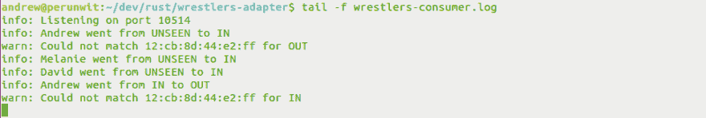

# 胡尔卡玛尼亚！或者；我如何让我们的办公室播放个性化的入口主题音乐

> 原文：<https://dev.to/buntine/hulkamania-or-how-i-made-our-office-play-personalized-entrance-theme-music>

这篇博文详细描述了我如何黑掉办公室的 WiFi，在我的同事每天早上进入大楼时为他们播放入口主题音乐。如果你只想看成品，对细节不感兴趣，这里有个小视频演示(包括一些严重欠考虑的过激行为):

[https://www.youtube.com/embed/o2S1Mmf6gnc](https://www.youtube.com/embed/o2S1Mmf6gnc)

我是一个非常普通的 90 年代的孩子。我哥哥和我花了太多的时间观看和模仿我们最喜欢的 WWF(咳咳，WWE)超级明星。

在澳大利亚，我们在电视上看不到摔跤比赛，所以我们只能在体育馆观看 VHS 发布的视频。看着他们我们做到了！每周五晚上，我们会利用当地音像店的“买五送五”交易，这让我们可以只花 5 美元租五盘每周录像带。通常，其中至少有三部会是经典之作，如[摔跤狂热 X](https://en.wikipedia.org/wiki/WrestleMania_X) 、[95 年夏季大满贯](https://en.wikipedia.org/wiki/SummerSlam_(1995))和[94 年皇家隆隆](https://en.wikipedia.org/wiki/Royal_Rumble_(1994))。

摔跤项目中最令人满意的部分之一是每个摔跤运动员第一次进入拳击场(或者我应该说是方形圈)时听到的主题音乐。对于那些不了解这种“非常真实，我确信”的摔跤的人来说，一般的入场看起来是这样的:

[https://www.youtube.com/embed/V3cBiEhSRd0](https://www.youtube.com/embed/V3cBiEhSRd0)

我相信你注意到了我和“冷酷无情”的史蒂夫·奥斯汀之间惊人的相似之处。

从小到大，我觉得只有我有自己的主题音乐才公平。我想，如果我得到了主题音乐，那么我的同事也应该得到他们自己的音乐(即使他们不同意)。

幸运的是，我们办公室里已经有一堆联网的 Sonos 扬声器，我可以通过局域网与之交流。所以我知道实际演奏音乐会很容易。所以现在的主要问题是:

1.  察觉某人何时进入办公室
2.  确定是谁
3.  确定这是否是他们今天的第一次访问
4.  在没有用户任何输入的情况下执行 1、2 和 3(也就是神奇地)

我首先想到的是在主门 <sup>1</sup> 上使用一个接近传感器。这是短暂的，因为我认为用户需要通过在他们的手机上安装一个应用程序并同意一些条款和条件来接受这个想法。更不用说我手头太紧，买不起那些传感器。

经过可能是令人尴尬的长时间思考这些问题后，我最终意识到，WiFi 是确定人们何时进入和离开办公区的一种非常合适的方式。因为我们办公室的 WiFi 信号足够强，可以到达前面的人行道，所以在用户进入大楼之前稍微播放一首主题曲会有额外的好处(你知道，为了增加真实感)。

我开始在办公室的路由器控制面板中寻找，希望能找到一些简单的方法来检测 WiFi 事件，比如*连接*和*断开*。过了一段时间，我得出结论，这不会那么容易！虽然我没有找到检测事件 <sup>2</sup> 的方法，但我确实看到这个特定的路由器有非常全面的日志。我认为一种快速而肮脏的方法可能是不断地轮询日志以寻找有用的事件。它并不伟大，但它是*的东西*。

经过进一步的调查，我发现我能够通过 TCP 将路由器日志转发到远程 [syslog 服务器](https://en.wikipedia.org/wiki/Syslog)。这很重要，因为这意味着路由器可以将事件推给我，而不是我必须不断跟踪日志文件。我开始看到这件事将如何走到一起。所以我在壁橱里找到了一台旧电脑，在上面安装了一个 Linux 版本，将它连接到局域网，并让 syslog 监听 TCP 端口 514(syslog 标准端口)。

成功了！我跟踪了`/var/log/syslog`，几乎立刻就开始看到这样的日志:

```
DATA 127.0.0.1: <14>Dec 12 15:15:20 10.our.host.com.au (\"YO,v3.7.21.5389 libubnt[1441]: w event.cust(): EVENT_STA_JOIN ath0: 00:34:da:58:8d:a6 / 3 
```

Enter fullscreen mode Exit fullscreen mode

每当一个设备连接到网络或从网络断开时，一个包含该设备唯一 mac 地址的日志就会被附加上 <sup>3</sup> 。厉害！但是有很多噪音。有关于连接、断开、漫游、握手、连接失败、速率限制等的日志。我最终决定，我真正感兴趣的只有两个事件:`EVENT_STA_JOIN`和`EVENT_STA_LEAVE`。所以我添加了一些系统日志配置

1.  查找与我想要的事件匹配的日志
2.  将它们转发到本地 TCP 端口`10514`(在这里，我将运行一个简单的 TCP 服务器来处理下一步)
3.  忽略其他一切

syslog 配置最终看起来是这样的:

```
if $msg contains "EVENT_STA_JOIN" or $msg contains "EVENT_STA_LEAVE" then
   action(type="omfwd" Target="localhost" Port="10514" Protocol="tcp")
& ~ 
```

Enter fullscreen mode Exit fullscreen mode

所以现在问题简单多了。每当有人连接或断开 WiFi 时，我房间角落里的小电脑就会收到设备的 mac 地址和事件类型的指示(`JOIN`或`LEAVE`)。我现在需要做的就是阅读这些收到的信息，将 mac 地址映射到一个人，然后播放合适的歌曲。

我用 [Rust 编程语言](http://rustlang.org)写了一个 TCP 服务器，你可以[在 Github](https://github.com/buntine/wrestlers-adapter) <sup>4</sup> 上查看。它只是将字节流读入一个字符串，解析出有用的信息，然后对 Sonos 采取适当的行动。

在了解谁触发了 WiFi 事件方面，我保持简单，只创建了一个 JSON 文件，将 mac 地址映射到名字、歌曲、问候等。它看起来像这样:

```
{
  "3d:5b:22:b7:dc:a9": {
    "name": "Andrew",        // In case I want it later (and for logging)
    "state": "UNSEEN",       // IN | OUT | UNSEEN
    "song": "owenhart.mp3",
    "join": "Welcome to the office, Bunts",
    "leave": "See you later, Bunts",
    "lastEvent": 1490436790  // Unix Epoch timestamp
  },
  "4d:aa:58:b6:9a:61": {
    "name": "Mel",
    "state": "IN",
    "song": "stonecold.mp3",
    "join": "Welcome back, Mel",
    "leave": "I hope to see you soon, Mel",
    "lastEvent": 1490436790
  },
  // ...
} 
```

Enter fullscreen mode Exit fullscreen mode

每天午夜，我都有一个小的 cron 任务来重置每个用户`state`到`UNSEEN`。我用这个来确保特定的主题曲只在给定用户第一次连接到 WiFi 时播放。任何随后的事件都会触发通过 Sonos 发声的问候或退出消息。这是通过使用伟大的[谷歌文本到语音](https://en.wikipedia.org/wiki/Google_Text-to-Speech)服务实现的。

剩下要做的唯一一件事就是添加一些小聪明，以防止办公室收到“你好”和“再见”的垃圾邮件。我注意到，某些设备经常会失去连接，然后很快重新建立连接，这将导致它们的问候被连续触发，即使用户实际上没有离开并重新进入办公室。我通过确保某些事件必须符合标准才能被认为是有效的来解决这个问题。例如，为了使`JOIN`事件被认为是有效的，相关用户必须:

1.  处于`OUT`或`UNSEEN`状态
2.  在过去的 15 秒内没有触发任何事件

我还允许`join`和`leave`键有一个可选的字符串数组，其中随机选择一个问候语并发声。这给了整个事情一点变化，防止人们厌倦每天相同的问候。

最终产品现在已经准备好摇滚了！在添加了一些日志之后，我得到了这样的结果:

[T2】](https://res.cloudinary.com/practicaldev/image/fetch/s--0eKVrN6L--/c_limit%2Cf_auto%2Cfl_progressive%2Cq_auto%2Cw_880/http://i.imgur.com/iAUC0l6.png)

至于接下来的步骤，创建一个简单的 GUI 来包装 JSON 文件(或者我应该做正确的事情，把它转移到数据库中)会非常简单。这将为用户提供一种简单的方式来写他们自己的问候和上传他们自己喜欢的主题音乐。而且，至少在理论上，这个系统可以用于更实际的任务，比如 slack bot 可以告诉员工某个同事是否在办公室。

我相信这种类型的激情项目是一种很好的方式来释放我的创造力，同时也给办公室带来清新的感觉。感谢阅读！

**脚注**:

1.  如果你想知道-不，不幸的是，当人们进入办公室时，我们没有任何类型的刷卡或用户识别过程。
2.  我后来发现路由器实际上附带了一个最小的 HTTP API，这可能已经足够了——但是找到文档和例子证明是困难的。
3.  是的，我知道有些手机操作系统会欺骗 mac 地址。但这在短期内不是问题，因为一旦设备连接到 WiFi 网络，它报告的 mac 地址往往会保持不变。假冒的 mac 地址是 WiFi 网络更关心的问题，这些网络试图跟踪节点间未连接的设备。
4.  出于读者完全不感兴趣的原因，我已经将一些更高级别的细节移到了基于节点的 web 服务中。我决定不在文章中明确提及这一点，因为它不必要地偏离了技术细节。